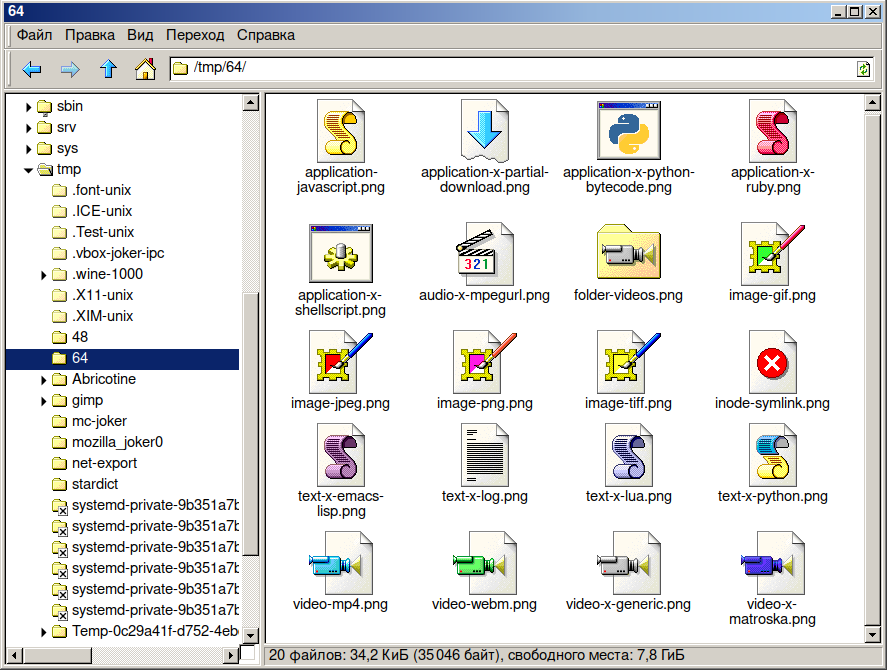

[  [Please vote for the Firefox icon!](https://github.com/nestoris/Win98SE/discussions/32)  ]

[ [For software developers: I need your help!](https://github.com/nestoris/Win98SE/discussions/33) ]


[ [Please help an Ukrainian family.](donation-to-poor-ukrainian-woman) ]<br>
If you want to support but not to send money, download my icon theme from [Pling.com](https://www.pling.com/p/1581320/) `Files (2) / main.zip` -- it will send them a few cents.<br>
Or download for me [ this book :-)](https://books.google.ru/books?id=jAR8Cv3b7mcC) (I myself can't do it. My Russian payment is unavailable for Europe and USA)

# SE98 Icon theme

## Description

 Enhanced Classic icon theme (used with Win98 Second Edition, WinME, Win2K systems) from MicroSoft Memphis project for GNU/Linux inspired by Chicago95 theme (actually it’s a manual copy-paste fork) of Grassmunk with icons in Windows 98 SE style added and/or created by myself. There are some icons in [16x16, 22x22, 24x24, 32x32, 48x48, 64x64, 72x72, 128x128](someicons.md), [160x160, 192x192, and 256x256](folder.md) sizes that I've made myself.

 Due to the  political  situation  in the world and the likelihood of GitHub being closed in future for Russians, I've created a mirror on [Russian git hosting](https://gitflic.ru/project/nestoris/se98) and on [openCode.net](https://www.opencode.net/nestoris/Win98SE) for this case. It is desirable that they will not be closed for people from any countries :-) But I am afraid that the ability to make commits on GitHub may disappear for me. So, if you haven't seen my activity for a long time, take a look [here](https://gitflic.ru/project/nestoris/se98) or [here](https://www.opencode.net/nestoris/Win98SE) ;-)

 The theme is currently in process of creating, so there are some icons from [ **Faenza**](https://github.com/shlinux/faenza-icon-theme) and [ **Chicago95**](https://github.com/grassmunk/Chicago95) themes in it... I want to turn them into a 98's style someday...

##  Installation
**Easy ways to install this theme:**

 Archlinux and the other distros that based on it:

```
yay -S se98-icon-theme-git
```

 FreeBSD and the systems that derive from it:

```
pkg install win98se-icon-theme
```

Clone the repository:

 **GIT:**

 *GitHub:*

```
git clone https://github.com/nestoris/Win98SE.git
```

 *OpenCode:*

```
git clone https://www.opencode.net/nestoris/Win98SE.git
```

 *GitFlic:*

```
git clone https://gitflic.ru/project/nestoris/se98.git
```

It will create Win98SE directory with SE98 subdirectory. Put the `SE98` to your `~/.icons`, `~/.local/share/icons`, or `/usr/share/icons` (for all users) directory by copying or symlinking (better for updates).

You can always get fresh update by going to your downloaded `Win98SE` directory and running the command:

```
git pull
```

 **SVN:**

`cd ~/.icons`, or `cd ~/.local/share/icons`

then

```
svn checkout https://github.com/nestoris/Win98SE/trunk/SE98
```

or

```
cd /usr/share/icons
sudo svn checkout https://github.com/nestoris/Win98SE/trunk/SE98
```

Or download the [ zip from GitHub](https://github.com/nestoris/Win98SE/archive/refs/heads/main.zip) and install manually :-)

If you want to contribute to the project, you can look at [some of the Windows 98/ME/2000 theme style features (Reference)](reference). It's in process of creating, not currently English-translated, but has a [link to Google-translated itself](https://github-com.translate.goog/nestoris/Win98SE/tree/main/reference?_x_tr_sl=ru&_x_tr_tl=en&_x_tr_hl=ru&_x_tr_pto=wapp).

##  Theme preview

[<br>Icons with extra large sizes (160x160, 192x192, and 256x256)](folder.md)


Here is [>>>>The bigger list of icons preview<<<<](someicons.md) of 128, 96, 72, 64, 48, 32, 24, 22, and 16 px sizes.

---

||Desktop|Computer|Hard Drive|CD-ROM|Folder|Network|Share|Server
|-|-|-|-|-|-|-|-|-|
|64x64|||||||||
|48x48|||||||||
|32x32|||||||||
|24x24|||||||||
|22x22|||||||||
|16x16|||||||||

||File Manager|Mplayer|Fceux|Terminal|Settings|Dconf Editor|Mail|Search
|-|-|-|-|-|-|-|-|-|
|64x64|||||||||
|48x48|||||||||
|32x32|||||||||
|24x24|||||||||
|22x22|||||||||
|16x16|||||||||

||Octet-stream|Exec|Python Bytecode|DOS App|Text Install|Text-x-generic|Package|Archive|
|-|-|-|-|-|-|-|-|-|
|64x64|||||||||
|48x48|||||||||
|32x32|||||||||
|24x24|||||||||
|22x22|||||||||
|16x16|||||||||

||RAR|ISO|Script|AWK|Python|HTML|XML|WAV|MP3
|-|-|-|-|-|-|-|-|-|-|
|64x64||||||||||
|48x48||||||||||
|32x32||||||||||
|24x24||||||||||
|22x22||||||||||
|16x16||||||||||

||Midi|Mod|MSI|TTF|Address book|3D-model|AbiWord document|Install Soft
|-|-|-|-|-|-|-|-|-|
|64x64|||||||||
|48x48|||||||||
|32x32|||||||||
|24x24|||||||||
|22x22|||||||||
|16x16|||||||||

||DOC|AVI|Calendar|SVG|Text-RTL|JPEG|PNG|NES-ROM
|-|-|-|-|-|-|-|-|-|
|64x64|||||||||
|48x48|||||||||
|32x32|||||||||
|24x24|||||||||
|22x22|||||||||
|16x16|||||||||

## Screenshots




