# SE98 Icon theme
The theme is currently in process of creating, so there are lots of icons from **Faenza** and **Chicago95** themes in it... I want to turn them into a 98's style someday...

---

||Desktop|Computer|Hard Drive|CD-ROM|Folder|Network|Share|Server
|-|-|-|-|-|-|-|-|-|
|64x64||||||||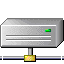|
|48x48||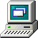|||||||
|32x32|||||||||
|24x24|||||||||
|22x22|||||||||
|16x16|||||||||

||File Manager|Mplayer|Fceux|Terminal|Settings|Dconf Editor|Mail|Search
|-|-|-|-|-|-|-|-|-|
|64x64||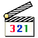||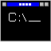|||||
|48x48||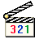|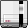|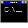|||||
|32x32||||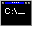|||||
|24x24||||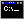|||||
|22x22|||||||||
|16x16|||||||||

||Octet-stream|Executable|Python Bytecode|DOS Application|TextInstall|Text-Preview|Text-x-generic|Package|Archive
|-|-|-|-|-|-|-|-|-|-|
|64x64||||||||||
|48x48||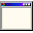|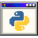||||||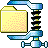|
|32x32||||||||||
|24x24||||||||||
|22x22||||||||||
|16x16||||||||||

||RAR|ISO|Script|AWK|Python|HTML|XML|WAV|MP3
|-|-|-|-|-|-|-|-|-|-|
|64x64||||||||||
|48x48||||||||||
|32x32||||||||||
|24x24||||||||||
|22x22||||||||||
|16x16||||||||||

||Midi|Rmi|MSI|TTF|Address book|3D-model|ShellScript|Install Soft
|-|-|-|-|-|-|-|-|-|
|64x64|||||||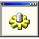||
|48x48|||||||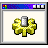||
|32x32|||||||||
|24x24|||||||||
|22x22|||||||||
|16x16|||||||||

||DOC|AVI|Calendar|SVG|Text-RTL|JPEG|PNG|NES-ROM
|-|-|-|-|-|-|-|-|-|
|64x64|||||||||
|48x48||||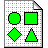|||||
|32x32|||||||||
|24x24|||||||||
|22x22|||||||||
|16x16|||||||||

### Description
This is an icon pack inspired by [Chicago95 theme](https://github.com/grassmunk/Chicago95/tree/master/Icons "github.com/grassmunk/Chicago95/tree/master/Icons") (actually it's a manual copy-paste fork) of [Grassmunk](https://github.com/grassmunk "github.com/grassmunk") with icons in Windows 98 SE style.

- Added some 48x48, 32x32, 24x24, 22x22, 16x16, and 64x64 sizes of 256 color palette.

*Screenshots:*

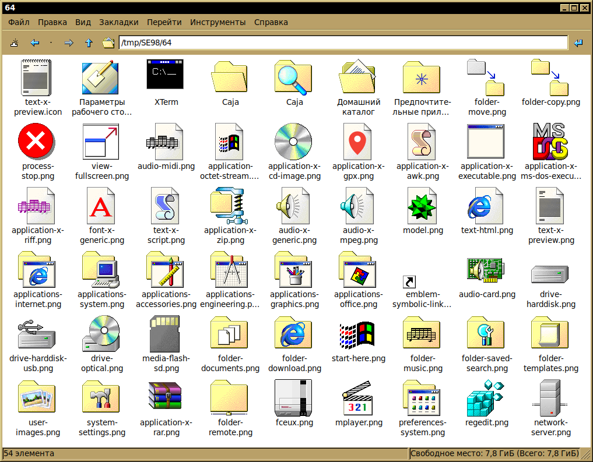
