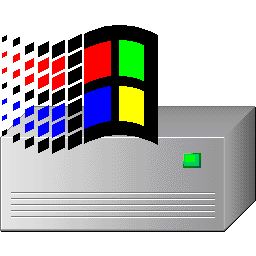

# SE98 icon theme in Win 98 SE style.

The description of scripts:

* [ upd.sh](upd.sh) - technical script for updating an icon cache of theme.
* [ win2k_icons.awk](win2k_icons.awk) - awk script (I don't know bash well, so I write on AWK) to install some  win2000 icons.
* [ win98_icons.awk](win98_icons.awk) - awk script to restore  win98 icons.
* [ sharp_icons.awk](sharp_icons.awk) - awk script if you prefer sharp Windows logo on unknown files and  Root Filesystem.
* [ smooth_icons.awk](smooth_icons.awk) - awk script for restoring smooth logo on unknown files and  Root Filesystem.
* [ icons.html.sh](icons.html.sh) - technical script for running `table_grassmunk` awk-script.
* [ table_grassmunk](table_grassmunk) - GNU-awk script for finding icons and automatically creating `icons.html` in context directories.

---

Some difference between Sharp and Smooth:

   