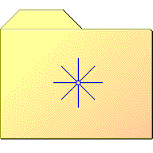
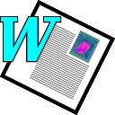

# Apps
| |**256x256**|**192x192**|**160x160**|**128x128**|**96x96**|**72x72**|**64x64**|**48x48**|**32x32**|**24x24**|**22x22**|**16x16**|
|-|-|-|-|-|-|-|-|-|-|-|-|-|
|**xchat-gnome**||||||| *xchat.png*|||| *xchat.png*||
|**pitivi**|||||||||||||
|**gnome-panel-launcher**|||||||||||||
|**gloobus**|||||||||||||
|**usb-creator-gtk**|||||||||||||
|**virtualbox**|||||||||||||
|**emesene**|||||||||||||
|**rosegarden**|||||||||||||
|**system-software-update**||||||| *update-manager.png*|| *update-manager.png*||||
|**preferences-system-session**|||||||||||||
|**preferences-system-services**|||||||||||||
|**qtassistant**|||||||||||||
|**internet-mail**|||||||||||||
|**gnome-inhibit-applet**|||||||||||||
|**jockey**|||||||| *driver-manager.png*|||||
|**xfce4-splash**|||||||||||||
|**flickr**|||||||||||||
|**frozen-bubble**|||||||||||||
|**gnome-panel**|||||||||||||
|**palemoon_48**|||||||||||||
|**wormux**|||||||||||||
|**wine-winetricks**|||||||||||||
|**jack**|||||||||||||
|**epiphany-bookmarks**|||||||||||||
|**htop**||||||| *utilities-system-monitor.png*|||| *utilities-system-monitor.png*||
|**preferences-system-time**||||||| *time-admin.png*||||||
|**Savage2**|||||||||||||
|**hedgewars**|||||||||||||
|**internet-chat**|||||||||||||
|**com.visualstudio.code**|||||||||||||
|**preferences-system-login**|||||||||||||
|**minecraft**|||||||||||||
|**panel-searchtool**|||||||||||||
|**multimedia-video-player**|||||||||||||
|**varicad**|||||||||||||
|**beryl-settings**|||||||||||||
|**WorldofPadman**|||||||||||||
|**gnome-glchess**|||||||||||||
|**config-language**||||| *preferences-desktop-locale.png*| *preferences-desktop-locale.png*| *preferences-desktop-locale.png*| *preferences-desktop-locale.png*| *preferences-desktop-locale.png*||||
|**xpdf**|||||||||||||
|**stock_help-agent**|||||||||||||
|**preferences-desktop-effects**|||||||||||||
|**do**|||||||||||||
|**seamonkey**|||||||||||||
|**internet-feed-reader**|||||||||||||
|**promoe**|||||||| *multimedia-audio-player.png*|||||
|**gnome-do**|||||||||||||
|**qtcreator**|||||||||||||
|**chrome-kbpgddbgniojgndnhlkjbkpknjhppkbk-Default**|||||||||||||
|**kompozer**|||||||||||||
|**fontypython**|||||||||||||
|**symlink2file**|||||||||||||
|**boot**||||||| *gnome-shutdown.png*|||| *gnome-shutdown.png*| *gnome-shutdown.png*|
|**galeon**| *web-browser.png*| *web-browser.png*| *web-browser.png*| *web-browser.png*| *web-browser.png*| *web-browser.png*| *web-browser.png*| *web-browser.png*| *web-browser.png*|| *web-browser.png*||
|**mate-panel**|||||||||||||
|**gnome-settings-keybindings**|||||||| *preferences-desktop-keyboard.png*|||||
|**xfce4-taskbar**|||||||||||||
|**audio-tag-tool**|||||||||||||
|**machinarium**|||||||||||||
|**teeworlds**|||||||||||||
|**midori**|||||||||||||
|**gnome-set-time**||||||| *clock.png*||||||
|**checkgmail**|||||||| *gmail.png*|||||
|**gunity**|||||||||||||
|**synfig**|||||||||||||
|**ibus**|||||||| *preferences-desktop-keyboard.png*| *preferences-desktop-keyboard.png*||||
|**interlink**|||||||||||||
|**dc++**|||||||||||||
|**ejecter**|||||||||||||
|**qtlinguist**|||||||||||||
|**baobab**|||||||||||||
|**vinagre**||||||| *preferences-desktop-remote-desktop.png*||||||
|**alien-arena**|||||||||||||
|**emerald-theme-manager-icon**|||||||||||||
|**c64**|||||||||||||
|**qgit**|||||||||||||
|**drakmenustyle**||||||| *menu-editor.png*|||| *menu-editor.png*||
|**ccsm**|||||||||||||
|**torcs**|||||||||||||
|**wxbanker**|||||||||||||
|**ccc_large**|||||||||||||
|**preferences-desktop-default-applications**|||||||||||||
|**magnatune**|||||||||||||
|**org.xfce.panel.separator**|||||||||||||
|**org.xfce.panel.launcher**|||||||||||||
|**eject_pc_cool_6_48x48x4**|||||||||||||
|**dconf**|||||||| *regedit.png*|||||
|**system-hibernate**||||||| *gnome-session-hibernate.png*||||||
|**lifeograph**|||||||||||||
|**stock_keyring**|||||||| *keyring-manager.png*| *keyring-manager.png*| *keyring-manager.png*| *keyring-manager.png*| *keyring-manager.png*|
|**gnome-session-switch**|||||||||||||
|**gnome-pdf**|||||||||||||
|**fretsonfire**|||||||||||||
|**gtk-recordmydesktop**|||||||||||||
|**gnome-mahjongg**|||||||||||||
|**uget-tray-error**|||||||||||||
|**xfce4-panel**|||||||||||||
|**gnome-quadrapassel**|||||||||||||
|**stock_delete-bookmark**|||||||||||||
|**gespeaker**|||||||||||||
|**anjuta**|||||||||||||
|**musescore**|||||||||||||
|**system-switch-java**|||||||||||||
|**application-community**|||||||||||||
|**gnome-fs-bookmark-missing**|||||||||||||
|**arts**|||||||| *media-player-banshee.png*| *multimedia-volume-control.png*||||
|**fedora-release-notes**|||||||||||||
|**plugin-screenshot**|||||||| *accessories-camera.png*|||||
|**product_logo_16**|||||||||||||
|**multimedia**|||||||||||||
|**xfce4-clock**||||||| *clock.png*||||||
|**yast-language**|||||||||||||
|**urban-terror**|||||||||||||
|**xmoto**|||||||||||||
|**blueradio**||||||| *preferences-system-bluetooth.png*|| *preferences-system-bluetooth.png*||||
|**gnome-display-properties**|||||||| *system-config-display.png*| *system-config-display.png*| *system-config-display.png*| *system-config-display.png*| *system-config-display.png*|
|**ooo-impress**|||||||| *libreoffice-impress.png*|||||
|**wesnoth**|||||||||||||
|**epiphany-icon**| *web-browser.png*| *web-browser.png*| *web-browser.png*| *web-browser.png*| *web-browser.png*| *web-browser.png*| *web-browser.png*| *web-browser.png*| *web-browser.png*|| *web-browser.png*||
|**wmtweaks**||||||| *desktop-effects.png*||||||
|**tap-extract-to**|||||||||||||
|**preferences-desktop-display**||||||| *gnome-display-properties.png*||||||
|**xchat-mini**||||||| *xchat.png*|||| *xchat.png*||
|**wine-winecfg**|||||||||||||
|**libreoffice-main**|||||||||||||
|**preferences-desktop-online-accounts**|||||||||||||
|**preferences-system**|||||||||||||
|**facebook**|||||||||||||
|**preferences-desktop-sound**|||||||||||||
|**comix**|||||||||||||
|**internet-news-reader**||||||| *liferea.png*| *evolution.png*|||||
|**gnome-mines**|||||||||||||
|**xfce4-xicon1**|||||||| *start-here.png*|||||
|**text-editor**||||||| *accessories-text-editor.png*| *accessories-text-editor.png*| *accessories-text-editor.png*||||
|**xchat**|||||||||||||
|**gnomebaker**|||||||||||||
|**internet-web-browser**| *web-browser.png*| *web-browser.png*| *web-browser.png*| *web-browser.png*| *web-browser.png*| *web-browser.png*| *web-browser.png*| *web-browser.png*||| *web-browser.png*||
|**bug-buddy**|||||||||||||
|**web-browser**|||||||||||||
|**preferences-desktop-wallpaper**|||||||| *preferences-wallpaper.png*|||||
|**easytag**|||||||||||||
|**preferences-desktop-theme**|||||||||||||
|**codeblocks**|||||||||||||
|**omgwords**|||||||||||||
|**Osmos**|||||||||||||
|**system-software-installer**|||||||||||||
|**smc**|||||||||||||
|**devhelp**|||||||||||||
|**ppa**|||||||||||||
|**bluefish**|||||||||||||
|**uget-tray-downloading**|||||||||||||
|**gnome-tetravex**|||||||||||||
|**mail-notification**|||||||||||||
|**confity**|||||||||||||
|**synapse**|||||||||||||
|**x-pdf**|||||||||||||
|**abiword_32**|||||||||||||
|**force-exit**|||||||||||||
|**preferences-desktop-font**|||||||||||||
|**playitslowly**|||||||||||||
|**gimp**|||||||||||||
|**date**|||||||| *office-calendar.png*|||||
|**monodevelop**|||||||||||||
|**multimedia-video-player_win2k**|||||||||||||
|**jackeq**|||||||||||||
|**system-shutdown**|||||||||||||
|**system-search**|||||||||||||
|**utilities-system-monitor**|||||||||||||
|**0ad**|||||||||||||
|**gksu-root-terminal**|||||||||||||
|**wireshark**|||||||||||||
|**xfsm-switch**||||||| *gnome-session-switch.png*||||||
|**time**||||||| *clock.png*||||||
|**guake**|||||||||||||
|**oregano**|||||||||||||
|**im-msn**|||||||||||||
|**minesweper**|||||||||||||
|**openjdk-6**|||||||||||||
|**git**|||||||||||||
|**preferences-desktop-multimedia**||||||| *preferences-desktop-sound.png*||||||
|**appfinder**|||||||||||||
|**fightgear**|||||||||||||
|**nm-vpn-standalone-lock**|||||||||||||
|**stock_view-details**||||||| *../../status/64/dialog-information.png*||||||
|**gnome-about-logo**|||||||||||||
|**a4**|||||||||||||
|**fontforge**|||||||||||||
|**supertux**|||||||||||||
|**truecrypt**|||||||||||||
|**imagemagick**|||||||||||||
|**rhythmbox**|||||||||||||
|**gnome-calculator**||||||| *accessories-calculator.png*| *accessories-calculator.png*|||||
|**xbmc**|||||||||||||
|**fceux**|||||||||||||
|**gtkpod**|||||||||||||
|**preferences-system-firewall**|||||||||||||
|**internet-archive**|||||||||||||
|**preferences-desktop-accessibility**|||||||||||||
|**gnochm**|||||||||||||
|**revenge**|||||||||||||
|**gnome-settings-theme**||||||| *preferences-desktop-theme.png*| *preferences-desktop-theme.png*| *preferences-theme.png*||||
|**keyring-manager**||||||| *stock_keyring.png*||||||
|**gnome-network-properties**|||||||||||||
|**gtk-info**|||||||||||||
|**twf**|||||||||||||
|**zim**|||||||| *accessories-text-editor.png*| *accessories-text-editor.png*||||
|**xfce4-ui**|||||||| *preferences-desktop-theme.png*|||||
|**caffeine**|||||||||||||
|**simple-scan**|||||||||||||
|**liferea**|||||||||||||
|**credentials-preferences**|||||||||||||
|**tracker**|||||||||||||
|**wikipedia**|||||||||||||
|**griffith**|||||||||||||
|**gnome-info**||||||| *../../status/64/dialog-information.png*||||||
|**preferences-desktop-locale**|||||||||||||
|**gnome-swell-foop**|||||||||||||
|**xpad**||||||| *tomboy.png*||| *tomboy.png*| *tomboy.png*||
|**terminator**|||||||||||||
|**im**|||||||| *pidgin.png*|| *pidgin.png*|||
|**help-contents**|||||||||||||
|**hwbroser**|||||||||||||
|**lugaru-hd**|||||||||||||
|**gnome-session-hibernate**|||||||||||||
|**gnome-tali**|||||||||||||
|**gnome-gnibbles**|||||||||||||
|**gnome-glines**|||||||||||||
|**kadu**|||||||||||||
|**indicator-applet**||||||| *../../status/64/dialog-information.png*||||||
|**video-editor**|||||||||||||
|**amule**|||||||||||||
|**indicator-weather**|||||||| *../../status/48/weather-storm.png*|||||
|**plus4**|||||||||||||
|**telepathy**|||||||||||||
|**eclipse**|||||||||||||
|**lastfm**|||||||||||||
|**ooo-template**|||||||||||||
|**podcast**|||||||||||||
|**gnome-character-map**||||||| *accessories-character-map.png*| *accessories-character-map.png*|||||
|**openttd**|||||||||||||
|**vic20**|||||||||||||
|**gnome-shutdown**|||||||| *system-shutdown.png*| *system-shutdown.png*| *system-shutdown.png*| *system-shutdown.png*| *system-shutdown.png*|
|**netbeans**|||||||||||||
|**ut2004**|||||||||||||
|**icedove**|||||||||||||
|**tap-create**|||||||||||||
|**mypaint**|||||||||||||
|**warsow**|||||||||||||
|**transmission**|||||||||||||
|**volleybrawl**|||||||||||||
|**warmux**|||||||||||||
|**libreoffice-startcenter**||||||| *libreoffice-main.png*||||||
|**glade**|||||||||||||
|**preferences-desktop-screensaver**|||||||||||||
|**pdfmod**|||||||||||||
|**umusicstore**|||||||||||||
|**stellarium**|||||||||||||
|**ooo-writer**|||||||||||||
|**jackbeat**|||||||||||||
|**pidgin-menu**|||||||| *pidgin.png*|||||
|**media-player-48**|||||||| *multimedia-audio-player.png*| *audacious.png*|| *audacious.png*||
|**exaile**|||||||||||||
|**hardinfo**|||||||| *driver-manager.png*|||||
|**adobe-reader**|||||||||||||
|**gnome-freecell**|||||||||||||
|**chromium-browser**| *web-browser.png*| *web-browser.png*| *web-browser.png*| *web-browser.png*| *web-browser.png*| *web-browser.png*| *web-browser.png*| *web-browser.png*|||||
|**serpentine**|||||||||||||
|**preferences-color**|||||||||||||
|**config-date**||||||| *time-admin.png*|| *time-admin.png*||||
|**system-suspend**||||||| *gnome-session-suspend.png*||||||
|**Gish**|||||||||||||
|**git-cola**|||||||||||||
|**gnome-window-manager**||||||| *preferences-system-windows.png*| *./preferences-system-windows.png*|||||
|**c610**|||||||||||||
|**jockey-kde**||||||| *jockey.png*| *driver-manager.png*| *jockey.png*||||
|**openofficeorg3-base**||||||| *ooo-base.png*| *./ooo-base.png*| *ooo-base.png*| *ooo-base.png*| *ooo-base.png*||
|**system-suspend-hibernate**||||||| *gnome-session-hibernate.png*||||||
|**cheese**|||||||||||||
|**hydrogen**|||||||||||||
|**plugin-scale**|||||||||||||
|**openshot**|||||||||||||
|**product_logo_22**|||||||||||||
|**product_logo_24**|||||||||||||
|**preferences-desktop-remote-desktop**|||||||||||||
|**linkerator**|||||||||||||
|**preferences-desktop-peripherals**||||||| *../../devices/64/input-mouse.png*||||||
|**google-chrome**| *web-browser.png*| *web-browser.png*| *web-browser.png*| *web-browser.png*| *web-browser.png*| *web-browser.png*| *web-browser.png*| *web-browser.png*|||||
|**mousepad**||||||| *accessories-text-editor.png*| *accessories-text-editor.png*| *accessories-text-editor.png*||||
|**miro**|||||||| *multimedia-video-player.png*|||||
|**palm-pilot-sync**|||||||||||||
|**inkscape**|||||||||||||
|**preferences-desktop-keyboard-shortcuts**|||||||||||||
|**tsclient**||||||| *preferences-desktop-remote-desktop.png*||||||
|**gkdebconf-icon**||||||| *../../categories/64/preferences-desktop.png*|| *../../categories/32/preferences-desktop.png*|| *../../categories/22/preferences-desktop.png*||
|**desktop-effects**|||||||||||||
|**desura**|||||||||||||
|**memaker**|||||||||||||
|**office-database**|||||||||||||
|**preferences-system-windows**|||||||||||||
|**quake**|||||||||||||
|**gwibber**|||||||||||||
|**kdenlive**|||||||||||||
|**im-msn_48**|||||||||||||
|**shares**||||||| *../../places/64/folder-remote.png*|| *../../places/32/folder-remote.png*|| *../../places/22/folder-remote.png*| *../../places/16/folder-remote.png*|
|**ooo-base**|||||||||||||
|**sleep**||||||| *gnome-session-suspend.png*||||||
|**gnome-clocks**|||||||||||||
|**download-manager**|||||||||||||
|**onboard-settings**|||||||||||||
|**gswitchit-properties-capplet**||||| *preferences-desktop-locale.png*| *preferences-desktop-locale.png*| *preferences-desktop-locale.png*| *preferences-desktop-locale.png*| *preferences-desktop-locale.png*||||
|**gmailwatcher**|||||||||||||
|**picasa**|||||||||||||
|**onboard**|||||||||||||
|**fusion-icon**|||||||||||||
|**supertuxkart**|||||||||||||
|**poedit**|||||||||||||
|**accessories-dictionary**|||||||||||||
|**gnome-mplayer**||||||| *mplayer.png*| *./mplayer.png*|| *mplayer.png*| *mplayer.png*||
|**giggle**|||||||||||||
|**locale**||||||| *preferences-desktop-locale.png*|| *preferences-desktop-locale.png*||||
|**epiphany**| *web-browser.png*| *web-browser.png*| *web-browser.png*| *web-browser.png*| *web-browser.png*| *web-browser.png*| *web-browser.png*| *web-browser.png*| *web-browser.png*|| *web-browser.png*||
|**lpi-translate**||||| *preferences-desktop-locale.png*| *preferences-desktop-locale.png*| *preferences-desktop-locale.png*| *preferences-desktop-locale.png*| *preferences-desktop-locale.png*||||
|**rclock**||||||| *clock.png*||||||
|**xfce-man**||||||| *help-browser.png*||||||
|**evolution-tasks**|||||||||||||
|**p7zip**|||||||||||||
|**openofficeorg3.0-base**||||||| *ooo-base.png*| *./ooo-base.png*| *ooo-base.png*| *ooo-base.png*| *ooo-base.png*||
|**xfce-mount**|||||||||||||
|**prism-google-mail**|||||||||||||
|**gnome-activity-journal**|||||||||||||
|**browser**| *web-browser.png*| *web-browser.png*| *web-browser.png*| *web-browser.png*| *web-browser.png*| *web-browser.png*| *web-browser.png*| *web-browser.png*| *web-browser.png*|| *web-browser.png*||
|**utilities-terminal**|||||||||||||
|**setroubleshoot_red_icon**|||||||||||||
|**gnome-session-suspend**|||||||||||||
|**xoscope**|||||||||||||
|**numpty-physics**|||||||||||||
|**jamin**|||||||||||||
|**gpk-repo**||||||| *software-properties.png*| *system-software-install.png*| *software-properties.png*|| *software-properties.png*||
|**gksu-debian**||||||| *gksu-root-terminal.png*||||||
|**gksu-root-terminal-old**|||||||||||||
|**f-spot**|||||||||||||
|**pup**||||||| *update-manager.png*|| *update-manager.png*||||
|**deja-dup**|||||||||||||
|**pidgin**|||||||||||||
|**checkbox**|||||||||||||
|**system-switch-user**||||||| *gnome-session-switch.png*||||||
|**gmusicbrowser**||||||| *rhythmbox.png*| *multimedia-audio-player.png*||| *rhythmbox.png*| *multimedia-audio-player.png*|
|**dia**|||||||||||||
|**pet**|||||||||||||
|**gnome-fs-bookmark**|||||||||||||
|**notifyconf**|||||||||||||
|**xine**|||||||| *multimedia-audio-player.png*|||||
|**gedit-logo**|||||||| *accessories-text-editor.png*| *accessories-text-editor.png*||||
|**workspace-switcher**|||||||||||||
|**system-settings**|||||||||||||
|**autoplus**|||||||||||||
|**amarok**|||||||||||||
|**nautilus-actions**|||||||||||||
|**pino**|||||||||||||
|**filezilla**|||||||||||||
|**mate-network-properties**||||||| *gnome-network-properties.png*| *gnome-network-properties.png*|| *gnome-network-properties.png*| *gnome-network-properties.png*| *gnome-network-properties.png*|
|**deadbeef**|||||||||||||
|**qjackctl**|||||||||||||
|**window**|||||||||||||
|**mate-notification-properties**||||||| *gtk-info.png*| *gtk-info.png*|| *gtk-info.png*| *gtk-info.png*| *gtk-info.png*|
|**mate-tweak**|||||||||||||
|**geogebra**|||||||||||||
|**gnome-panel-force-quit**|||||||||||||
|**driver-manager**|||||||||||||
|**resapplet**|||||||| *system-config-display.png*|||||
|**keepassx**|||||||||||||
|**mate-panel-clock**||||||| *clock.png*| *clock.png*|| *clock.png*| *clock.png*| *clock.png*|
|**lv_icon**|||||||||||||
|**gnome-gmenu**||||||| *menu-editor.png*|||| *menu-editor.png*||
|**gnome-weather**||||||||| *xfce4-weather.png*| *xfce4-weather.png*|||
|**clipman**|||||||||||||
|**menu-editor**|||||||||||||
|**docky**|||||||||||||
|**firefox_2**|||||||||||||
|**kcharselect**||||||| *accessories-character-map.png*| *accessories-character-map.png*|||||
|**alchemy**|||||||||||||
|**xournal**|||||||||||||
|**usb-creator**||||||| *usb-creator-gtk.png*||||||
|**pingus**|||||||||||||
|**invest-applet**||||||| *wxbanker.png*||||||
|**iceweasel**|||||||||||||
|**gedit-icon**|||||||| *accessories-text-editor.png*| *accessories-text-editor.png*||||
|**screenruler-icon**|||||||||||||
|**taskbar**|||||||||||||
|**apport**|||||||||||||
|**ekiga**|||||||||||||
|**logviewer**|||||||||||||
|**mumble**|||||||||||||
|**unison-gtk**|||||||||||||
|**epiphany-gecko**| *web-browser.png*| *web-browser.png*| *web-browser.png*| *web-browser.png*| *web-browser.png*| *web-browser.png*| *web-browser.png*| *web-browser.png*| *web-browser.png*|| *web-browser.png*||
|**multimedia-volume-control**|||||||||||||
|**flashplayer**|||||||||||||
|**openarena**|||||||||||||
|**wine-notepad**|||||||| *accessories-text-editor.png*| *accessories-text-editor.png*||||
|**teamviewer**|||||||||||||
|**pdfshuffler**|||||||||||||
|**jamendo**|||||||||||||
|**paprefs**||||||| *../../categories/64/preferences-desktop.png*|| *../../categories/32/preferences-desktop.png*|| *../../categories/22/preferences-desktop.png*||
|**notifyosdconf**|||||||| *notifyconf.png*|||||
|**gnome-desktop-config**||||||| *../../categories/64/preferences-desktop.png*||||||
|**gnome-session-hebirnate**|||||||||||||
|**sound-juicer**|||||||||||||
|**phatch-inspector**|||||||||||||
|**flash**|||||||||||||
|**orage_globaltime**|||||||||||||
|**firefox**|||||||||||||
|**applets-screenshooter**||||||| *gnome-screenshot.png*||||||
|**youtube**|||||||||||||
|**wine**|||||||||||||
|**xsane**|||||||||||||
|**gnome-settings-accessibility-technologies**||||||| *preferences-desktop-accessibility.png*||||||
|**scribus**|||||||||||||
|**anki**|||||||||||||
|**software-properties**|||||||||||||
|**eagle**|||||||||||||
|**scribes**|||||||||||||
|**xmms**|||||||| *multimedia-audio-player.png*|||||
|**meld**|||||||||||||
|**shotwell**|||||||||||||
|**gnome-monitor**||||||| *utilities-system-monitor.png*||||||
|**ksysguard**||||||| *utilities-system-monitor.png*| *./utilities-system-monitor.png*|||||
|**gresistor**|||||||||||||
|**xonotic**|||||||||||||
|**hexchat**||||||| *xchat.png*|||| *xchat.png*||
|**libreoffice-base**|||||||||||||
|**accessories-system-cleaner**|||||||||||||
|**gcstar**|||||||||||||
|**devede**|||||||||||||
|**mugshot**|||||||||||||
|**deluge**|||||||||||||
|**gnome-panel-window-list**|||||||||||||
|**zen-icon**||||||| *update-manager.png*|| *update-manager.png*||||
|**the-board**|||||||||||||
|**mame**|||||||||||||
|**gnome-screenshot**|||||||| *accessories-camera.png*|||||
|**gnome-web-browser**| *web-browser.png*| *web-browser.png*| *web-browser.png*| *web-browser.png*| *web-browser.png*| *web-browser.png*| *web-browser.png*| *web-browser.png*| *web-browser.png*|| *web-browser.png*||
|**mail**||||||||| *internet-mail.png*| *internet-mail.png*| *internet-mail.png*| *evolution.png*|
|**gnome-session-halt**||||||| *gnome-shutdown.png*|||| *gnome-shutdown.png*||
|**gbrainy**|||||||||||||
|**bazaar**|||||||||||||
|**gnome-fs-blockdev**|||||||||||||
|**im-yahoo**|||||||||||||
|**im-msn_2**|||||||||||||
|**accessories-calculator**|||||||||||||
|**frostwire**|||||||||||||
|**jdownloader**|||||||||||||
|**audacity**|||||||||||||
|**rip**|||||||||||||
|**xfsm-suspend**||||||| *gnome-session-suspend.png*||||||
|**gmail**|||||||||||||
|**vendetta-online**|||||||||||||
|**regedit**|||||||||||||
|**emerillon**|||||||||||||
|**gnome-session-sleep**||||||| *gnome-session-suspend.png*||||||
|**cairo-clock**||||||| *clock.png*||||||
|**ghex**|||||||||||||
|**setroubleshoot_icon**|||||||||||||
|**gnome-settings-background**||||||| *preferences-desktop-wallpaper.png*| *preferences-wallpaper.png*|||||
|**disk-usage-analyzer**|||||||||||||
|**product_logo_32**|||||||||||||
|**xfce-ui**||||||| *preferences-desktop-theme.png*| *preferences-desktop-theme.png*| *preferences-theme.png*|| *preferences-desktop-theme.png*||
|**palm-pilot**|||||||||||||
|**acroread**|||||||||||||
|**far**|||||||||||||
|**bluetooth**|||||||||||||
|**plugin-notification**|||||||||||||
|**pithos**|||||||||||||
|**im-chooser**|||||||||||||
|**preferences-wallpaper**|||||||||||||
|**chrome-ejidjjhkpiempkbhmpbfngldlkglhimk-Default**|||||||| *gmail.png*|||||
|**gnome-robots**|||||||||||||
|**pithos-tray-plugin**|||||||||||||
|**plugin-commands**|||||||| *preferences-desktop-keyboard.png*| *preferences-desktop-keyboard.png*||||
|**xfce4-systray**|||||||||||||
|**simple-ccsm**||||||| *ccsm.png*||||||
|**system-users**|||||||||||||
|**kupfer**|||||||||||||
|**gnome-translate**||||| *preferences-desktop-locale.png*| *preferences-desktop-locale.png*| *preferences-desktop-locale.png*| *preferences-desktop-locale.png*| *preferences-desktop-locale.png*||||
|**libreoffice-impress**|||||||||||||
|**randr**|||||||||||||
|**gnome-system-monitor**||||||| *utilities-system-monitor.png*|||| *utilities-system-monitor.png*||
|**Penumbra**|||||||||||||
|**monodoc-browser**|||||||||||||
|**xfce4-cpugraph-plugin**||||||||| *xfce4-cpufreq-plugin.png*||| *xfce4-cpufreq-plugin.png*|
|**update-manager**|||||||||||||
|**gnome-panel-clock**||||||| *clock.png*||||||
|**accessories-camera**|||||||||| *../../devices/24/camera-web.png*|| *../../devices/16/camera-web.png*|
|**AdobeReader**|||||||||||||
|**soundconverter**|||||||||||||
|**ET-quakewars**|||||||||||||
|**stock_new-spreadsheet**||||||||||| *libreoffice-calc.png*| *libreoffice-calc.png*|
|**vlc**|||||||||||||
|**gpm-hibernate**|||||||||||||
|**amnesia-dark-decent**|||||||||||||
|**redhat-tools**||||||| *../../categories/64/preferences-desktop.png*| *../../categories/48/preferences-desktop.png*| *../../categories/32/preferences-desktop.png*|| *../../categories/22/preferences-desktop.png*||
|**ooo-calc**|||||||||||||
|**office-writer**||||||| *ooo-writer.png*||||||
|**drive-removable-media**|||||||||||||
|**master-pdf-editor**|||||||||||||
|**libreoffice-writer**|||||||||||||
|**xfce-schedule**||||||| *clock.png*||||||
|**jag_editor**|||||||||||||
|**kuser**||||||| *config-users.png*| *preferences-desktop-user.png*|||| *system-users.png*|
|**nexuiz**|||||||||||||
|**ooo-printeradmin**|||||||||||||
|**accessories-text-editor**|||||||||||||
|**gnome-gnumeric**|||||||||||||
|**q4wine**|||||||||||||
|**alltray**|||||||||||||
|**lpi-bug**|||||||||||||
|**Trine**|||||||||||||
|**panel**|||||||||||||
|**picasa-fontcfg**|||||||||||||
|**xfce4-cpufreq-plugin**|||||||||||||
|**c128**|||||||||||||
|**unknown-channel**|||||||||||||
|**plugin-wallpaper**|||||||| *preferences-wallpaper.png*|||||
|**pk-package-sources**||||||| *software-properties.png*| *system-software-install.png*| *software-properties.png*|| *software-properties.png*||
|**qtdesigner**|||||||||||||
|**remote-desktop**|||||||||||||
|**wallpaper**||||||| *preferences-desktop-wallpaper.png*| *preferences-wallpaper.png*| *preferences-wallpaper.png*| *preferences-wallpaper.png*|| *preferences-wallpaper.png*|
|**homebank**|||||||||||||
|**tuxguitar**|||||||||||||
|**qucs**|||||||||||||
|**im-aim**|||||||||||||
|**bluegriffon**|||||||||||||
|**clock**|||||||||||||
|**ooo-math**|||||||||||||
|**gnome-aisleriot**|||||||||||||
|**xfce4-notifyd**|||||||| *notifyconf.png*|||||
|**slingshot**|||||||||||||
|**shutter**|||||||||||||
|**gajim**|||||||||||||
|**openbravo-erp**|||||||||||||
|**preferences-system-sound**|||||||||||||
|**accessibility-directory**||||||| *preferences-desktop-accessibility.png*||||||
|**skype**|||||||||||||
|**redhat-server_settings**||||||| *../../categories/64/preferences-desktop.png*| *../../categories/48/preferences-desktop.png*| *../../categories/32/preferences-desktop.png*|| *../../categories/22/preferences-desktop.png*||
|**totem**|||||||| *multimedia-audio-player.png*|||||
|**aptoncd**|||||||||||||
|**gparted**|||||||||||||
|**partner**|||||||||||||
|**key_bindings**||||||| *preferences-desktop-keyboard-shortcuts.png*| *preferences-desktop-keyboard.png*|||||
|**jokosher**|||||||||||||
|**gnome-device-manager**||||||| *palimpsest.png*| *driver-manager.png*| *palimpsest.png*|| *palimpsest.png*| *palimpsest.png*|
|**radiotray**|||||||||||||
|**system-file-manager**|||||||||||||
|**xfce4-weather**|||||||| *../../status/48/weather-storm.png*|||||
|**gnome-gnect**|||||||||||||
|**postscript-viewer**|||||||||||||
|**access**||||||| *preferences-desktop-accessibility.png*| *preferences-desktop-accesibility.png*|||||
|**phatch**|||||||||||||
|**awn-settings**|||||||||||||
|**tvtime**|||||||||||||
|**accessories-media-converter**|||||||||||||
|**gnome-cd**|||||||||||||
|**xfce4-backdrop**||||||| *preferences-desktop-wallpaper.png*| *preferences-wallpaper.png*| *preferences-wallpaper.png*| *preferences-wallpaper.png*|| *preferences-wallpaper.png*|
|**accessories-image-viewer**|||||||||||||
|**gnome-nettool**|||||||||||||
|**preferences-desktop-system-time**|||||||||||||
|**dosbox**|||||||||||||
|**xfce-printer**|||||||||||||
|**appointment**|||||||||||||
|**kcmkwm**||||||| *preferences-system-windows.png*| *./preferences-system-windows.png*|||||
|**gnomebaker-48**|||||||||||||
|**evince**|||||||||||||
|**abiword**|||||||||||||
|**miro-browse**|||||||||||||
|**haguichi**|||||||||||||
|**unreal-tournament**|||||||||||||
|**control-center2**||||||||| *../../categories/32/preferences-desktop.png*|| *../../categories/22/preferences-desktop.png*||
|**preferences-system-power**|||||||||||||
|**gnome-contacts**||||||| *x-office-address-book.png*||||||
|**libreoffice-calc**|||||||||||||
|**mitter**|||||||||||||
|**multimedia-audio-player**|||||||||||||
|**office-address-book**||||||| *x-office-address-book.png*||||||
|**gnome-iagno**|||||||||||||
|**kobo-icon**|||||||||||||
|**video-player**|||||||| *multimedia-audio-player.png*| *mplayer.png*|| *mplayer.png*||
|**avant-window-navigator**|||||||||||||
|**brasero**|||||||||||||
|**pluma**|||||||||||||
|**uck**|||||||||||||
|**ubuntu-tweak**|||||||||||||
|**system-config-securitylevel**|||||||||||||
|**jack-rack**|||||||||||||
|**gconf-cleaner**|||||||||||||
|**gnome-panel-notification-area**|||||||||||||
|**gnome-klotski**|||||||||||||
|**dvdrip**|||||||||||||
|**ksplash**|||||||||||||
|**chrome-boeajhmfdjldchidhphikilcgdacljfm-Default**|||||||| *facebook.png*|||||
|**ooo-draw**|||||||||||||
|**gstreamer-properties**|||||||||||||
|**x-office-calendar**|||||||||||||
|**geany**|||||||||||||
|**mines**|||||||||||||
|**clementine**|||||||||||||
|**epiphany-browser**| *web-browser.png*| *web-browser.png*| *web-browser.png*| *web-browser.png*| *web-browser.png*| *web-browser.png*| *web-browser.png*| *web-browser.png*| *web-browser.png*|| *web-browser.png*||
|**im-jabber**|||||||||||||
|**playonlinux**|||||||||||||
|**gnumeric**|||||||||||||
|**library-internet-radio**|||||||||||||
|**quake2**|||||||||||||
|**quake3**|||||||||||||
|**sauerbraten**|||||||||||||
|**system-config-display**|||||||||||||
|**style**||||||| *preferences-desktop-theme.png*| *preferences-desktop-theme.png*| *preferences-theme.png*||||
|**spotify**|||||||||||||
|**quake4**|||||||||||||
|**preferences-system-network**||||||| *../../places/64/network-workgroup.png*||||||
|**display-im6.q16**|||||||||||||
|**chrome-blpcfgokakmgnkcojhhkbfbldkacnbeo-Default**|||||||||||||
|**preferences-desktop**|||||||||||||
|**accessories-character-map**|||||||||||||
|**im-icq**|||||||||||||
|**libreoffice-math**|||||||||||||
|**background**||||||| *preferences-desktop-wallpaper.png*| *preferences-wallpaper.png*|||||
|**mate-panel-launcher**||||||| *gnome-panel-launcher.png*| *gnome-panel-launcher.png*|| *gnome-panel-launcher.png*| *gnome-panel-launcher.png*| *gnome-panel-launcher.png*|
|**multimedia-video-player_win98**|||||||||||||
|**gnome-sudoku**|||||||||||||
|**gnome-word**||||||| *accessories-text-editor.png*| *accessories-text-editor.png*| *accessories-text-editor.png*||||
|**gcolor2**|||||||||||||
|**parole**||||||| *totem.png*| *multimedia-video-player.png*||| *totem.png*||
|**guayadeque**|||||||||||||
|**time-admin**|||||||||||||
|**fontmatrix**|||||||||||||
|**mahjong**|||||||||||||
|**tangerine-properties**|||||||||||||
|**administration**|||||||||||||
|**xfce4-fsguard-plugin-warning**|||||||||||||
|**stock_bookmark**|||||||||||||
|**AdobeReader8**|||||||||||||
|**openofficeorg-base**||||||| *ooo-base.png*| *./ooo-base.png*| *ooo-base.png*| *ooo-base.png*| *ooo-base.png*||
|**goa-panel**|||||||| *system-software-install.png*|||||
|**org.xfce.volman**|||||||||||||
|**xfsm-hibernate**||||||| *gnome-session-hibernate.png*||||||
|**libreoffice-draw**|||||||||||||
|**wine-uninstaller**|||||||||||||
|**tap-extract**|||||||||||||
|**openerp-client**|||||||||||||
|**gnome-lightsoff**|||||||||||||
|**emacs**|||||||||||||
|**accessories-notes**|||||||||||||
|**google-hangout**|||||||||||||
|**blender**|||||||||||||
|**vim**|||||||||||||
|**Doom3**|||||||||||||
|**EasyTAG_icon**||||||| *easytag.png*||||||
|**gnome-documents**|||||||||||||
|**edit-urpm-sources**||||||| *software-properties.png*| *system-software-install.png*| *software-properties.png*|| *software-properties.png*||
|**love**|||||||||||||
|**jag**|||||||||||||
|**thunderbird**|||||||||||||
