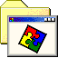
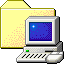

# Categories
Only the main icons are shown here (without symlinked duplicates, in sizes from 16x16 to 64x64). The full icon list with sizes from 16x16 to 64x64 is there: [icons.md](icons.md)

| |**64x64**|**48x48**|**32x32**|**24x24**|**22x22**|**16x16**|
|-|-|-|-|-|-|-|
|**application-community**|||||||
|**applications-3D**|||||||
|**applications-accessibility**|||||||
|**applications-accessories**|||||||
|**applications-development**|||||||
|**applications-electronics**|||||||
|**applications-engineering**|||||||
|**applications-fonts**|||||||
|**applications-games**|||||||
|**applications-graphics**|||||||
|**applications-internet**|||||||
|**applications-multimedia**|||||||
|**applications-office**|||||||
|**applications-other**|||||||
|**applications-science**|||||||
|**applications-system**|||||||
|**applications-webbrowsers**|||||||
|**configuration_section**|||||||
|**documentation_section**|||||||
|**gnome-control-center**|||||||
|**gnome-devel**|||||||
|**gnome-globe**|||||||
|**gnome-settings**|||||||
|**gtk-preferences**|||||||
|**input_devices_settings**|||||||
|**kcontrol**|||||||
|**package_development**|||||||
|**package_network**|||||||
|**ppa**|||||||
|**preferences-desktop-peripherals-directory**|||||||
|**preferences-desktop-peripherals_old**|||||||
|**preferences-desktop-personal-directory**|||||||
|**preferences-other**|||||||
|**preferences-system-network**|||||||
|**preferences-system-parental-controls**|||||||
|**redhat-internet**|||||||
|**redhat-preferences**|||||||
|**redhat-programming**|||||||
|**stock_internet**|||||||
|**xfce-devel**|||||||
|**xfce-internet**|||||||
|**xfce4-settings**|||||||
