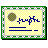
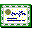
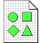
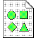
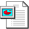
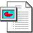
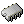
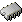

# Mimes

Total **774** icons in **mimes** context.

| |**96x96**|**72x72**|**64x64**|**48x48**|**32x32**|**24x24**|**22x22**|**16x16**|
|-|-|-|-|-|-|-|-|-|
|**application-7zip**|||

*link:* 
*application-x-archive.png*
|

*link:* 
*application-x-archive.png*
|||

*link:* 
*package-x-generic.png*
|

*link:* 
*application-x-archive.png*
|
|**application-atom+xml**|||

*link:* 
*application-rss+xml.png*
||

*link:* 
*application-rss+xml.png*
||

*link:* 
*application-rss+xml.png*
|

*link:* 
*text-xml.png*
|
|**application-audio-playlist**|

*link:* 
*audio-x-playlist.png*
|

*link:* 
*audio-x-playlist.png*
|

*link:* 
*audio-x-playlist.png*
|

*link:* 
*audio-x-playlist.png*
|

*link:* 
*audio-x-playlist.png*
|

*link:* 
*audio-x-playlist.png*
|

*link:* 
*audio-x-playlist.png*
|

*link:* 
*audio-x-playlist.png*
|
|**application-audio**|

*link:* 
*audio-x-generic.png*
|

*link:* 
*audio-x-generic.png*
|

*link:* 
*audio-x-generic.png*
|

*link:* 
*audio-x-generic.png*
|

*link:* 
*audio-x-generic.png*
|

*link:* 
*audio-x-generic.png*
|

*link:* 
*audio-x-generic.png*
|

*link:* 
*audio-x-generic.png*
|
|**application-blank**|

*link:* 
*empty.png*
|

*link:* 
*empty.png*
|

*link:* 
*empty.png*
|

*link:* 
*empty.png*
|

*link:* 
*empty.png*
|

*link:* 
*empty.png*
|

*link:* 
*empty.png*
|

*link:* 
*empty.png*
|
|**application-certificate-symbolic**||||

*link:* 
*application-certificate.png*
|

*link:* 
*application-certificate.png*
|

*link:* 
*application-certificate.png*
|

*link:* 
*application-certificate.png*
|

*link:* 
*application-certificate.png*
|
|**application-certificate**|||||||||
|**application-default-icon**|

*link:* 
*application-x-executable.png*
|

*link:* 
*application-x-executable.png*
|

*link:* 
*application-x-executable.png*
|

*link:* 
*application-x-executable.png*
|

*link:* 
*application-x-executable.png*
|

*link:* 
*application-x-executable.png*
|

*link:* 
*application-x-executable.png*
|

*link:* 
*application-x-executable.png*
|
|**application-epub+zip**|||||||||
|**application-executable**|

*link:* 
*application-x-executable.png*
|

*link:* 
*application-x-executable.png*
|

*link:* 
*application-x-executable.png*
|

*link:* 
*application-x-executable.png*
|

*link:* 
*application-x-executable.png*
|

*link:* 
*application-x-executable.png*
|

*link:* 
*application-x-executable.png*
|

*link:* 
*application-x-executable.png*
|
|**application-font**|||

*link:* 
*font-x-generic.png*
|

*link:* 
*font-x-generic.png*
|

*link:* 
*font-x-generic.png*
|

*link:* 
*font-x-generic.png*
|

*link:* 
*font-x-generic.png*
|

*link:* 
*font-x-generic.png*
|
|**application-geo+json**|

*link:* 
*application-x-gpx.png*
|

*link:* 
*application-x-gpx.png*
|

*link:* 
*application-x-gpx.png*
|

*link:* 
*application-x-gpx.png*
|

*link:* 
*application-x-gpx.png*
|

*link:* 
*application-x-gpx.png*
|

*link:* 
*application-x-gpx.png*
|

*link:* 
*application-x-gpx.png*
|
|**application-gml+xml**|

*link:* 
*application-x-gpx.png*
|

*link:* 
*application-x-gpx.png*
|

*link:* 
*application-x-gpx.png*
|

*link:* 
*application-x-gpx.png*
|

*link:* 
*application-x-gpx.png*
|

*link:* 
*application-x-gpx.png*
|

*link:* 
*application-x-gpx.png*
|

*link:* 
*application-x-gpx.png*
|
|**application-gpx+xml**|

*link:* 
*application-x-gpx.png*
|

*link:* 
*application-x-gpx.png*
|

*link:* 
*application-x-gpx.png*
|

*link:* 
*application-x-gpx.png*
|

*link:* 
*application-x-gpx.png*
|

*link:* 
*application-x-gpx.png*
|

*link:* 
*application-x-gpx.png*
|

*link:* 
*application-x-gpx.png*
|
|**application-gpx**|

*link:* 
*application-x-gpx.png*
|

*link:* 
*application-x-gpx.png*
|

*link:* 
*application-x-gpx.png*
|

*link:* 
*application-x-gpx.png*
|

*link:* 
*application-x-gpx.png*
|

*link:* 
*application-x-gpx.png*
|

*link:* 
*application-x-gpx.png*
|

*link:* 
*application-x-gpx.png*
|
|**application-gzip**|

*link:* 
*application-x-archive.png*
|

*link:* 
*application-x-archive.png*
|

*link:* 
*application-x-archive.png*
|

*link:* 
*application-x-archive.png*
|

*link:* 
*application-x-archive.png*
|

*link:* 
*application-x-archive.png*
|

*link:* 
*application-x-archive.png*
|

*link:* 
*application-x-archive.png*
|
|**application-illustrator**|

*link:* 
*x-office-drawing.png*
|

*link:* 
*x-office-drawing.png*
|

*link:* 
*x-office-drawing.png*
||||||
|**application-image-gif**|

*link:* 
*image-gif.png*
|

*link:* 
*image-gif.png*
|

*link:* 
*image-gif.png*
|

*link:* 
*image-gif.png*
|

*link:* 
*image-gif.png*
|

*link:* 
*image-gif.png*
|

*link:* 
*image-gif.png*
|

*link:* 
*image-gif.png*
|
|**application-image-jpeg**|

*link:* 
*image-jpeg.png*
|

*link:* 
*image-jpeg.png*
|

*link:* 
*image-jpeg.png*
|

*link:* 
*image-jpeg.png*
|

*link:* 
*image-jpeg.png*
|

*link:* 
*image-jpeg.png*
|

*link:* 
*image-jpeg.png*
|

*link:* 
*image-jpeg.png*
|
|**application-image-png**|

*link:* 
*image-png.png*
|

*link:* 
*image-png.png*
|

*link:* 
*image-png.png*
|

*link:* 
*image-png.png*
|

*link:* 
*image-png.png*
|

*link:* 
*image-png.png*
|

*link:* 
*image-png.png*
|

*link:* 
*image-png.png*
|
|**application-image-tiff**|

*link:* 
*image-tiff.png*
|

*link:* 
*image-tiff.png*
|

*link:* 
*image-tiff.png*
|

*link:* 
*image-tiff.png*
|

*link:* 
*image-tiff.png*
|

*link:* 
*image-tiff.png*
|

*link:* 
*image-tiff.png*
|

*link:* 
*image-tiff.png*
|
|**application-install**|||||||||
|**application-javascript**|||||||||
|**application-loc+xml**|

*link:* 
*application-x-gpx.png*
|

*link:* 
*application-x-gpx.png*
|

*link:* 
*application-x-gpx.png*
|

*link:* 
*application-x-gpx.png*
|

*link:* 
*application-x-gpx.png*
|

*link:* 
*application-x-gpx.png*
|

*link:* 
*application-x-gpx.png*
|

*link:* 
*application-x-gpx.png*
|
|**application-m3u**|

*link:* 
*audio-x-playlist.png*
|

*link:* 
*audio-x-playlist.png*
|

*link:* 
*audio-x-playlist.png*
|

*link:* 
*audio-x-playlist.png*
|

*link:* 
*audio-x-playlist.png*
|

*link:* 
*audio-x-playlist.png*
|

*link:* 
*audio-x-playlist.png*
|

*link:* 
*audio-x-playlist.png*
|
|**application-mbox**|||

*link:* 
*message.png*
|

*link:* 
*./message.png*
|

*link:* 
*message.png*
|

*link:* 
*message.png*
|

*link:* 
*message.png*
|

*link:* 
*message.png*
|
|**application-ms-htmlhelp**|||||||||
|**application-msword**|

*link:* 
*x-office-document.png*
|

*link:* 
*x-office-document.png*
|

*link:* 
*x-office-document.png*
|

*link:* 
*x-office-document.png*
|

*link:* 
*x-office-document.png*
|

*link:* 
*x-office-document.png*
|

*link:* 
*x-office-document.png*
|

*link:* 
*x-office-document.png*
|
|**application-octet-stream**|||||||||
|**application-octet-stream_SHARP**|||||||||
|**application-octet-stream_SMOOTH**|||||||||
|**application-ogg-symbolic**|

*link:* 
*audio-x-vorbis+ogg.png*
|

*link:* 
*audio-x-vorbis+ogg.png*
|

*link:* 
*audio-x-vorbis+ogg.png*
|

*link:* 
*audio-x-vorbis+ogg.png*
|

*link:* 
*audio-x-vorbis+ogg.png*
|

*link:* 
*audio-x-vorbis+ogg.png*
|

*link:* 
*audio-x-vorbis+ogg.png*
|

*link:* 
*audio-x-vorbis+ogg.png*
|
|**application-ogg**|

*link:* 
*audio-x-vorbis+ogg.png*
|

*link:* 
*audio-x-vorbis+ogg.png*
|

*link:* 
*audio-x-vorbis+ogg.png*
|

*link:* 
*audio-x-vorbis+ogg.png*
|

*link:* 
*audio-x-vorbis+ogg.png*
|

*link:* 
*audio-x-vorbis+ogg.png*
|

*link:* 
*audio-x-vorbis+ogg.png*
|

*link:* 
*audio-x-vorbis+ogg.png*
|
|**application-pdf**|||||||||
|**application-pgp-encrypted**|||

*link:* 
*encrypted.png*
|

*link:* 
*./encrypted.png*
|

*link:* 
*encrypted.png*
|

*link:* 
*encrypted.png*
|

*link:* 
*encrypted.png*
|

*link:* 
*encrypted.png*
|
|**application-pgp-keys**|||||||||
|**application-pgp**|||||||||
|**application-php**|

*link:* 
*application-x-php.png*
|

*link:* 
*application-x-php.png*
|

*link:* 
*application-x-php.png*
|

*link:* 
*application-x-php.png*
|

*link:* 
*application-x-php.png*
|

*link:* 
*application-x-php.png*
|

*link:* 
*application-x-php.png*
|

*link:* 
*application-x-php.png*
|
|**application-pkcs10**||||

*link:* 
*application-certificate.png*
|

*link:* 
*application-certificate.png*
|

*link:* 
*application-certificate.png*
|

*link:* 
*application-certificate.png*
|

*link:* 
*application-certificate.png*
|
|**application-pkcs12**||||

*link:* 
*application-certificate.png*
|

*link:* 
*application-certificate.png*
|

*link:* 
*application-certificate.png*
|

*link:* 
*application-certificate.png*
|

*link:* 
*application-certificate.png*
|
|**application-pkcs7-mime**|||

*link:* 
*application-pgp-keys.png*
|

*link:* 
*./application-pgp-keys.png*
|

*link:* 
*application-pgp-keys.png*
|

*link:* 
*application-pgp-keys.png*
|

*link:* 
*application-pgp-keys.png*
|

*link:* 
*application-pgp-keys.png*
|
|**application-pkix-cerl**||||

*link:* 
*application-certificate.png*
|

*link:* 
*application-certificate.png*
|

*link:* 
*application-certificate.png*
|

*link:* 
*application-certificate.png*
|

*link:* 
*application-certificate.png*
|
|**application-pkix-cert+pem**||||

*link:* 
*application-certificate.png*
|

*link:* 
*application-certificate.png*
|

*link:* 
*application-certificate.png*
|

*link:* 
*application-certificate.png*
|

*link:* 
*application-certificate.png*
|
|**application-pkix-cert**||||

*link:* 
*application-certificate.png*
|

*link:* 
*application-certificate.png*
|

*link:* 
*application-certificate.png*
|

*link:* 
*application-certificate.png*
|

*link:* 
*application-certificate.png*
|
|**application-postscript**|

*link:* 
*x-office-document.png*
|

*link:* 
*x-office-document.png*
|

*link:* 
*x-office-document.png*
|

*link:* 
*x-office-document.png*
|

*link:* 
*x-office-document.png*
|

*link:* 
*x-office-document.png*
|

*link:* 
*x-office-document.png*
|

*link:* 
*x-office-document.png*
|
|**application-rss+xml-symbolic**|||||

*link:* 
*application-rss+xml.png*
|

*link:* 
*application-rss+xml.png*
|

*link:* 
*application-rss+xml.png*
|

*link:* 
*application-rss+xml.png*
|
|**application-rss+xml**|||||||||
|**application-rtf-rtl**|||||||||
|**application-rtf**|

*link:* 
*x-office-document.png*
|

*link:* 
*x-office-document.png*
|

*link:* 
*x-office-document.png*
|

*link:* 
*x-office-document.png*
|

*link:* 
*x-office-document.png*
|

*link:* 
*x-office-document.png*
|

*link:* 
*x-office-document.png*
|

*link:* 
*x-office-document.png*
|
|**application-ruby**|

*link:* 
*application-x-ruby.png*
|

*link:* 
*application-x-ruby.png*
|

*link:* 
*application-x-ruby.png*
|

*link:* 
*application-x-ruby.png*
|

*link:* 
*application-x-ruby.png*
|

*link:* 
*application-x-ruby.png*
|

*link:* 
*application-x-ruby.png*
|

*link:* 
*application-x-ruby.png*
|
|**application-slf+xml**|

*link:* 
*application-x-gpx.png*
|

*link:* 
*application-x-gpx.png*
|

*link:* 
*application-x-gpx.png*
|

*link:* 
*application-x-gpx.png*
|

*link:* 
*application-x-gpx.png*
|

*link:* 
*application-x-gpx.png*
|

*link:* 
*application-x-gpx.png*
|

*link:* 
*application-x-gpx.png*
|
|**application-smil+xml**|

*link:* 
*text-x-ssa.png*
|

*link:* 
*text-x-ssa.png*
|

*link:* 
*text-x-ssa.png*
|

*link:* 
*text-x-ssa.png*
|

*link:* 
*text-x-ssa.png*
|

*link:* 
*text-x-ssa.png*
|

*link:* 
*text-x-ssa.png*
|

*link:* 
*text-x-ssa.png*
|
|**application-tcx+xml**|

*link:* 
*application-x-gpx.png*
|

*link:* 
*application-x-gpx.png*
|

*link:* 
*application-x-gpx.png*
|

*link:* 
*application-x-gpx.png*
|

*link:* 
*application-x-gpx.png*
|

*link:* 
*application-x-gpx.png*
|

*link:* 
*application-x-gpx.png*
|

*link:* 
*application-x-gpx.png*
|
|**application-text**|

*link:* 
*text-plain.png*
|

*link:* 
*text-plain.png*
|

*link:* 
*text-plain.png*
|

*link:* 
*text-x-generic.png*
|

*link:* 
*text-x-generic.png*
|

*link:* 
*text-plain.png*
|

*link:* 
*text-plain.png*
|

*link:* 
*text-plain.png*
|
|**application-trash**|

*link:* 
*application-x-trash.png*
|

*link:* 
*application-x-trash.png*
|

*link:* 
*application-x-trash.png*
|

*link:* 
*application-x-trash.png*
|

*link:* 
*application-x-trash.png*
|

*link:* 
*application-x-trash.png*
|

*link:* 
*application-x-trash.png*
|

*link:* 
*application-x-trash.png*
|
|**application-video**|

*link:* 
*video-x-generic.png*
|

*link:* 
*video-x-generic.png*
|

*link:* 
*video-x-generic.png*
|

*link:* 
*video-x-generic.png*
|

*link:* 
*video-x-generic.png*
|

*link:* 
*video-x-generic.png*
|

*link:* 
*video-x-generic.png*
|

*link:* 
*video-x-generic.png*
|
|**application-vnd-google-earth-kml**|

*link:* 
*application-x-gpx.png*
|

*link:* 
*application-x-gpx.png*
|

*link:* 
*application-x-gpx.png*
|

*link:* 
*application-x-gpx.png*
|

*link:* 
*application-x-gpx.png*
|

*link:* 
*application-x-gpx.png*
|

*link:* 
*application-x-gpx.png*
|

*link:* 
*application-x-gpx.png*
|
|**application-vnd.ant.fit**|

*link:* 
*application-x-gpx.png*
|

*link:* 
*application-x-gpx.png*
|

*link:* 
*application-x-gpx.png*
|

*link:* 
*application-x-gpx.png*
|

*link:* 
*application-x-gpx.png*
|

*link:* 
*application-x-gpx.png*
|

*link:* 
*application-x-gpx.png*
|

*link:* 
*application-x-gpx.png*
|
|**application-vnd.apple.mpegurl**|

*link:* 
*audio-x-playlist.png*
|

*link:* 
*audio-x-playlist.png*
|

*link:* 
*audio-x-playlist.png*
|

*link:* 
*audio-x-playlist.png*
|

*link:* 
*audio-x-playlist.png*
|

*link:* 
*audio-x-playlist.png*
|

*link:* 
*audio-x-playlist.png*
|

*link:* 
*audio-x-playlist.png*
|
|**application-vnd.debian.binary-package-symbolic**|

*link:* 
*application-vnd.debian.binary-package.png*
|

*link:* 
*application-vnd.debian.binary-package.png*
|

*link:* 
*application-vnd.debian.binary-package.png*
|

*link:* 
*application-vnd.debian.binary-package.png*
|

*link:* 
*application-vnd.debian.binary-package.png*
|

*link:* 
*application-vnd.debian.binary-package.png*
|

*link:* 
*application-vnd.debian.binary-package.png*
|

*link:* 
*application-vnd.debian.binary-package.png*
|
|**application-vnd.debian.binary-package**|||||||||
|**application-vnd.fai.igc**|

*link:* 
*application-x-gpx.png*
|

*link:* 
*application-x-gpx.png*
|

*link:* 
*application-x-gpx.png*
|

*link:* 
*application-x-gpx.png*
|

*link:* 
*application-x-gpx.png*
|

*link:* 
*application-x-gpx.png*
|

*link:* 
*application-x-gpx.png*
|

*link:* 
*application-x-gpx.png*
|
|**application-vnd.geo+json**|

*link:* 
*application-x-gpx.png*
|

*link:* 
*application-x-gpx.png*
|

*link:* 
*application-x-gpx.png*
|

*link:* 
*application-x-gpx.png*
|

*link:* 
*application-x-gpx.png*
|

*link:* 
*application-x-gpx.png*
|

*link:* 
*application-x-gpx.png*
|

*link:* 
*application-x-gpx.png*
|
|**application-vnd.google-apps.map**|

*link:* 
*application-x-gpx.png*
|

*link:* 
*application-x-gpx.png*
|

*link:* 
*application-x-gpx.png*
|

*link:* 
*application-x-gpx.png*
|

*link:* 
*application-x-gpx.png*
|

*link:* 
*application-x-gpx.png*
|

*link:* 
*application-x-gpx.png*
|

*link:* 
*application-x-gpx.png*
|
|**application-vnd.google-earh.kml+xml**|

*link:* 
*application-x-gpx.png*
|

*link:* 
*application-x-gpx.png*
|

*link:* 
*application-x-gpx.png*
|

*link:* 
*application-x-gpx.png*
|

*link:* 
*application-x-gpx.png*
|

*link:* 
*application-x-gpx.png*
|

*link:* 
*application-x-gpx.png*
|

*link:* 
*application-x-gpx.png*
|
|**application-vnd.google-earh.kml**|

*link:* 
*application-x-gpx.png*
|

*link:* 
*application-x-gpx.png*
|

*link:* 
*application-x-gpx.png*
|

*link:* 
*application-x-gpx.png*
|

*link:* 
*application-x-gpx.png*
|

*link:* 
*application-x-gpx.png*
|

*link:* 
*application-x-gpx.png*
|

*link:* 
*application-x-gpx.png*
|
|**application-vnd.google-earth.kml+xml**|

*link:* 
*application-x-gpx.png*
|

*link:* 
*application-x-gpx.png*
|

*link:* 
*application-x-gpx.png*
|

*link:* 
*application-x-gpx.png*
|

*link:* 
*application-x-gpx.png*
|

*link:* 
*application-x-gpx.png*
|

*link:* 
*application-x-gpx.png*
|

*link:* 
*application-x-gpx.png*
|
|**application-vnd.google-earth.kml**|

*link:* 
*application-x-gpx.png*
|

*link:* 
*application-x-gpx.png*
|

*link:* 
*application-x-gpx.png*
|

*link:* 
*application-x-gpx.png*
|

*link:* 
*application-x-gpx.png*
|

*link:* 
*application-x-gpx.png*
|

*link:* 
*application-x-gpx.png*
|

*link:* 
*application-x-gpx.png*
|
|**application-vnd.google-earth.kmz**|

*link:* 
*application-x-gpx.png*
|

*link:* 
*application-x-gpx.png*
|

*link:* 
*application-x-gpx.png*
|

*link:* 
*application-x-gpx.png*
|

*link:* 
*application-x-gpx.png*
|

*link:* 
*application-x-gpx.png*
|

*link:* 
*application-x-gpx.png*
|

*link:* 
*application-x-gpx.png*
|
|**application-vnd.kde.kleopatra.keygroup**||||

*link:* 
*application-certificate.png*
|

*link:* 
*application-certificate.png*
|

*link:* 
*application-certificate.png*
|

*link:* 
*application-certificate.png*
|

*link:* 
*application-certificate.png*
|
|**application-vnd.ms-access**|||

*link:* 
*text-x-sql.png*
||||

*link:* 
*libreoffice-database.png*
||
|**application-vnd.ms-cab-compressed**|

*link:* 
*application-x-archive.png*
|

*link:* 
*application-x-archive.png*
|

*link:* 
*application-x-archive.png*
|

*link:* 
*application-x-archive.png*
|

*link:* 
*application-x-archive.png*
|

*link:* 
*application-x-archive.png*
|

*link:* 
*application-x-archive.png*
|

*link:* 
*application-x-archive.png*
|
|**application-vnd.ms-excel-symbolic**|

*link:* 
*x-office-spreadsheet.png*
|

*link:* 
*x-office-spreadsheet.png*
|

*link:* 
*x-office-spreadsheet.png*
|

*link:* 
*x-office-spreadsheet.png*
|

*link:* 
*x-office-spreadsheet.png*
|

*link:* 
*x-office-spreadsheet.png*
|

*link:* 
*x-office-spreadsheet.png*
|

*link:* 
*x-office-spreadsheet.png*
|
|**application-vnd.ms-excel**|

*link:* 
*x-office-spreadsheet.png*
|

*link:* 
*x-office-spreadsheet.png*
|

*link:* 
*x-office-spreadsheet.png*
|

*link:* 
*x-office-spreadsheet.png*
|

*link:* 
*x-office-spreadsheet.png*
|

*link:* 
*x-office-spreadsheet.png*
|

*link:* 
*x-office-spreadsheet.png*
|

*link:* 
*x-office-spreadsheet.png*
|
|**application-vnd.ms-excel.sheet.macroEnabled.12**|

*link:* 
*x-office-spreadsheet.png*
|

*link:* 
*x-office-spreadsheet.png*
|

*link:* 
*x-office-spreadsheet.png*
|

*link:* 
*x-office-spreadsheet.png*
|

*link:* 
*x-office-spreadsheet.png*
|

*link:* 
*x-office-spreadsheet.png*
|

*link:* 
*x-office-spreadsheet.png*
|

*link:* 
*x-office-spreadsheet.png*
|
|**application-vnd.ms-powerpoint**|||||

*link:* 
*x-office-presentation.png*
||

*link:* 
*x-office-presentation.png*
|

*link:* 
*x-office-presentation.png*
|
|**application-vnd.ms-powerpoint.presentation.macroEnabled.12**|||||

*link:* 
*x-office-presentation.png*
|||

*link:* 
*x-office-presentation.png*
|
|**application-vnd.ms-visio.drawing.main+xml**||||

*link:* 
*x-office-drawing.png*
|

*link:* 
*x-office-drawing.png*
|

*link:* 
*x-office-drawing.png*
|

*link:* 
*x-office-drawing.png*
|

*link:* 
*x-office-drawing.png*
|
|**application-vnd.ms-visio.template.main+xml**||||

*link:* 
*x-office-drawing-template.png*
|

*link:* 
*x-office-drawing-template.png*
|

*link:* 
*x-office-drawing-template.png*
|

*link:* 
*x-office-drawing-template.png*
|

*link:* 
*x-office-drawing-template.png*
|
|**application-vnd.ms-word.document.macroEnabled.12**|

*link:* 
*x-office-document.png*
|

*link:* 
*x-office-document.png*
|

*link:* 
*x-office-document.png*
|

*link:* 
*x-office-document.png*
|

*link:* 
*x-office-document.png*
|

*link:* 
*x-office-document.png*
|

*link:* 
*x-office-document.png*
|

*link:* 
*x-office-document.png*
|
|**application-vnd.ms-word**|||||||||
|**application-vnd.nintendo.snes.rom**|||||||||
|**application-vnd.nmea.nmea**|

*link:* 
*application-x-gpx.png*
|

*link:* 
*application-x-gpx.png*
|

*link:* 
*application-x-gpx.png*
|

*link:* 
*application-x-gpx.png*
|

*link:* 
*application-x-gpx.png*
|

*link:* 
*application-x-gpx.png*
|

*link:* 
*application-x-gpx.png*
|

*link:* 
*application-x-gpx.png*
|
|**application-vnd.nokia.qt.qmakeprofile**|||||||||
|**application-vnd.nokia.xml.qt.resource**|||||||||
|**application-vnd.oasis.opendocument.chart**|

*link:* 
*x-office-spreadsheet.png*
|

*link:* 
*x-office-spreadsheet.png*
|

*link:* 
*x-office-spreadsheet.png*
||

*link:* 
*x-office-spreadsheet.png*
|

*link:* 
*x-office-spreadsheet.png*
|

*link:* 
*x-office-spreadsheet.png*
|

*link:* 
*x-office-spreadsheet.png*
|
|**application-vnd.oasis.opendocument.database**|||

*link:* 
*text-x-sql.png*
||||

*link:* 
*libreoffice-database.png*
||
|**application-vnd.oasis.opendocument.drawing-template**|||||||

*link:* 
*libreoffice-drawing-template.png*
|

*link:* 
*x-office-drawing-template.png*
|
|**application-vnd.oasis.opendocument.drawing**||||

*link:* 
*x-office-drawing.png*
|

*link:* 
*x-office-drawing.png*
|

*link:* 
*x-office-drawing.png*
|

*link:* 
*x-office-drawing.png*
|

*link:* 
*x-office-drawing.png*
|
|**application-vnd.oasis.opendocument.formula**|||||||

*link:* 
*libreoffice-formula.png*
||
|**application-vnd.oasis.opendocument.graphics**|

*link:* 
*x-office-drawing.png*
|

*link:* 
*x-office-drawing.png*
|

*link:* 
*x-office-drawing.png*
|

*link:* 
*x-office-drawing.png*
|

*link:* 
*x-office-drawing.png*
|

*link:* 
*x-office-drawing.png*
|

*link:* 
*x-office-drawing.png*
|

*link:* 
*x-office-drawing.png*
|
|**application-vnd.oasis.opendocument.presentation-template**|||||

*link:* 
*x-office-presentation-template.png*
||

*link:* 
*libreoffice-presentation-template.png*
|

*link:* 
*x-office-presentation-template.png*
|
|**application-vnd.oasis.opendocument.presentation**|||||

*link:* 
*x-office-presentation.png*
||

*link:* 
*libreoffice-presentation.png*
|

*link:* 
*x-office-presentation.png*
|
|**application-vnd.oasis.opendocument.spreadsheet-template**|||||||

*link:* 
*libreoffice-spreadsheet-template.png*
|

*link:* 
*x-office-spreadsheet-template.png*
|
|**application-vnd.oasis.opendocument.spreadsheet**|

*link:* 
*x-office-spreadsheet.png*
|

*link:* 
*x-office-spreadsheet.png*
|

*link:* 
*x-office-spreadsheet.png*
|

*link:* 
*x-office-spreadsheet.png*
|

*link:* 
*x-office-spreadsheet.png*
|

*link:* 
*x-office-spreadsheet.png*
|

*link:* 
*x-office-spreadsheet.png*
|

*link:* 
*x-office-spreadsheet.png*
|
|**application-vnd.oasis.opendocument.text-rtl**|||||||||
|**application-vnd.oasis.opendocument.text-template**|||||

*link:* 
*x-office-document-template.png*
||

*link:* 
*libreoffice-text-template.png*
|

*link:* 
*x-office-document-template.png*
|
|**application-vnd.oasis.opendocument.text-web**|

*link:* 
*text-html.png*
|

*link:* 
*text-html.png*
|

*link:* 
*text-html.png*
|

*link:* 
*text-html.png*
|

*link:* 
*text-html.png*
|

*link:* 
*text-html.png*
|

*link:* 
*text-html.png*
|

*link:* 
*text-html.png*
|
|**application-vnd.oasis.opendocument.text**|

*link:* 
*x-office-document.png*
|

*link:* 
*x-office-document.png*
|

*link:* 
*x-office-document.png*
|

*link:* 
*x-office-document.png*
|

*link:* 
*x-office-document.png*
|

*link:* 
*x-office-document.png*
|

*link:* 
*x-office-document.png*
|

*link:* 
*x-office-document.png*
|
|**application-vnd.openxmlformats-officedocument.presentationml.presentation**|||

*link:* 
*application-vnd.ms-powerpoint.png*
||

*link:* 
*x-office-presentation.png*
|||

*link:* 
*x-office-presentation.png*
|
|**application-vnd.openxmlformats-officedocument.presentationml.slideshow**|||

*link:* 
*application-vnd.ms-powerpoint.png*
||

*link:* 
*x-office-presentation.png*
||

*link:* 
*application-vnd.ms-powerpoint.png*
|

*link:* 
*x-office-presentation.png*
|
|**application-vnd.openxmlformats-officedocument.presentationml.template**|||||

*link:* 
*x-office-presentation-template.png*
||

*link:* 
*x-office-presentation-template.png*
|

*link:* 
*x-office-presentation-template.png*
|
|**application-vnd.openxmlformats-officedocument.spreadsheetml.sheet**|

*link:* 
*x-office-spreadsheet.png*
|

*link:* 
*x-office-spreadsheet.png*
|

*link:* 
*x-office-spreadsheet.png*
|

*link:* 
*x-office-spreadsheet.png*
|

*link:* 
*x-office-spreadsheet.png*
|

*link:* 
*x-office-spreadsheet.png*
|

*link:* 
*x-office-spreadsheet.png*
|

*link:* 
*x-office-spreadsheet.png*
|
|**application-vnd.openxmlformats-officedocument.spreadsheetml.template**|||||||

*link:* 
*x-office-spreadsheet-template.png*
|

*link:* 
*x-office-spreadsheet-template.png*
|
|**application-vnd.openxmlformats-officedocument.wordprocessingml.document**|

*link:* 
*x-office-document.png*
|

*link:* 
*x-office-document.png*
|

*link:* 
*x-office-document.png*
|

*link:* 
*x-office-document.png*
|

*link:* 
*x-office-document.png*
|

*link:* 
*x-office-document.png*
|

*link:* 
*x-office-document.png*
|

*link:* 
*x-office-document.png*
|
|**application-vnd.openxmlformats-officedocument.wordprocessingml.template**|||||

*link:* 
*x-office-document-template.png*
||

*link:* 
*x-office-document-template.png*
|

*link:* 
*x-office-document-template.png*
|
|**application-vnd.oziexplorer.plt**|

*link:* 
*application-x-gpx.png*
|

*link:* 
*application-x-gpx.png*
|

*link:* 
*application-x-gpx.png*
|

*link:* 
*application-x-gpx.png*
|

*link:* 
*application-x-gpx.png*
|

*link:* 
*application-x-gpx.png*
|

*link:* 
*application-x-gpx.png*
|

*link:* 
*application-x-gpx.png*
|
|**application-vnd.oziexplorer.rte**|

*link:* 
*application-x-gpx.png*
|

*link:* 
*application-x-gpx.png*
|

*link:* 
*application-x-gpx.png*
|

*link:* 
*application-x-gpx.png*
|

*link:* 
*application-x-gpx.png*
|

*link:* 
*application-x-gpx.png*
|

*link:* 
*application-x-gpx.png*
|

*link:* 
*application-x-gpx.png*
|
|**application-vnd.oziexplorer.wpt**|

*link:* 
*application-x-gpx.png*
|

*link:* 
*application-x-gpx.png*
|

*link:* 
*application-x-gpx.png*
|

*link:* 
*application-x-gpx.png*
|

*link:* 
*application-x-gpx.png*
|

*link:* 
*application-x-gpx.png*
|

*link:* 
*application-x-gpx.png*
|

*link:* 
*application-x-gpx.png*
|
|**application-vnd.rar-symbolic**|||

*link:* 
*application-x-rar.png*
|

*link:* 
*application-x-rar.png*
|

*link:* 
*application-x-rar.png*
|

*link:* 
*application-x-rar.png*
|

*link:* 
*application-x-rar.png*
|

*link:* 
*application-x-rar.png*
|
|**application-vnd.rar**|||

*link:* 
*application-x-rar.png*
|

*link:* 
*application-x-rar.png*
|

*link:* 
*application-x-rar.png*
|

*link:* 
*application-x-rar.png*
|

*link:* 
*application-x-rar.png*
|

*link:* 
*application-x-rar.png*
|
|**application-vnd.rn-realmedia**|

*link:* 
*video-x-generic.png*
|

*link:* 
*video-x-generic.png*
|

*link:* 
*video-x-generic.png*
|

*link:* 
*video-x-generic.png*
|

*link:* 
*video-x-generic.png*
|

*link:* 
*video-x-generic.png*
|

*link:* 
*video-x-generic.png*
|

*link:* 
*video-x-generic.png*
|
|**application-vnd.scribus**|||||||||
|**application-vnd.squashfs**|

*link:* 
*application-x-raw-disk-image.png*
|

*link:* 
*application-x-raw-disk-image.png*
|

*link:* 
*application-x-raw-disk-image.png*
|

*link:* 
*application-x-raw-disk-image.png*
|

*link:* 
*application-x-raw-disk-image.png*
|

*link:* 
*application-x-raw-disk-image.png*
|

*link:* 
*application-x-raw-disk-image.png*
|

*link:* 
*application-x-raw-disk-image.png*
|
|**application-vnd.sun.xml.calc**|

*link:* 
*x-office-spreadsheet.png*
|

*link:* 
*x-office-spreadsheet.png*
|

*link:* 
*x-office-spreadsheet.png*
|

*link:* 
*x-office-spreadsheet.png*
|

*link:* 
*x-office-spreadsheet.png*
|

*link:* 
*x-office-spreadsheet.png*
|

*link:* 
*x-office-spreadsheet.png*
|

*link:* 
*x-office-spreadsheet.png*
|
|**application-vnd.sun.xml.draw**|

*link:* 
*x-office-drawing.png*
|

*link:* 
*x-office-drawing.png*
|

*link:* 
*x-office-drawing.png*
|

*link:* 
*x-office-drawing.png*
|

*link:* 
*x-office-drawing.png*
|

*link:* 
*x-office-drawing.png*
|

*link:* 
*x-office-drawing.png*
|

*link:* 
*x-office-drawing.png*
|
|**application-vnd.sun.xml.draw.template**|||

*link:* 
*x-office-drawing-template.png*
|

*link:* 
*x-office-drawing-template.png*
|

*link:* 
*x-office-drawing-template.png*
|

*link:* 
*x-office-drawing-template.png*
|

*link:* 
*x-office-drawing-template.png*
|

*link:* 
*x-office-drawing-template.png*
|
|**application-vnd.sun.xml.writer-rtl**|||||||||
|**application-vnd.sun.xml.writer**|

*link:* 
*x-office-document.png*
|

*link:* 
*x-office-document.png*
|

*link:* 
*x-office-document.png*
|

*link:* 
*x-office-document.png*
|

*link:* 
*x-office-document.png*
|

*link:* 
*x-office-document.png*
|

*link:* 
*x-office-document.png*
|

*link:* 
*x-office-document.png*
|
|**application-vnd.visio**||||

*link:* 
*x-office-drawing.png*
|

*link:* 
*x-office-drawing.png*
|

*link:* 
*x-office-drawing.png*
|

*link:* 
*x-office-drawing.png*
|

*link:* 
*x-office-drawing.png*
|
|**application-vnd.wordperfect-rtl**|||||||||
|**application-vnd.wordperfect**|

*link:* 
*x-office-document.png*
|

*link:* 
*x-office-document.png*
|

*link:* 
*x-office-document.png*
|

*link:* 
*x-office-document.png*
|

*link:* 
*x-office-document.png*
|

*link:* 
*x-office-document.png*
|

*link:* 
*x-office-document.png*
|

*link:* 
*x-office-document.png*
|
|**application-x-7z-compressed**|

*link:* 
*application-x-archive.png*
|

*link:* 
*application-x-archive.png*
|

*link:* 
*application-x-archive.png*
|

*link:* 
*application-x-archive.png*
|

*link:* 
*application-x-archive.png*
|

*link:* 
*application-x-archive.png*
|

*link:* 
*application-x-archive.png*
|

*link:* 
*application-x-archive.png*
|
|**application-x-7zip**|||

*link:* 
*application-x-archive.png*
|||||

*link:* 
*application-x-archive.png*
|
|**application-x-abiword**|||||||||
|**application-x-ace**|

*link:* 
*application-x-archive.png*
|

*link:* 
*application-x-archive.png*
|

*link:* 
*application-x-archive.png*
|

*link:* 
*application-x-archive.png*
|

*link:* 
*application-x-archive.png*
|

*link:* 
*application-x-archive.png*
|

*link:* 
*application-x-archive.png*
|

*link:* 
*application-x-archive.png*
|
|**application-x-alpm-package**|||||||||
|**application-x-apple-diskimage**|||||||||
|**application-x-appliance-symbolic**|

*link:* 
*application-x-executable.png*
|

*link:* 
*application-x-executable.png*
|

*link:* 
*application-x-executable.png*
|

*link:* 
*application-x-executable.png*
|

*link:* 
*application-x-executable.png*
|

*link:* 
*application-x-executable.png*
|

*link:* 
*application-x-executable.png*
|

*link:* 
*application-x-executable.png*
|
|**application-x-appliance**|

*link:* 
*application-x-executable.png*
|

*link:* 
*application-x-executable.png*
|

*link:* 
*application-x-executable.png*
|

*link:* 
*application-x-executable.png*
|

*link:* 
*application-x-executable.png*
|

*link:* 
*application-x-executable.png*
|

*link:* 
*application-x-executable.png*
|

*link:* 
*application-x-executable.png*
|
|**application-x-arc**|

*link:* 
*application-x-archive.png*
|

*link:* 
*application-x-archive.png*
|

*link:* 
*application-x-archive.png*
|

*link:* 
*application-x-archive.png*
|

*link:* 
*application-x-archive.png*
|

*link:* 
*application-x-archive.png*
|

*link:* 
*application-x-archive.png*
|

*link:* 
*application-x-archive.png*
|
|**application-x-archive**|||||||||
|**application-x-arj**|

*link:* 
*application-x-archive.png*
|

*link:* 
*application-x-archive.png*
|

*link:* 
*application-x-archive.png*
|

*link:* 
*application-x-archive.png*
|

*link:* 
*application-x-archive.png*
|

*link:* 
*application-x-archive.png*
|

*link:* 
*application-x-archive.png*
|

*link:* 
*application-x-archive.png*
|
|**application-x-awk**|||||||||
|**application-x-bin**|

*link:* 
*application-x-cd-image.png*
|

*link:* 
*application-x-cd-image.png*
|

*link:* 
*application-x-cd-image.png*
|

*link:* 
*application-x-cd-image.png*
|

*link:* 
*application-x-cd-image.png*
|

*link:* 
*application-x-cd-image.png*
|

*link:* 
*application-x-cd-image.png*
|

*link:* 
*application-x-cd-image.png*
|
|**application-x-bittorrent**|||||||||
|**application-x-blender--symbolic**|||

*link:* 
*model-x-generic.png*
|

*link:* 
*model-x-generic.png*
|

*link:* 
*model-x-generic.png*
|

*link:* 
*model-x-generic.png*
|

*link:* 
*model-x-generic.png*
|

*link:* 
*model-x-generic.png*
|
|**application-x-blender**|||

*link:* 
*model-x-generic.png*
|

*link:* 
*model-x-generic.png*
|

*link:* 
*model-x-generic.png*
|

*link:* 
*model-x-generic.png*
|

*link:* 
*model-x-generic.png*
|

*link:* 
*model-x-generic.png*
|
|**application-x-brasero**|

*link:* 
*application-x-cd-image.png*
|

*link:* 
*application-x-cd-image.png*
|

*link:* 
*application-x-cd-image.png*
|

*link:* 
*application-x-cd-image.png*
|

*link:* 
*application-x-cd-image.png*
|

*link:* 
*application-x-cd-image.png*
|

*link:* 
*application-x-cd-image.png*
|

*link:* 
*application-x-cd-image.png*
|
|**application-x-bzip-compressed-tar**|

*link:* 
*application-x-archive.png*
|

*link:* 
*application-x-archive.png*
|

*link:* 
*application-x-archive.png*
|

*link:* 
*application-x-archive.png*
|

*link:* 
*application-x-archive.png*
|

*link:* 
*application-x-archive.png*
|

*link:* 
*application-x-archive.png*
|

*link:* 
*application-x-archive.png*
|
|**application-x-bzip**|

*link:* 
*application-x-archive.png*
|

*link:* 
*application-x-archive.png*
|

*link:* 
*application-x-archive.png*
|

*link:* 
*application-x-archive.png*
|

*link:* 
*application-x-archive.png*
|

*link:* 
*application-x-archive.png*
|

*link:* 
*application-x-archive.png*
|

*link:* 
*application-x-archive.png*
|
|**application-x-cd-image**|||||||||
|**application-x-cda**|

*link:* 
*application-x-cd-image.png*
|

*link:* 
*application-x-cd-image.png*
|

*link:* 
*application-x-cd-image.png*
|

*link:* 
*application-x-cd-image.png*
|

*link:* 
*application-x-cd-image.png*
|

*link:* 
*application-x-cd-image.png*
|

*link:* 
*application-x-cd-image.png*
|

*link:* 
*application-x-cd-image.png*
|
|**application-x-class-file**|

*link:* 
*text-html.png*
|

*link:* 
*text-html.png*
|

*link:* 
*text-x-java.png*
|

*link:* 
*text-html.png*
|||

*link:* 
*text-x-java-source.png*
||
|**application-x-compress**|||

*link:* 
*application-x-archive.png*
|

*link:* 
*application-x-archive.png*
|||

*link:* 
*package-x-generic.png*
|

*link:* 
*application-x-archive.png*
|
|**application-x-compressed-iso**|

*link:* 
*application-x-cd-image.png*
|

*link:* 
*application-x-cd-image.png*
|

*link:* 
*application-x-cd-image.png*
|

*link:* 
*application-x-cd-image.png*
|

*link:* 
*application-x-cd-image.png*
|

*link:* 
*application-x-cd-image.png*
|

*link:* 
*application-x-cd-image.png*
|

*link:* 
*application-x-cd-image.png*
|
|**application-x-compressed-tar**|

*link:* 
*application-x-archive.png*
|

*link:* 
*application-x-archive.png*
|

*link:* 
*application-x-archive.png*
|

*link:* 
*application-x-archive.png*
|

*link:* 
*application-x-archive.png*
|

*link:* 
*application-x-archive.png*
|

*link:* 
*application-x-archive.png*
|

*link:* 
*application-x-archive.png*
|
|**application-x-cpio**|

*link:* 
*application-x-archive.png*
|

*link:* 
*application-x-archive.png*
|

*link:* 
*application-x-archive.png*
|

*link:* 
*application-x-archive.png*
|

*link:* 
*application-x-archive.png*
|

*link:* 
*application-x-archive.png*
|

*link:* 
*application-x-archive.png*
|

*link:* 
*application-x-archive.png*
|
|**application-x-csproj**|||

*link:* 
*application-x-sln.png*
||

*link:* 
*text-x-script.png*
||

*link:* 
*application-x-sln.png*
|

*link:* 
*text-x-script.png*
|
|**application-x-cue**|

*link:* 
*application-x-cd-image.png*
|

*link:* 
*application-x-cd-image.png*
|

*link:* 
*application-x-cd-image.png*
|

*link:* 
*application-x-cd-image.png*
|

*link:* 
*application-x-cd-image.png*
|

*link:* 
*application-x-cd-image.png*
|

*link:* 
*application-x-cd-image.png*
|

*link:* 
*application-x-cd-image.png*
|
|**application-x-deb-debian**|

*link:* 
*application-vnd.debian.binary-package.png*
|

*link:* 
*application-vnd.debian.binary-package.png*
|

*link:* 
*application-vnd.debian.binary-package.png*
|

*link:* 
*application-vnd.debian.binary-package.png*
|

*link:* 
*application-vnd.debian.binary-package.png*
|

*link:* 
*application-vnd.debian.binary-package.png*
|

*link:* 
*application-vnd.debian.binary-package.png*
|

*link:* 
*application-vnd.debian.binary-package.png*
|
|**application-x-deb**|

*link:* 
*application-vnd.debian.binary-package.png*
|

*link:* 
*application-vnd.debian.binary-package.png*
|

*link:* 
*application-vnd.debian.binary-package.png*
|

*link:* 
*application-vnd.debian.binary-package.png*
|

*link:* 
*application-vnd.debian.binary-package.png*
|

*link:* 
*application-vnd.debian.binary-package.png*
|

*link:* 
*application-vnd.debian.binary-package.png*
|

*link:* 
*application-vnd.debian.binary-package.png*
|
|**application-x-designer**|||

*link:* 
*application-x-glade.png*
|

*link:* 
*./application-x-glade.png*
|

*link:* 
*application-x-glade.png*
|

*link:* 
*application-x-glade.png*
|

*link:* 
*application-x-glade.png*
|

*link:* 
*application-x-glade.png*
|
|**application-x-desktop-gnome**|

*link:* 
*../../places/96/user-desktop.png*
|

*link:* 
*../../places/72/user-desktop.png*
|

*link:* 
*../../places/64/user-desktop.png*
|

*link:* 
*../../places/48/user-desktop.png*
|

*link:* 
*../../places/32/user-desktop.png*
|

*link:* 
*../../places/24/user-desktop.png*
|

*link:* 
*../../places/22/user-desktop.png*
|

*link:* 
*../../places/16/user-desktop.png*
|
|**application-x-desktop**|||

*link:* 
*../../places/64/user-desktop.png*
|

*link:* 
*../../places/48/user-desktop.png*
|

*link:* 
*../../places/32/user-desktop.png*
|

*link:* 
*../../places/24/user-desktop.png*
|

*link:* 
*../../places/22/user-desktop.png*
|

*link:* 
*../../places/16/user-desktop.png*
|
|**application-x-executable-symbolic**|

*link:* 
*application-x-executable.png*
|

*link:* 
*application-x-executable.png*
|

*link:* 
*application-x-executable.png*
|

*link:* 
*application-x-executable.png*
|

*link:* 
*application-x-executable.png*
|

*link:* 
*application-x-executable.png*
|

*link:* 
*application-x-executable.png*
|

*link:* 
*application-x-executable.png*
|
|**application-x-executable**|||||||||
|**application-x-extension-html**|

*link:* 
*text-html.png*
|

*link:* 
*text-html.png*
|

*link:* 
*text-html.png*
|

*link:* 
*text-html.png*
|

*link:* 
*text-html.png*
|

*link:* 
*text-html.png*
|

*link:* 
*text-html.png*
|

*link:* 
*text-html.png*
|
|**application-x-fictionbook+xml**|||||||||
|**application-x-firmware**||||

*link:* 
*text-x-install.png*
|

*link:* 
*text-x-install.png*
|

*link:* 
*text-x-install.png*
|

*link:* 
*text-x-install.png*
|

*link:* 
*text-x-install.png*
|
|**application-x-flash-video**|||||||||
|**application-x-font-afm**|||

*link:* 
*font-x-generic.png*
|

*link:* 
*font-x-generic.png*
|

*link:* 
*font-x-generic.png*
|

*link:* 
*font-x-generic.png*
|

*link:* 
*font-x-generic.png*
|

*link:* 
*font-x-generic.png*
|
|**application-x-font-bdf**|||

*link:* 
*font-x-generic.png*
|

*link:* 
*font-x-generic.png*
|

*link:* 
*font-x-generic.png*
|

*link:* 
*font-x-generic.png*
|

*link:* 
*font-x-generic.png*
|

*link:* 
*font-x-generic.png*
|
|**application-x-font-otf**|||

*link:* 
*font-x-generic.png*
|

*link:* 
*font-x-generic.png*
|

*link:* 
*font-x-generic.png*
|

*link:* 
*font-x-generic.png*
|

*link:* 
*font-x-generic.png*
|

*link:* 
*font-x-generic.png*
|
|**application-x-font-pcf**|||

*link:* 
*font-x-generic.png*
|

*link:* 
*font-x-generic.png*
|

*link:* 
*font-x-generic.png*
|

*link:* 
*font-x-generic.png*
|

*link:* 
*font-x-generic.png*
|

*link:* 
*font-x-generic.png*
|
|**application-x-font-pcf.type1**|||

*link:* 
*font-x-generic.png*
|

*link:* 
*font-x-generic.png*
|

*link:* 
*font-x-generic.png*
|

*link:* 
*font-x-generic.png*
|

*link:* 
*font-x-generic.png*
|

*link:* 
*font-x-generic.png*
|
|**application-x-font-snf**|||

*link:* 
*font-x-generic.png*
|

*link:* 
*font-x-generic.png*
|

*link:* 
*font-x-generic.png*
|

*link:* 
*font-x-generic.png*
|

*link:* 
*font-x-generic.png*
|

*link:* 
*font-x-generic.png*
|
|**application-x-font-ttf**|||

*link:* 
*font-x-generic.png*
|

*link:* 
*font-x-generic.png*
|

*link:* 
*font-x-generic.png*
|

*link:* 
*font-x-generic.png*
|

*link:* 
*font-x-generic.png*
|

*link:* 
*font-x-generic.png*
|
|**application-x-font-type1**|||

*link:* 
*font-x-generic.png*
|

*link:* 
*font-x-generic.png*
|

*link:* 
*font-x-generic.png*
|

*link:* 
*font-x-generic.png*
|

*link:* 
*font-x-generic.png*
|

*link:* 
*font-x-generic.png*
|
|**application-x-gamecube-rom**|||||||||
|**application-x-genesis-rom-symbolic**|||

*link:* 
*application-x-genesis-rom.png*
|

*link:* 
*application-x-genesis-rom.png*
|

*link:* 
*application-x-genesis-rom.png*
|

*link:* 
*application-x-genesis-rom.png*
|

*link:* 
*application-x-genesis-rom.png*
|

*link:* 
*application-x-genesis-rom.png*
|
|**application-x-genesis-rom**|||||||||
|**application-x-glade**|||||||||
|**application-x-gnome-theme-package**|||

*link:* 
*application-x-theme.png*
||

*link:* 
*application-x-theme.png*
||

*link:* 
*application-x-theme.png*
|

*link:* 
*application-x-theme.png*
|
|**application-x-gnumeric**|

*link:* 
*x-office-spreadsheet.png*
|

*link:* 
*x-office-spreadsheet.png*
|

*link:* 
*x-office-spreadsheet.png*
|

*link:* 
*x-office-spreadsheet.png*
|

*link:* 
*x-office-spreadsheet.png*
|

*link:* 
*x-office-spreadsheet.png*
|

*link:* 
*x-office-spreadsheet.png*
|

*link:* 
*x-office-spreadsheet.png*
|
|**application-x-gpx+xml**|

*link:* 
*application-x-gpx.png*
|

*link:* 
*application-x-gpx.png*
|

*link:* 
*application-x-gpx.png*
|

*link:* 
*application-x-gpx.png*
|

*link:* 
*application-x-gpx.png*
|

*link:* 
*application-x-gpx.png*
|

*link:* 
*application-x-gpx.png*
|

*link:* 
*application-x-gpx.png*
|
|**application-x-gpx**|||||||||
|**application-x-gzip**|

*link:* 
*application-x-archive.png*
|

*link:* 
*application-x-archive.png*
|

*link:* 
*application-x-archive.png*
|

*link:* 
*application-x-archive.png*
|

*link:* 
*application-x-archive.png*
|

*link:* 
*application-x-archive.png*
|

*link:* 
*application-x-archive.png*
|

*link:* 
*application-x-archive.png*
|
|**application-x-img**|

*link:* 
*application-x-cd-image.png*
|

*link:* 
*application-x-cd-image.png*
|

*link:* 
*application-x-cd-image.png*
|

*link:* 
*application-x-cd-image.png*
|

*link:* 
*application-x-cd-image.png*
|

*link:* 
*application-x-cd-image.png*
|

*link:* 
*application-x-cd-image.png*
|

*link:* 
*application-x-cd-image.png*
|
|**application-x-iso**|

*link:* 
*application-x-cd-image.png*
|

*link:* 
*application-x-cd-image.png*
|

*link:* 
*application-x-cd-image.png*
|

*link:* 
*application-x-cd-image.png*
|

*link:* 
*application-x-cd-image.png*
|

*link:* 
*application-x-cd-image.png*
|

*link:* 
*application-x-cd-image.png*
|

*link:* 
*application-x-cd-image.png*
|
|**application-x-jar**|

*link:* 
*application-x-archive.png*
|

*link:* 
*application-x-archive.png*
|

*link:* 
*application-x-archive.png*
|

*link:* 
*application-x-archive.png*
|

*link:* 
*application-x-archive.png*
|

*link:* 
*application-x-archive.png*
|

*link:* 
*application-x-archive.png*
|

*link:* 
*application-x-archive.png*
|
|**application-x-java-archive**|

*link:* 
*application-x-archive.png*
|

*link:* 
*application-x-archive.png*
|

*link:* 
*application-x-archive.png*
|

*link:* 
*application-x-archive.png*
|

*link:* 
*application-x-archive.png*
|

*link:* 
*application-x-archive.png*
|

*link:* 
*application-x-archive.png*
|

*link:* 
*application-x-archive.png*
|
|**application-x-java**|||

*link:* 
*text-x-java.png*
||||

*link:* 
*text-x-java-source.png*
||
|**application-x-javascript**|

*link:* 
*application-javascript.png*
|

*link:* 
*application-javascript.png*
|

*link:* 
*application-javascript.png*
|

*link:* 
*application-javascript.png*
|

*link:* 
*application-javascript.png*
|

*link:* 
*application-javascript.png*
|

*link:* 
*application-javascript.png*
|

*link:* 
*application-javascript.png*
|
|**application-x-jokosher**|

*link:* 
*audio-x-generic.png*
|

*link:* 
*audio-x-generic.png*
|

*link:* 
*audio-x-generic.png*
|

*link:* 
*audio-x-generic.png*
|

*link:* 
*audio-x-generic.png*
|

*link:* 
*audio-x-generic.png*
|

*link:* 
*audio-x-generic.png*
|

*link:* 
*audio-x-generic.png*
|
|**application-x-k3b**|

*link:* 
*application-x-cd-image.png*
|

*link:* 
*application-x-cd-image.png*
|

*link:* 
*application-x-cd-image.png*
|

*link:* 
*application-x-cd-image.png*
|

*link:* 
*application-x-cd-image.png*
|

*link:* 
*application-x-cd-image.png*
|

*link:* 
*application-x-cd-image.png*
|

*link:* 
*application-x-cd-image.png*
|
|**application-x-keepass**|||

*link:* 
*application-pgp-keys.png*
|

*link:* 
*./application-pgp-keys.png*
|

*link:* 
*application-pgp-keys.png*
|

*link:* 
*application-pgp-keys.png*
|

*link:* 
*application-pgp-keys.png*
|

*link:* 
*application-pgp-keys.png*
|
|**application-x-krita**|

*link:* 
*image-x-xcf.png*
|

*link:* 
*image-x-xcf.png*
|

*link:* 
*image-x-xcf.png*
|

*link:* 
*image-x-xcf.png*
|

*link:* 
*image-x-xcf.png*
|

*link:* 
*image-x-xcf.png*
|

*link:* 
*image-x-xcf.png*
|

*link:* 
*image-x-xcf.png*
|
|**application-x-lha**|

*link:* 
*application-x-archive.png*
|

*link:* 
*application-x-archive.png*
|

*link:* 
*application-x-archive.png*
|

*link:* 
*application-x-archive.png*
|

*link:* 
*application-x-archive.png*
|

*link:* 
*application-x-archive.png*
|

*link:* 
*application-x-archive.png*
|

*link:* 
*application-x-archive.png*
|
|**application-x-lhz**|

*link:* 
*application-x-archive.png*
|

*link:* 
*application-x-archive.png*
|

*link:* 
*application-x-archive.png*
|

*link:* 
*application-x-archive.png*
|

*link:* 
*application-x-archive.png*
|

*link:* 
*application-x-archive.png*
|

*link:* 
*application-x-archive.png*
|

*link:* 
*application-x-archive.png*
|
|**application-x-lz4**|

*link:* 
*application-x-archive.png*
|

*link:* 
*application-x-archive.png*
|

*link:* 
*application-x-archive.png*
|

*link:* 
*application-x-archive.png*
|

*link:* 
*application-x-archive.png*
|

*link:* 
*application-x-archive.png*
|

*link:* 
*application-x-archive.png*
|

*link:* 
*application-x-archive.png*
|
|**application-x-lzma-compressed-tar**|

*link:* 
*application-x-archive.png*
|

*link:* 
*application-x-archive.png*
|

*link:* 
*application-x-archive.png*
|

*link:* 
*application-x-archive.png*
|

*link:* 
*application-x-archive.png*
|

*link:* 
*application-x-archive.png*
|

*link:* 
*application-x-archive.png*
|

*link:* 
*application-x-archive.png*
|
|**application-x-lzma**|

*link:* 
*application-x-archive.png*
|

*link:* 
*application-x-archive.png*
|

*link:* 
*application-x-archive.png*
|

*link:* 
*application-x-archive.png*
|

*link:* 
*application-x-archive.png*
|

*link:* 
*application-x-archive.png*
|

*link:* 
*application-x-archive.png*
|

*link:* 
*application-x-archive.png*
|
|**application-x-lzop**|

*link:* 
*application-x-archive.png*
|

*link:* 
*application-x-archive.png*
|

*link:* 
*application-x-archive.png*
|

*link:* 
*application-x-archive.png*
|

*link:* 
*application-x-archive.png*
|

*link:* 
*application-x-archive.png*
|

*link:* 
*application-x-archive.png*
|

*link:* 
*application-x-archive.png*
|
|**application-x-m4**|

*link:* 
*x-office-document.png*
|

*link:* 
*x-office-document.png*
|

*link:* 
*x-office-document.png*
|

*link:* 
*x-office-document.png*
|

*link:* 
*x-office-document.png*
|

*link:* 
*x-office-document.png*
|

*link:* 
*x-office-document.png*
|

*link:* 
*x-office-document.png*
|
|**application-x-matroska**|

*link:* 
*video-x-matroska.png*
|

*link:* 
*video-x-matroska.png*
|

*link:* 
*video-x-matroska.png*
|

*link:* 
*video-x-matroska.png*
|

*link:* 
*video-x-matroska.png*
|

*link:* 
*video-x-matroska.png*
|

*link:* 
*video-x-matroska.png*
|

*link:* 
*video-x-matroska.png*
|
|**application-x-ms-dos-executable**|||||||||
|**application-x-msdownload**|||||||||
|**application-x-msi**|||||||||
|**application-x-mswinurl**|||||||||
|**application-x-nes-rom**|||||||||
|**application-x-object**|||

*link:* 
*application-x-sharedlib.png*
|

*link:* 
*application-x-sharedlib.png*
|

*link:* 
*application-x-sharedlib.png*
|

*link:* 
*application-x-sharedlib.png*
|

*link:* 
*application-x-sharedlib.png*
|

*link:* 
*application-x-sharedlib.png*
|
|**application-x-ole-storage**|||

*link:* 
*multipart-encrypted.png*
||

*link:* 
*application-octet-stream.png*
||

*link:* 
*multipart-encrypted.png*
||
|**application-x-osm+xml**|

*link:* 
*application-x-gpx.png*
|

*link:* 
*application-x-gpx.png*
|

*link:* 
*application-x-gpx.png*
|

*link:* 
*application-x-gpx.png*
|

*link:* 
*application-x-gpx.png*
|

*link:* 
*application-x-gpx.png*
|

*link:* 
*application-x-gpx.png*
|

*link:* 
*application-x-gpx.png*
|
|**application-x-pak**|

*link:* 
*application-x-archive.png*
|

*link:* 
*application-x-archive.png*
|

*link:* 
*application-x-archive.png*
|

*link:* 
*application-x-archive.png*
|

*link:* 
*application-x-archive.png*
|

*link:* 
*application-x-archive.png*
|

*link:* 
*application-x-archive.png*
|

*link:* 
*application-x-archive.png*
|
|**application-x-partial-download**|||||||||
|**application-x-pem-key**|||

*link:* 
*application-pgp-keys.png*
|

*link:* 
*./application-pgp-keys.png*
|

*link:* 
*application-pgp-keys.png*
|

*link:* 
*application-pgp-keys.png*
|

*link:* 
*application-pgp-keys.png*
|

*link:* 
*application-pgp-keys.png*
|
|**application-x-perl**|||||||||
|**application-x-php**|||||||||
|**application-x-pkcs12**||||

*link:* 
*application-certificate.png*
|

*link:* 
*application-certificate.png*
|

*link:* 
*application-certificate.png*
|

*link:* 
*application-certificate.png*
|

*link:* 
*application-certificate.png*
|
|**application-x-pkcs7-certificates**||||

*link:* 
*application-certificate.png*
|

*link:* 
*application-certificate.png*
|

*link:* 
*application-certificate.png*
|

*link:* 
*application-certificate.png*
|

*link:* 
*application-certificate.png*
|
|**application-x-python-bytecode**|||||||||
|**application-x-q4os-execscript**|||

*link:* 
*application-install.png*
|

*link:* 
*application-install.png*
|

*link:* 
*application-install.png*
|

*link:* 
*application-install.png*
|

*link:* 
*application-install.png*
|

*link:* 
*application-install.png*
|
|**application-x-qemu-disk**|

*link:* 
*application-x-raw-disk-image.png*
|

*link:* 
*application-x-raw-disk-image.png*
|

*link:* 
*application-x-raw-disk-image.png*
|

*link:* 
*application-x-raw-disk-image.png*
|

*link:* 
*application-x-raw-disk-image.png*
|

*link:* 
*application-x-raw-disk-image.png*
|

*link:* 
*application-x-raw-disk-image.png*
|

*link:* 
*application-x-raw-disk-image.png*
|
|**application-x-rar-symbolic**|||

*link:* 
*application-x-rar.png*
|

*link:* 
*application-x-rar.png*
|

*link:* 
*application-x-rar.png*
|

*link:* 
*application-x-rar.png*
|

*link:* 
*application-x-rar.png*
|

*link:* 
*application-x-rar.png*
|
|**application-x-rar**|||||||||
|**application-x-raw-disk-image**|||||||||
|**application-x-riff-symbolic**|

*link:* 
*application-x-riff.png*
|

*link:* 
*application-x-riff.png*
|

*link:* 
*application-x-riff.png*
|

*link:* 
*application-x-riff.png*
|

*link:* 
*application-x-riff.png*
|

*link:* 
*application-x-riff.png*
|

*link:* 
*application-x-riff.png*
|

*link:* 
*application-x-riff.png*
|
|**application-x-riff**|||||||||
|**application-x-rpm-redhat**|

*link:* 
*application-x-rpm.png*
|

*link:* 
*application-x-rpm.png*
|

*link:* 
*application-x-rpm.png*
|

*link:* 
*application-x-rpm.png*
|

*link:* 
*application-x-rpm.png*
|

*link:* 
*application-x-rpm.png*
|

*link:* 
*application-x-rpm.png*
|

*link:* 
*application-x-rpm.png*
|
|**application-x-rpm**|||||||||
|**application-x-ruby**|||||||||
|**application-x-sami**|

*link:* 
*text-x-ssa.png*
|

*link:* 
*text-x-ssa.png*
|

*link:* 
*text-x-ssa.png*
|

*link:* 
*text-x-ssa.png*
|

*link:* 
*text-x-ssa.png*
|

*link:* 
*text-x-ssa.png*
|

*link:* 
*text-x-ssa.png*
|

*link:* 
*text-x-ssa.png*
|
|**application-x-scribus**|||

*link:* 
*application-vnd.scribus.png*
|

*link:* 
*./application-vnd.scribus.png*
|

*link:* 
*application-vnd.scribus.png*
|

*link:* 
*application-vnd.scribus.png*
|

*link:* 
*application-vnd.scribus.png*
|

*link:* 
*application-vnd.scribus.png*
|
|**application-x-sed**|

*link:* 
*text-x-script.png*
|

*link:* 
*text-x-script.png*
|

*link:* 
*text-x-script.png*
|

*link:* 
*text-x-script.png*
|

*link:* 
*text-x-script.png*
|

*link:* 
*text-x-script.png*
|

*link:* 
*text-x-script.png*
|

*link:* 
*text-x-script.png*
|
|**application-x-shar**|

*link:* 
*application-x-archive.png*
|

*link:* 
*application-x-archive.png*
|

*link:* 
*application-x-archive.png*
|

*link:* 
*application-x-archive.png*
|

*link:* 
*application-x-archive.png*
|

*link:* 
*application-x-archive.png*
|

*link:* 
*application-x-archive.png*
|

*link:* 
*application-x-archive.png*
|
|**application-x-sharedlib**|||||||||
|**application-x-shellscript**|

*link:* 
*text-x-script.png*
|

*link:* 
*text-x-script.png*
|

*link:* 
*text-x-script.png*
|

*link:* 
*text-x-script.png*
|

*link:* 
*text-x-script.png*
|

*link:* 
*text-x-script.png*
|

*link:* 
*text-x-script.png*
|

*link:* 
*text-x-script.png*
|
|**application-x-shockwave-flash**|||

*link:* 
*application-x-flash-video.png*
||||

*link:* 
*application-x-flash-video.png*
||
|**application-x-sln**|||||

*link:* 
*text-x-script.png*
|||

*link:* 
*text-x-script.png*
|
|**application-x-sqlite2**|||

*link:* 
*text-x-sql.png*
||||

*link:* 
*text-x-sql.png*
||
|**application-x-sqlite3**|||

*link:* 
*text-x-sql.png*
||||

*link:* 
*text-x-sql.png*
||
|**application-x-srt**|

*link:* 
*text-x-ssa.png*
|

*link:* 
*text-x-ssa.png*
|

*link:* 
*text-x-ssa.png*
|

*link:* 
*text-x-ssa.png*
|

*link:* 
*text-x-ssa.png*
|

*link:* 
*text-x-ssa.png*
|

*link:* 
*text-x-ssa.png*
|

*link:* 
*text-x-ssa.png*
|
|**application-x-srtrip**|

*link:* 
*text-x-ssa.png*
|

*link:* 
*text-x-ssa.png*
|

*link:* 
*text-x-ssa.png*
|

*link:* 
*text-x-ssa.png*
|

*link:* 
*text-x-ssa.png*
|

*link:* 
*text-x-ssa.png*
|

*link:* 
*text-x-ssa.png*
|

*link:* 
*text-x-ssa.png*
|
|**application-x-stuffit-symbolic**|

*link:* 
*application-x-stuffit.png*
|

*link:* 
*application-x-stuffit.png*
|

*link:* 
*application-x-stuffit.png*
|

*link:* 
*application-x-stuffit.png*
|

*link:* 
*application-x-stuffit.png*
|

*link:* 
*application-x-stuffit.png*
|

*link:* 
*application-x-stuffit.png*
|

*link:* 
*application-x-stuffit.png*
|
|**application-x-stuffit**|||||||||
|**application-x-subrip**|

*link:* 
*text-x-ssa.png*
|

*link:* 
*text-x-ssa.png*
|

*link:* 
*text-x-ssa.png*
|

*link:* 
*text-x-ssa.png*
|

*link:* 
*text-x-ssa.png*
|

*link:* 
*text-x-ssa.png*
|

*link:* 
*text-x-ssa.png*
|

*link:* 
*text-x-ssa.png*
|
|**application-x-tar**|||||||||
|**application-x-theme**|||||||||
|**application-x-trash**|||||||||
|**application-x-vdi-disk**|

*link:* 
*application-x-raw-disk-image.png*
|

*link:* 
*application-x-raw-disk-image.png*
|

*link:* 
*application-x-raw-disk-image.png*
|

*link:* 
*application-x-raw-disk-image.png*
|

*link:* 
*application-x-raw-disk-image.png*
|

*link:* 
*application-x-raw-disk-image.png*
|

*link:* 
*application-x-raw-disk-image.png*
|

*link:* 
*application-x-raw-disk-image.png*
|
|**application-x-vmdk-disk-symbolic**|

*link:* 
*application-x-raw-disk-image.png*
|

*link:* 
*application-x-raw-disk-image.png*
|

*link:* 
*application-x-raw-disk-image.png*
|

*link:* 
*application-x-raw-disk-image.png*
|

*link:* 
*application-x-raw-disk-image.png*
|

*link:* 
*application-x-raw-disk-image.png*
|

*link:* 
*application-x-raw-disk-image.png*
|

*link:* 
*application-x-raw-disk-image.png*
|
|**application-x-vmdk-disk**|

*link:* 
*application-x-raw-disk-image.png*
|

*link:* 
*application-x-raw-disk-image.png*
|

*link:* 
*application-x-raw-disk-image.png*
|

*link:* 
*application-x-raw-disk-image.png*
|

*link:* 
*application-x-raw-disk-image.png*
|

*link:* 
*application-x-raw-disk-image.png*
|

*link:* 
*application-x-raw-disk-image.png*
|

*link:* 
*application-x-raw-disk-image.png*
|
|**application-x-vmware-vmdisk**|

*link:* 
*application-x-raw-disk-image.png*
|

*link:* 
*application-x-raw-disk-image.png*
|

*link:* 
*application-x-raw-disk-image.png*
|

*link:* 
*application-x-raw-disk-image.png*
|

*link:* 
*application-x-raw-disk-image.png*
|

*link:* 
*application-x-raw-disk-image.png*
|

*link:* 
*application-x-raw-disk-image.png*
|

*link:* 
*application-x-raw-disk-image.png*
|
|**application-x-wii-rom-symbolic**|

*link:* 
*application-x-cd-image.png*
|

*link:* 
*application-x-cd-image.png*
|

*link:* 
*application-x-cd-image.png*
|

*link:* 
*application-x-cd-image.png*
|

*link:* 
*application-x-cd-image.png*
|

*link:* 
*application-x-cd-image.png*
|

*link:* 
*application-x-cd-image.png*
|

*link:* 
*application-x-cd-image.png*
|
|**application-x-wii-rom**|

*link:* 
*application-x-cd-image.png*
|

*link:* 
*application-x-cd-image.png*
|

*link:* 
*application-x-cd-image.png*
|

*link:* 
*application-x-cd-image.png*
|

*link:* 
*application-x-cd-image.png*
|

*link:* 
*application-x-cd-image.png*
|

*link:* 
*application-x-cd-image.png*
|

*link:* 
*application-x-cd-image.png*
|
|**application-x-wine-extension-ini-symbolic**|||

*link:* 
*text-x-install.png*
|

*link:* 
*text-x-install.png*
|

*link:* 
*text-x-install.png*
|

*link:* 
*text-x-install.png*
|

*link:* 
*text-x-install.png*
|

*link:* 
*text-x-install.png*
|
|**application-x-wine-extension-ini**|||

*link:* 
*text-x-install.png*
|

*link:* 
*text-x-install.png*
|

*link:* 
*text-x-install.png*
|

*link:* 
*text-x-install.png*
|

*link:* 
*text-x-install.png*
|

*link:* 
*text-x-install.png*
|
|**application-x-wine-extension-vbs**|

*link:* 
*text-x-script.png*
|

*link:* 
*text-x-script.png*
|

*link:* 
*text-x-script.png*
|

*link:* 
*text-x-script.png*
|

*link:* 
*text-x-script.png*
|

*link:* 
*text-x-script.png*
|

*link:* 
*text-x-script.png*
|

*link:* 
*text-x-script.png*
|
|**application-x-wmf**|

*link:* 
*image-x-wmf.png*
|

*link:* 
*image-x-wmf.png*
|

*link:* 
*image-x-wmf.png*
|

*link:* 
*image-x-wmf.png*
|

*link:* 
*image-x-wmf.png*
|

*link:* 
*image-x-wmf.png*
|

*link:* 
*image-x-wmf.png*
|

*link:* 
*image-x-wmf.png*
|
|**application-x-x509-ca-cert**||||

*link:* 
*application-certificate.png*
|

*link:* 
*application-certificate.png*
|

*link:* 
*application-certificate.png*
|

*link:* 
*application-certificate.png*
|

*link:* 
*application-certificate.png*
|
|**application-x-x509-user-cert**||||

*link:* 
*application-certificate.png*
|

*link:* 
*application-certificate.png*
|

*link:* 
*application-certificate.png*
|

*link:* 
*application-certificate.png*
|

*link:* 
*application-certificate.png*
|
|**application-x-xz-compressed-tar**|

*link:* 
*application-x-archive.png*
|

*link:* 
*application-x-archive.png*
|

*link:* 
*application-x-archive.png*
|

*link:* 
*application-x-archive.png*
|

*link:* 
*application-x-archive.png*
|

*link:* 
*application-x-archive.png*
|

*link:* 
*application-x-archive.png*
|

*link:* 
*application-x-archive.png*
|
|**application-x-zerosize**|

*link:* 
*empty.png*
|

*link:* 
*empty.png*
|

*link:* 
*empty.png*
|

*link:* 
*empty.png*
|

*link:* 
*empty.png*
|

*link:* 
*empty.png*
|

*link:* 
*empty.png*
|

*link:* 
*empty.png*
|
|**application-x-zip**|

*link:* 
*application-x-archive.png*
|

*link:* 
*application-x-archive.png*
|

*link:* 
*application-x-archive.png*
|

*link:* 
*application-x-archive.png*
|

*link:* 
*application-x-archive.png*
|

*link:* 
*application-x-archive.png*
|

*link:* 
*application-x-archive.png*
|

*link:* 
*application-x-archive.png*
|
|**application-x-zoo**|

*link:* 
*application-x-archive.png*
|

*link:* 
*application-x-archive.png*
|

*link:* 
*application-x-archive.png*
|

*link:* 
*application-x-archive.png*
|

*link:* 
*application-x-archive.png*
|

*link:* 
*application-x-archive.png*
|

*link:* 
*application-x-archive.png*
|

*link:* 
*application-x-archive.png*
|
|**application-x-zstd-compressed-tar**|

*link:* 
*application-x-archive.png*
|

*link:* 
*application-x-archive.png*
|

*link:* 
*application-x-archive.png*
|

*link:* 
*application-x-archive.png*
|

*link:* 
*application-x-archive.png*
|

*link:* 
*application-x-archive.png*
|

*link:* 
*application-x-archive.png*
|

*link:* 
*application-x-archive.png*
|
|**application-xhtml+xml**|

*link:* 
*text-html.png*
|

*link:* 
*text-html.png*
|

*link:* 
*text-html.png*
|

*link:* 
*text-html.png*
|

*link:* 
*text-html.png*
|

*link:* 
*text-html.png*
|

*link:* 
*text-html.png*
|

*link:* 
*text-html.png*
|
|**application-xml**|

*link:* 
*text-xml.png*
|

*link:* 
*text-xml.png*
|

*link:* 
*text-xml.png*
|

*link:* 
*text-xml.png*
|

*link:* 
*text-xml.png*
|

*link:* 
*text-xml.png*
|

*link:* 
*text-xml.png*
|

*link:* 
*text-xml.png*
|
|**application-zip**|

*link:* 
*application-x-archive.png*
|

*link:* 
*application-x-archive.png*
|

*link:* 
*application-x-archive.png*
|

*link:* 
*application-x-archive.png*
|

*link:* 
*application-x-archive.png*
|

*link:* 
*application-x-archive.png*
|

*link:* 
*application-x-archive.png*
|

*link:* 
*application-x-archive.png*
|
|**archive**|

*link:* 
*application-x-archive.png*
|

*link:* 
*application-x-archive.png*
||

*link:* 
*application-x-archive.png*
|

*link:* 
*application-x-archive.png*
|

*link:* 
*application-x-archive.png*
|

*link:* 
*package-x-generic.png*
|

*link:* 
*application-x-archive.png*
|
|**ascii**|

*link:* 
*text-x-generic.png*
|

*link:* 
*text-x-generic.png*
|

*link:* 
*text-x-generic.png*
|

*link:* 
*text-x-generic.png*
|

*link:* 
*text-x-generic.png*
||||
|**audio-aac**|||||||||
|**audio-ac3**|

*link:* 
*audio-x-generic.png*
|

*link:* 
*audio-x-generic.png*
|

*link:* 
*audio-x-generic.png*
|

*link:* 
*audio-x-generic.png*
|

*link:* 
*audio-x-generic.png*
|

*link:* 
*audio-x-generic.png*
|

*link:* 
*audio-x-generic.png*
|

*link:* 
*audio-x-generic.png*
|
|**audio-basic**|

*link:* 
*audio-x-generic.png*
|

*link:* 
*audio-x-generic.png*
|

*link:* 
*audio-x-generic.png*
|

*link:* 
*audio-x-generic.png*
|

*link:* 
*audio-x-generic.png*
|

*link:* 
*audio-x-generic.png*
|

*link:* 
*audio-x-generic.png*
|

*link:* 
*audio-x-generic.png*
|
|**audio-flac**|||||||||
|**audio-m3u**|

*link:* 
*audio-x-playlist.png*
|

*link:* 
*audio-x-playlist.png*
|

*link:* 
*audio-x-playlist.png*
|

*link:* 
*audio-x-playlist.png*
|

*link:* 
*audio-x-playlist.png*
|

*link:* 
*audio-x-playlist.png*
|

*link:* 
*audio-x-playlist.png*
|

*link:* 
*audio-x-playlist.png*
|
|**audio-midi-symbolic**|

*link:* 
*audio-midi.png*
|

*link:* 
*audio-midi.png*
|

*link:* 
*audio-midi.png*
|

*link:* 
*audio-midi.png*
|

*link:* 
*audio-midi.png*
|

*link:* 
*audio-midi.png*
|

*link:* 
*audio-midi.png*
|

*link:* 
*audio-midi.png*
|
|**audio-midi**|||||||||
|**audio-mp2**|

*link:* 
*audio-x-mpeg.png*
|

*link:* 
*audio-x-mpeg.png*
|

*link:* 
*audio-x-mpeg.png*
|

*link:* 
*audio-x-mpeg.png*
|

*link:* 
*audio-x-mpeg.png*
|

*link:* 
*audio-x-mpeg.png*
|

*link:* 
*audio-x-mpeg.png*
|

*link:* 
*audio-x-mpeg.png*
|
|**audio-mp3**|

*link:* 
*audio-x-mpeg.png*
|

*link:* 
*audio-x-mpeg.png*
|

*link:* 
*audio-x-mpeg.png*
|

*link:* 
*audio-x-mpeg.png*
|

*link:* 
*audio-x-mpeg.png*
|

*link:* 
*audio-x-mpeg.png*
|

*link:* 
*audio-x-mpeg.png*
|

*link:* 
*audio-x-mpeg.png*
|
|**audio-mp4-symbolic**|

*link:* 
*audio-x-mpeg.png*
|

*link:* 
*audio-x-mpeg.png*
|

*link:* 
*audio-x-mpeg.png*
|

*link:* 
*audio-x-mpeg.png*
|

*link:* 
*audio-x-mpeg.png*
|

*link:* 
*audio-x-mpeg.png*
|

*link:* 
*audio-x-mpeg.png*
|

*link:* 
*audio-x-mpeg.png*
|
|**audio-mp4**|

*link:* 
*audio-x-mpeg.png*
|

*link:* 
*audio-x-mpeg.png*
|

*link:* 
*audio-x-mpeg.png*
|

*link:* 
*audio-x-mpeg.png*
|

*link:* 
*audio-x-mpeg.png*
|

*link:* 
*audio-x-mpeg.png*
|

*link:* 
*audio-x-mpeg.png*
|

*link:* 
*audio-x-mpeg.png*
|
|**audio-mpeg**|

*link:* 
*audio-x-mpeg.png*
|

*link:* 
*audio-x-mpeg.png*
|

*link:* 
*audio-x-mpeg.png*
|

*link:* 
*audio-x-mpeg.png*
|

*link:* 
*audio-x-mpeg.png*
|

*link:* 
*audio-x-mpeg.png*
|

*link:* 
*audio-x-mpeg.png*
|

*link:* 
*audio-x-mpeg.png*
|
|**audio-ogg-symbolic**|

*link:* 
*audio-x-vorbis+ogg.png*
|

*link:* 
*audio-x-vorbis+ogg.png*
|

*link:* 
*audio-x-vorbis+ogg.png*
|

*link:* 
*audio-x-vorbis+ogg.png*
|

*link:* 
*audio-x-vorbis+ogg.png*
|

*link:* 
*audio-x-vorbis+ogg.png*
|

*link:* 
*audio-x-vorbis+ogg.png*
|

*link:* 
*audio-x-vorbis+ogg.png*
|
|**audio-ogg**|

*link:* 
*audio-x-vorbis+ogg.png*
|

*link:* 
*audio-x-vorbis+ogg.png*
|

*link:* 
*audio-x-vorbis+ogg.png*
|

*link:* 
*audio-x-vorbis+ogg.png*
|

*link:* 
*audio-x-vorbis+ogg.png*
|

*link:* 
*audio-x-vorbis+ogg.png*
|

*link:* 
*audio-x-vorbis+ogg.png*
|

*link:* 
*audio-x-vorbis+ogg.png*
|
|**audio-prs.sid-symbolic**|

*link:* 
*audio-prs.sid.png*
|

*link:* 
*audio-prs.sid.png*
|

*link:* 
*audio-prs.sid.png*
|

*link:* 
*audio-prs.sid.png*
|

*link:* 
*audio-prs.sid.png*
|

*link:* 
*audio-prs.sid.png*
|

*link:* 
*audio-prs.sid.png*
|

*link:* 
*audio-prs.sid.png*
|
|**audio-prs.sid**|||||||||
|**audio-vnd.rn-realaudio**|

*link:* 
*audio-x-generic.png*
|

*link:* 
*audio-x-generic.png*
|

*link:* 
*audio-x-generic.png*
|

*link:* 
*audio-x-generic.png*
|

*link:* 
*audio-x-generic.png*
|

*link:* 
*audio-x-generic.png*
|

*link:* 
*audio-x-generic.png*
|

*link:* 
*audio-x-generic.png*
|
|**audio-vnd.rn-realvideo**|

*link:* 
*video-x-generic.png*
|

*link:* 
*video-x-generic.png*
|

*link:* 
*video-x-generic.png*
|

*link:* 
*video-x-generic.png*
|

*link:* 
*video-x-generic.png*
|

*link:* 
*video-x-generic.png*
|

*link:* 
*video-x-generic.png*
|

*link:* 
*video-x-generic.png*
|
|**audio-wav**|

*link:* 
*audio-x-generic.png*
|

*link:* 
*audio-x-generic.png*
|

*link:* 
*audio-x-generic.png*
|

*link:* 
*audio-x-generic.png*
|

*link:* 
*audio-x-generic.png*
|

*link:* 
*audio-x-generic.png*
|

*link:* 
*audio-x-generic.png*
|

*link:* 
*audio-x-generic.png*
|
|**audio-x-adpcm**|

*link:* 
*audio-x-generic.png*
|

*link:* 
*audio-x-generic.png*
|

*link:* 
*audio-x-generic.png*
|

*link:* 
*audio-x-generic.png*
|

*link:* 
*audio-x-generic.png*
|

*link:* 
*audio-x-generic.png*
|

*link:* 
*audio-x-generic.png*
|

*link:* 
*audio-x-generic.png*
|
|**audio-x-aiff**|

*link:* 
*audio-x-generic.png*
|

*link:* 
*audio-x-generic.png*
|

*link:* 
*audio-x-generic.png*
|

*link:* 
*audio-x-generic.png*
|

*link:* 
*audio-x-generic.png*
|

*link:* 
*audio-x-generic.png*
|

*link:* 
*audio-x-generic.png*
|

*link:* 
*audio-x-generic.png*
|
|**audio-x-flac+ogg-symbolic**|

*link:* 
*audio-x-vorbis+ogg.png*
|

*link:* 
*audio-x-vorbis+ogg.png*
|

*link:* 
*audio-x-vorbis+ogg.png*
|

*link:* 
*audio-x-vorbis+ogg.png*
|

*link:* 
*audio-x-vorbis+ogg.png*
|

*link:* 
*audio-x-vorbis+ogg.png*
|

*link:* 
*audio-x-vorbis+ogg.png*
|

*link:* 
*audio-x-vorbis+ogg.png*
|
|**audio-x-flac+ogg**|

*link:* 
*audio-x-vorbis+ogg.png*
|

*link:* 
*audio-x-vorbis+ogg.png*
|

*link:* 
*audio-x-vorbis+ogg.png*
|

*link:* 
*audio-x-vorbis+ogg.png*
|

*link:* 
*audio-x-vorbis+ogg.png*
|

*link:* 
*audio-x-vorbis+ogg.png*
|

*link:* 
*audio-x-vorbis+ogg.png*
|

*link:* 
*audio-x-vorbis+ogg.png*
|
|**audio-x-generic-symbolic**|||||

*link:* 
*audio-x-generic.png*
|

*link:* 
*audio-x-generic.png*
|

*link:* 
*audio-x-generic.png*
|

*link:* 
*audio-x-generic.png*
|
|**audio-x-generic**|||||||||
|**audio-x-it-symbolic**|

*link:* 
*audio-x-it.png*
|

*link:* 
*audio-x-it.png*
|

*link:* 
*audio-x-it.png*
|

*link:* 
*audio-x-it.png*
|

*link:* 
*audio-x-it.png*
|

*link:* 
*audio-x-it.png*
|

*link:* 
*audio-x-it.png*
|

*link:* 
*audio-x-it.png*
|
|**audio-x-it**|||||||||
|**audio-x-m3u**|

*link:* 
*audio-x-playlist.png*
|

*link:* 
*audio-x-playlist.png*
|

*link:* 
*audio-x-playlist.png*
|

*link:* 
*audio-x-playlist.png*
|

*link:* 
*audio-x-playlist.png*
|

*link:* 
*audio-x-playlist.png*
|

*link:* 
*audio-x-playlist.png*
|

*link:* 
*audio-x-playlist.png*
|
|**audio-x-matroska**|

*link:* 
*audio-x-generic.png*
|

*link:* 
*audio-x-generic.png*
|

*link:* 
*audio-x-generic.png*
|

*link:* 
*audio-x-generic.png*
|

*link:* 
*audio-x-generic.png*
|

*link:* 
*audio-x-generic.png*
|

*link:* 
*audio-x-generic.png*
|

*link:* 
*audio-x-generic.png*
|
|**audio-x-midi**|

*link:* 
*audio-midi.png*
|

*link:* 
*audio-midi.png*
|

*link:* 
*audio-midi.png*
|

*link:* 
*audio-midi.png*
|

*link:* 
*audio-midi.png*
|

*link:* 
*audio-midi.png*
|

*link:* 
*audio-midi.png*
|

*link:* 
*audio-midi.png*
|
|**audio-x-mod-symbolic**|

*link:* 
*audio-x-mod.png*
|

*link:* 
*audio-x-mod.png*
|

*link:* 
*audio-x-mod.png*
|

*link:* 
*audio-x-mod.png*
|

*link:* 
*audio-x-mod.png*
|

*link:* 
*audio-x-mod.png*
|

*link:* 
*audio-x-mod.png*
|

*link:* 
*audio-x-mod.png*
|
|**audio-x-mod**|||||||||
|**audio-x-monkey**|

*link:* 
*audio-x-generic.png*
|

*link:* 
*audio-x-generic.png*
|

*link:* 
*audio-x-generic.png*
|

*link:* 
*audio-x-generic.png*
|

*link:* 
*audio-x-generic.png*
|

*link:* 
*audio-x-generic.png*
|

*link:* 
*audio-x-generic.png*
|

*link:* 
*audio-x-generic.png*
|
|**audio-x-mp2**|

*link:* 
*audio-x-mpeg.png*
|

*link:* 
*audio-x-mpeg.png*
|

*link:* 
*audio-x-mpeg.png*
|

*link:* 
*audio-x-mpeg.png*
|

*link:* 
*audio-x-mpeg.png*
|

*link:* 
*audio-x-mpeg.png*
|

*link:* 
*audio-x-mpeg.png*
|

*link:* 
*audio-x-mpeg.png*
|
|**audio-x-mp3-playlist**|

*link:* 
*audio-x-playlist.png*
|

*link:* 
*audio-x-playlist.png*
|

*link:* 
*audio-x-playlist.png*
|

*link:* 
*audio-x-playlist.png*
|

*link:* 
*audio-x-playlist.png*
|

*link:* 
*audio-x-playlist.png*
|

*link:* 
*audio-x-playlist.png*
|

*link:* 
*audio-x-playlist.png*
|
|**audio-x-mpeg**|||||||||
|**audio-x-mpegurl**|

*link:* 
*audio-x-playlist.png*
|

*link:* 
*audio-x-playlist.png*
|

*link:* 
*audio-x-playlist.png*
|

*link:* 
*audio-x-playlist.png*
|

*link:* 
*audio-x-playlist.png*
|

*link:* 
*audio-x-playlist.png*
|

*link:* 
*audio-x-playlist.png*
|

*link:* 
*audio-x-playlist.png*
|
|**audio-x-ms-wma**|

*link:* 
*audio-x-generic.png*
|

*link:* 
*audio-x-generic.png*
|

*link:* 
*audio-x-generic.png*
|

*link:* 
*audio-x-generic.png*
|

*link:* 
*audio-x-generic.png*
|

*link:* 
*audio-x-generic.png*
|

*link:* 
*audio-x-generic.png*
|

*link:* 
*audio-x-generic.png*
|
|**audio-x-musepack**|

*link:* 
*audio-x-generic.png*
|

*link:* 
*audio-x-generic.png*
|

*link:* 
*audio-x-generic.png*
|

*link:* 
*audio-x-generic.png*
|

*link:* 
*audio-x-generic.png*
|

*link:* 
*audio-x-generic.png*
|

*link:* 
*audio-x-generic.png*
|

*link:* 
*audio-x-generic.png*
|
|**audio-x-playlist**|||||||||
|**audio-x-s3m-symbolic**|

*link:* 
*audio-x-s3m.png*
|

*link:* 
*audio-x-s3m.png*
|

*link:* 
*audio-x-s3m.png*
|

*link:* 
*audio-x-s3m.png*
|

*link:* 
*audio-x-s3m.png*
|

*link:* 
*audio-x-s3m.png*
|

*link:* 
*audio-x-s3m.png*
|

*link:* 
*audio-x-s3m.png*
|
|**audio-x-s3m**|||||||||
|**audio-x-scpls**|

*link:* 
*audio-x-playlist.png*
|

*link:* 
*audio-x-playlist.png*
|

*link:* 
*audio-x-playlist.png*
|

*link:* 
*audio-x-playlist.png*
|

*link:* 
*audio-x-playlist.png*
|

*link:* 
*audio-x-playlist.png*
|

*link:* 
*audio-x-playlist.png*
|

*link:* 
*audio-x-playlist.png*
|
|**audio-x-smart-playlist**|

*link:* 
*audio-x-playlist.png*
|

*link:* 
*audio-x-playlist.png*
|

*link:* 
*audio-x-playlist.png*
|

*link:* 
*audio-x-playlist.png*
|

*link:* 
*audio-x-playlist.png*
|

*link:* 
*audio-x-playlist.png*
|

*link:* 
*audio-x-playlist.png*
|

*link:* 
*audio-x-playlist.png*
|
|**audio-x-speex+ogg-symbolic**|

*link:* 
*audio-x-vorbis+ogg.png*
|

*link:* 
*audio-x-vorbis+ogg.png*
|

*link:* 
*audio-x-vorbis+ogg.png*
|

*link:* 
*audio-x-vorbis+ogg.png*
|

*link:* 
*audio-x-vorbis+ogg.png*
|

*link:* 
*audio-x-vorbis+ogg.png*
|

*link:* 
*audio-x-vorbis+ogg.png*
|

*link:* 
*audio-x-vorbis+ogg.png*
|
|**audio-x-speex+ogg**|

*link:* 
*audio-x-vorbis+ogg.png*
|

*link:* 
*audio-x-vorbis+ogg.png*
|

*link:* 
*audio-x-vorbis+ogg.png*
|

*link:* 
*audio-x-vorbis+ogg.png*
|

*link:* 
*audio-x-vorbis+ogg.png*
|

*link:* 
*audio-x-vorbis+ogg.png*
|

*link:* 
*audio-x-vorbis+ogg.png*
|

*link:* 
*audio-x-vorbis+ogg.png*
|
|**audio-x-vorbis+ogg-symbolic**|

*link:* 
*audio-x-vorbis+ogg.png*
|

*link:* 
*audio-x-vorbis+ogg.png*
|

*link:* 
*audio-x-vorbis+ogg.png*
|

*link:* 
*audio-x-vorbis+ogg.png*
|

*link:* 
*audio-x-vorbis+ogg.png*
|

*link:* 
*audio-x-vorbis+ogg.png*
|

*link:* 
*audio-x-vorbis+ogg.png*
|

*link:* 
*audio-x-vorbis+ogg.png*
|
|**audio-x-vorbis+ogg**|||||||||
|**audio-x-wav**|

*link:* 
*audio-x-generic.png*
|

*link:* 
*audio-x-generic.png*
|

*link:* 
*audio-x-generic.png*
|

*link:* 
*audio-x-generic.png*
|

*link:* 
*audio-x-generic.png*
|

*link:* 
*audio-x-generic.png*
|

*link:* 
*audio-x-generic.png*
|

*link:* 
*audio-x-generic.png*
|
|**audio-x-xi**|

*link:* 
*audio-x-generic.png*
|

*link:* 
*audio-x-generic.png*
|

*link:* 
*audio-x-generic.png*
|

*link:* 
*audio-x-generic.png*
|

*link:* 
*audio-x-generic.png*
|

*link:* 
*audio-x-generic.png*
|

*link:* 
*audio-x-generic.png*
|

*link:* 
*audio-x-generic.png*
|
|**audio-x-xm-symbolic**|

*link:* 
*audio-x-xm.png*
|

*link:* 
*audio-x-xm.png*
|

*link:* 
*audio-x-xm.png*
|

*link:* 
*audio-x-xm.png*
|

*link:* 
*audio-x-xm.png*
|

*link:* 
*audio-x-xm.png*
|

*link:* 
*audio-x-xm.png*
|

*link:* 
*audio-x-xm.png*
|
|**audio-x-xm**|||||||||
|**authors**||||||||

*link:* 
*text-x-authors.png*
|
|**binary**|

*link:* 
*application-x-executable.png*
|

*link:* 
*application-x-executable.png*
|

*link:* 
*application-x-executable.png*
|

*link:* 
*application-x-executable.png*
|

*link:* 
*application-x-executable.png*
||

*link:* 
*application-x-executable.png*
||
|**cdimage**|

*link:* 
*application-x-cd-image.png*
|

*link:* 
*application-x-cd-image.png*
|

*link:* 
*application-x-cd-image.png*
|

*link:* 
*application-x-cd-image.png*
|

*link:* 
*application-x-cd-image.png*
|

*link:* 
*application-x-cd-image.png*
|

*link:* 
*application-x-cd-image.png*
|

*link:* 
*application-x-cd-image.png*
|
|**chrome-lneaknkopdijkpnocmklfnjbeapigfbh-Default**||||||

*link:* 
*application-x-gpx.png*
|||
|**contents2**||||

*link:* 
*text-vcard.png*
|||||
|**deb**|

*link:* 
*application-vnd.debian.binary-package.png*
|

*link:* 
*application-vnd.debian.binary-package.png*
|

*link:* 
*application-vnd.debian.binary-package.png*
|

*link:* 
*application-vnd.debian.binary-package.png*
|

*link:* 
*application-vnd.debian.binary-package.png*
|

*link:* 
*application-vnd.debian.binary-package.png*
|

*link:* 
*application-vnd.debian.binary-package.png*
|

*link:* 
*application-vnd.debian.binary-package.png*
|
|**document-rtl**|||||||||
|**document**|

*link:* 
*x-office-document.png*
|

*link:* 
*x-office-document.png*
|

*link:* 
*x-office-document.png*
|

*link:* 
*x-office-document.png*
|

*link:* 
*x-office-document.png*
|

*link:* 
*x-office-document.png*
|

*link:* 
*x-office-document.png*
|

*link:* 
*x-office-document.png*
|
|**empty**|||||||||
|**encrypted**|||||||||
|**exchange**||||||||

*link:* 
*libreoffice-extension.png*
|
|**exec**|

*link:* 
*application-x-executable.png*
|

*link:* 
*application-x-executable.png*
|

*link:* 
*application-x-executable.png*
|

*link:* 
*application-x-executable.png*
|

*link:* 
*application-x-executable.png*
||

*link:* 
*application-x-executable.png*
||
|**extension**||||

*link:* 
*libreoffice-extension.png*
|

*link:* 
*libreoffice-extension.png*
|||

*link:* 
*libreoffice-extension.png*
|
|**filename-genre-amarok**|

*link:* 
*audio-x-generic.png*
|

*link:* 
*audio-x-generic.png*
|

*link:* 
*audio-x-generic.png*
|

*link:* 
*audio-x-generic.png*
|

*link:* 
*audio-x-generic.png*
|

*link:* 
*audio-x-generic.png*
|

*link:* 
*audio-x-generic.png*
|

*link:* 
*audio-x-generic.png*
|
|**folder-tar**|

*link:* 
*application-x-tar.png*
|

*link:* 
*application-x-tar.png*
|

*link:* 
*application-x-tar.png*
|

*link:* 
*application-x-tar.png*
|

*link:* 
*application-x-tar.png*
|

*link:* 
*application-x-tar.png*
|

*link:* 
*application-x-tar.png*
|

*link:* 
*application-x-tar.png*
|
|**folder_tar**|

*link:* 
*application-x-tar.png*
|

*link:* 
*application-x-tar.png*
|

*link:* 
*application-x-tar.png*
|

*link:* 
*application-x-tar.png*
|

*link:* 
*application-x-tar.png*
|

*link:* 
*application-x-tar.png*
|

*link:* 
*application-x-tar.png*
|

*link:* 
*application-x-tar.png*
|
|**font-otf**|||

*link:* 
*font-x-generic.png*
|

*link:* 
*font-x-generic.png*
|

*link:* 
*font-x-generic.png*
|

*link:* 
*font-x-generic.png*
|

*link:* 
*font-x-generic.png*
|

*link:* 
*font-x-generic.png*
|
|**font-ttf**|||

*link:* 
*font-x-generic.png*
|

*link:* 
*font-x-generic.png*
|

*link:* 
*font-x-generic.png*
|

*link:* 
*font-x-generic.png*
|

*link:* 
*font-x-generic.png*
|

*link:* 
*font-x-generic.png*
|
|**font-woff**|||

*link:* 
*font-x-generic.png*
|

*link:* 
*font-x-generic.png*
|

*link:* 
*font-x-generic.png*
|

*link:* 
*font-x-generic.png*
|

*link:* 
*font-x-generic.png*
|

*link:* 
*font-x-generic.png*
|
|**font-x-generic**|||||||||
|**font**|||

*link:* 
*font-x-generic.png*
|

*link:* 
*font-x-generic.png*
|

*link:* 
*font-x-generic.png*
|

*link:* 
*font-x-generic.png*
|

*link:* 
*font-x-generic.png*
|

*link:* 
*font-x-generic.png*
|
|**font_bitmap**|||

*link:* 
*font-x-generic.png*
|

*link:* 
*font-x-generic.png*
|

*link:* 
*font-x-generic.png*
|

*link:* 
*font-x-generic.png*
|

*link:* 
*font-x-generic.png*
|

*link:* 
*font-x-generic.png*
|
|**font_truetype**|||

*link:* 
*font-x-generic.png*
|

*link:* 
*font-x-generic.png*
|

*link:* 
*font-x-generic.png*
|

*link:* 
*font-x-generic.png*
|

*link:* 
*font-x-generic.png*
|

*link:* 
*font-x-generic.png*
|
|**font_type1**|||

*link:* 
*font-x-generic.png*
|

*link:* 
*font-x-generic.png*
|

*link:* 
*font-x-generic.png*
|

*link:* 
*font-x-generic.png*
|

*link:* 
*font-x-generic.png*
|

*link:* 
*font-x-generic.png*
|
|**gedit-plugin**||||

*link:* 
*libreoffice-extension.png*
|

*link:* 
*libreoffice-extension.png*
||

*link:* 
*extension.png*
|

*link:* 
*libreoffice-extension.png*
|
|**gif**|

*link:* 
*image-gif.png*
|

*link:* 
*image-gif.png*
|

*link:* 
*image-gif.png*
|

*link:* 
*image-gif.png*
|

*link:* 
*image-gif.png*
|

*link:* 
*image-gif.png*
|

*link:* 
*image-gif.png*
|

*link:* 
*image-gif.png*
|
|**gnome-exe-thumbnailer-generic-x**|||

*link:* 
*application-x-ms-dos-executable.png*
|

*link:* 
*application-x-ms-dos-executable.png*
|

*link:* 
*application-x-ms-dos-executable.png*
|

*link:* 
*application-x-ms-dos-executable.png*
|

*link:* 
*application-x-ms-dos-executable.png*
|

*link:* 
*application-x-ms-dos-executable.png*
|
|**gnome-exe-thumbnailer-generic**|||

*link:* 
*application-x-msdownload.png*
|

*link:* 
*./application-x-msdownload.png*
|

*link:* 
*application-x-msdownload.png*
|

*link:* 
*application-x-msdownload.png*
|

*link:* 
*application-x-msdownload.png*
|

*link:* 
*application-x-msdownload.png*
|
|**gnome-exe-thumbnailer-template**|||

*link:* 
*application-x-msdownload.png*
|

*link:* 
*./application-x-msdownload.png*
|

*link:* 
*application-x-msdownload.png*
|

*link:* 
*application-x-msdownload.png*
|

*link:* 
*application-x-msdownload.png*
|

*link:* 
*application-x-msdownload.png*
|
|**gnome-fs-executable**|

*link:* 
*application-x-executable.png*
|

*link:* 
*application-x-executable.png*
|

*link:* 
*application-x-executable.png*
|

*link:* 
*application-x-executable.png*
|

*link:* 
*application-x-executable.png*
||

*link:* 
*application-x-executable.png*
||
|**gnome-fs-regular**|

*link:* 
*empty.png*
|

*link:* 
*empty.png*
|

*link:* 
*empty.png*
|

*link:* 
*empty.png*
|

*link:* 
*empty.png*
|

*link:* 
*empty.png*
|

*link:* 
*empty.png*
|

*link:* 
*empty.png*
|
|**gnome-mime-application-atom+xml**|||

*link:* 
*application-rss+xml.png*
||

*link:* 
*application-rss+xml.png*
||

*link:* 
*application-rss+xml.png*
||
|**gnome-mime-application-javascript**|

*link:* 
*application-javascript.png*
|

*link:* 
*application-javascript.png*
|

*link:* 
*application-javascript.png*
|

*link:* 
*application-javascript.png*
|

*link:* 
*application-javascript.png*
|

*link:* 
*application-javascript.png*
|

*link:* 
*application-javascript.png*
|

*link:* 
*application-javascript.png*
|
|**gnome-mime-application-magicpoint**|||

*link:* 
*x-office-presentation.png*
||

*link:* 
*x-office-presentation.png*
|||

*link:* 
*x-office-presentation.png*
|
|**gnome-mime-application-msword**|

*link:* 
*x-office-document.png*
|

*link:* 
*x-office-document.png*
|

*link:* 
*x-office-document.png*
|

*link:* 
*x-office-document.png*
|

*link:* 
*x-office-document.png*
|

*link:* 
*x-office-document.png*
|

*link:* 
*x-office-document.png*
|

*link:* 
*x-office-document.png*
|
|**gnome-mime-application-ogg-symbolic**|

*link:* 
*audio-x-vorbis+ogg.png*
|

*link:* 
*audio-x-vorbis+ogg.png*
|

*link:* 
*audio-x-vorbis+ogg.png*
|

*link:* 
*audio-x-vorbis+ogg.png*
|

*link:* 
*audio-x-vorbis+ogg.png*
|

*link:* 
*audio-x-vorbis+ogg.png*
|

*link:* 
*audio-x-vorbis+ogg.png*
|

*link:* 
*audio-x-vorbis+ogg.png*
|
|**gnome-mime-application-ogg**|

*link:* 
*audio-x-vorbis+ogg.png*
|

*link:* 
*audio-x-vorbis+ogg.png*
|

*link:* 
*audio-x-vorbis+ogg.png*
|

*link:* 
*audio-x-vorbis+ogg.png*
|

*link:* 
*audio-x-vorbis+ogg.png*
|

*link:* 
*audio-x-vorbis+ogg.png*
|

*link:* 
*audio-x-vorbis+ogg.png*
|

*link:* 
*audio-x-vorbis+ogg.png*
|
|**gnome-mime-application-pdf**|||

*link:* 
*application-pdf.png*
|||||

*link:* 
*application-pdf.png*
|
|**gnome-mime-application-postscript**|

*link:* 
*x-office-document.png*
|

*link:* 
*x-office-document.png*
|

*link:* 
*x-office-document.png*
|

*link:* 
*x-office-document.png*
|

*link:* 
*x-office-document.png*
|

*link:* 
*x-office-document.png*
|

*link:* 
*x-office-document.png*
|

*link:* 
*x-office-document.png*
|
|**gnome-mime-application-rss+xml**|||

*link:* 
*application-rss+xml.png*
||

*link:* 
*application-rss+xml.png*
||

*link:* 
*application-rss+xml.png*
|

*link:* 
*text-xml.png*
|
|**gnome-mime-application-rtf**|

*link:* 
*x-office-document.png*
|

*link:* 
*x-office-document.png*
|

*link:* 
*x-office-document.png*
|

*link:* 
*x-office-document.png*
|

*link:* 
*x-office-document.png*
|

*link:* 
*x-office-document.png*
|

*link:* 
*x-office-document.png*
|

*link:* 
*x-office-document.png*
|
|**gnome-mime-application-vnd.lotus-1-2-3**|

*link:* 
*x-office-spreadsheet.png*
|

*link:* 
*x-office-spreadsheet.png*
|

*link:* 
*x-office-spreadsheet.png*
|

*link:* 
*x-office-spreadsheet.png*
|

*link:* 
*x-office-spreadsheet.png*
|

*link:* 
*x-office-spreadsheet.png*
|

*link:* 
*x-office-spreadsheet.png*
|

*link:* 
*x-office-spreadsheet.png*
|
|**gnome-mime-application-vnd.ms-cab-compressed**|

*link:* 
*application-x-archive.png*
|

*link:* 
*application-x-archive.png*
|

*link:* 
*application-x-archive.png*
|

*link:* 
*application-x-archive.png*
|

*link:* 
*application-x-archive.png*
|

*link:* 
*application-x-archive.png*
|

*link:* 
*application-x-archive.png*
|

*link:* 
*application-x-archive.png*
|
|**gnome-mime-application-vnd.ms-excel**|

*link:* 
*x-office-spreadsheet.png*
|

*link:* 
*x-office-spreadsheet.png*
|

*link:* 
*x-office-spreadsheet.png*
|

*link:* 
*x-office-spreadsheet.png*
|

*link:* 
*x-office-spreadsheet.png*
|

*link:* 
*x-office-spreadsheet.png*
|

*link:* 
*x-office-spreadsheet.png*
|

*link:* 
*x-office-spreadsheet.png*
|
|**gnome-mime-application-vnd.ms-powerpoint**|||||

*link:* 
*x-office-presentation.png*
|||

*link:* 
*x-office-presentation.png*
|
|**gnome-mime-application-vnd.oasis.opendocument.formula**|||

*link:* 
*application-vnd.oasis.opendocument.formula.png*
|

*link:* 
*./application-vnd.oasis.opendocument.formula.png*
|

*link:* 
*application-vnd.oasis.opendocument.formula.png*
|

*link:* 
*application-vnd.oasis.opendocument.formula.png*
|

*link:* 
*application-vnd.oasis.opendocument.formula.png*
|

*link:* 
*application-vnd.oasis.opendocument.formula.png*
|
|**gnome-mime-application-vnd.oasis.opendocument.graphics-template**|||||||

*link:* 
*x-office-drawing-template.png*
|

*link:* 
*x-office-drawing-template.png*
|
|**gnome-mime-application-vnd.oasis.opendocument.graphics**|

*link:* 
*x-office-drawing.png*
|

*link:* 
*x-office-drawing.png*
|

*link:* 
*x-office-drawing.png*
|

*link:* 
*x-office-drawing.png*
||||

*link:* 
*x-office-drawing.png*
|
|**gnome-mime-application-vnd.oasis.opendocument.image**|

*link:* 
*x-office-drawing.png*
|

*link:* 
*x-office-drawing.png*
|

*link:* 
*x-office-drawing.png*
|

*link:* 
*x-office-drawing.png*
||||

*link:* 
*x-office-drawing.png*
|
|**gnome-mime-application-vnd.oasis.opendocument.presentation-template**|||||

*link:* 
*x-office-presentation-template.png*
||

*link:* 
*x-office-presentation-template.png*
|

*link:* 
*x-office-presentation-template.png*
|
|**gnome-mime-application-vnd.oasis.opendocument.presentation**|||

*link:* 
*x-office-presentation.png*
||

*link:* 
*x-office-presentation.png*
|||

*link:* 
*x-office-presentation.png*
|
|**gnome-mime-application-vnd.oasis.opendocument.spreadsheet-template**|||||||

*link:* 
*x-office-spreadsheet-template.png*
|

*link:* 
*x-office-spreadsheet-template.png*
|
|**gnome-mime-application-vnd.oasis.opendocument.spreadsheet**|

*link:* 
*x-office-spreadsheet.png*
|

*link:* 
*x-office-spreadsheet.png*
|

*link:* 
*x-office-spreadsheet.png*
|

*link:* 
*x-office-spreadsheet.png*
|

*link:* 
*x-office-spreadsheet.png*
|

*link:* 
*x-office-spreadsheet.png*
|

*link:* 
*x-office-spreadsheet.png*
|

*link:* 
*x-office-spreadsheet.png*
|
|**gnome-mime-application-vnd.oasis.opendocument.text-template**|||||

*link:* 
*x-office-document-template.png*
||

*link:* 
*x-office-document-template.png*
|

*link:* 
*x-office-document-template.png*
|
|**gnome-mime-application-vnd.oasis.opendocument.text-web**|

*link:* 
*text-html.png*
|

*link:* 
*text-html.png*
|

*link:* 
*text-html.png*
|

*link:* 
*text-html.png*
|

*link:* 
*text-html.png*
|

*link:* 
*text-html.png*
|

*link:* 
*text-html.png*
|

*link:* 
*text-html.png*
|
|**gnome-mime-application-vnd.oasis.opendocument.text**|

*link:* 
*x-office-document.png*
|

*link:* 
*x-office-document.png*
|

*link:* 
*x-office-document.png*
|

*link:* 
*x-office-document.png*
|

*link:* 
*x-office-document.png*
|

*link:* 
*x-office-document.png*
|

*link:* 
*x-office-document.png*
|

*link:* 
*x-office-document.png*
|
|**gnome-mime-application-vnd.openxmlformats-officedocument.presentationml.presentation**|||

*link:* 
*application-vnd.ms-powerpoint.png*
||

*link:* 
*x-office-presentation.png*
||

*link:* 
*application-vnd.ms-powerpoint.png*
|

*link:* 
*x-office-presentation.png*
|
|**gnome-mime-application-vnd.openxmlformats-officedocument.presentationml.slideshow**|||

*link:* 
*application-vnd.ms-powerpoint.png*
||

*link:* 
*x-office-presentation.png*
||

*link:* 
*application-vnd.ms-powerpoint.png*
|

*link:* 
*x-office-presentation.png*
|
|**gnome-mime-application-vnd.openxmlformats-officedocument.spreadsheetml.sheet**|

*link:* 
*x-office-spreadsheet.png*
|

*link:* 
*x-office-spreadsheet.png*
|

*link:* 
*x-office-spreadsheet.png*
|

*link:* 
*x-office-spreadsheet.png*
|

*link:* 
*x-office-spreadsheet.png*
|

*link:* 
*x-office-spreadsheet.png*
|

*link:* 
*x-office-spreadsheet.png*
|

*link:* 
*x-office-spreadsheet.png*
|
|**gnome-mime-application-vnd.openxmlformats-officedocument.wordprocessingml.document**|

*link:* 
*x-office-document.png*
|

*link:* 
*x-office-document.png*
|

*link:* 
*x-office-document.png*
|

*link:* 
*x-office-document.png*
|

*link:* 
*x-office-document.png*
|

*link:* 
*x-office-document.png*
|

*link:* 
*x-office-document.png*
|

*link:* 
*x-office-document.png*
|
|**gnome-mime-application-vnd.rn-realmedia-secure**|

*link:* 
*video-x-generic.png*
|

*link:* 
*video-x-generic.png*
|

*link:* 
*video-x-generic.png*
|

*link:* 
*video-x-generic.png*
|

*link:* 
*video-x-generic.png*
|

*link:* 
*video-x-generic.png*
|

*link:* 
*video-x-generic.png*
|

*link:* 
*video-x-generic.png*
|
|**gnome-mime-application-vnd.rn-realmedia-vbr**|

*link:* 
*video-x-generic.png*
|

*link:* 
*video-x-generic.png*
|

*link:* 
*video-x-generic.png*
|

*link:* 
*video-x-generic.png*
|

*link:* 
*video-x-generic.png*
|

*link:* 
*video-x-generic.png*
|

*link:* 
*video-x-generic.png*
|

*link:* 
*video-x-generic.png*
|
|**gnome-mime-application-vnd.rn-realmedia**|

*link:* 
*video-x-generic.png*
|

*link:* 
*video-x-generic.png*
|

*link:* 
*video-x-generic.png*
|

*link:* 
*video-x-generic.png*
|

*link:* 
*video-x-generic.png*
|

*link:* 
*video-x-generic.png*
|

*link:* 
*video-x-generic.png*
|

*link:* 
*video-x-generic.png*
|
|**gnome-mime-application-vnd.scribus**|||

*link:* 
*application-vnd.scribus.png*
|

*link:* 
*./application-vnd.scribus.png*
|

*link:* 
*application-vnd.scribus.png*
|

*link:* 
*application-vnd.scribus.png*
|

*link:* 
*application-vnd.scribus.png*
|

*link:* 
*application-vnd.scribus.png*
|
|**gnome-mime-application-vnd.stardivision.calc**|

*link:* 
*x-office-spreadsheet.png*
|

*link:* 
*x-office-spreadsheet.png*
|

*link:* 
*x-office-spreadsheet.png*
|

*link:* 
*x-office-spreadsheet.png*
|

*link:* 
*x-office-spreadsheet.png*
|

*link:* 
*x-office-spreadsheet.png*
|

*link:* 
*x-office-spreadsheet.png*
|

*link:* 
*x-office-spreadsheet.png*
|
|**gnome-mime-application-vnd.stardivision.impress**|||

*link:* 
*x-office-presentation.png*
||

*link:* 
*x-office-presentation.png*
|||

*link:* 
*x-office-presentation.png*
|
|**gnome-mime-application-vnd.stardivision.writer**|

*link:* 
*x-office-document.png*
|

*link:* 
*x-office-document.png*
|

*link:* 
*x-office-document.png*
|

*link:* 
*x-office-document.png*
|

*link:* 
*x-office-document.png*
|

*link:* 
*x-office-document.png*
|

*link:* 
*x-office-document.png*
|

*link:* 
*x-office-document.png*
|
|**gnome-mime-application-vnd.sun.xml.calc**|

*link:* 
*x-office-spreadsheet.png*
|

*link:* 
*x-office-spreadsheet.png*
|

*link:* 
*x-office-spreadsheet.png*
|

*link:* 
*x-office-spreadsheet.png*
|

*link:* 
*x-office-spreadsheet.png*
|

*link:* 
*x-office-spreadsheet.png*
|

*link:* 
*x-office-spreadsheet.png*
|

*link:* 
*x-office-spreadsheet.png*
|
|**gnome-mime-application-vnd.sun.xml.calc.template**|||||||

*link:* 
*x-office-spreadsheet-template.png*
|

*link:* 
*x-office-spreadsheet-template.png*
|
|**gnome-mime-application-vnd.sun.xml.draw**|

*link:* 
*x-office-drawing.png*
|

*link:* 
*x-office-drawing.png*
|

*link:* 
*x-office-drawing.png*
|

*link:* 
*x-office-drawing.png*
|

*link:* 
*x-office-drawing.png*
|

*link:* 
*x-office-drawing.png*
|

*link:* 
*x-office-drawing.png*
|

*link:* 
*x-office-drawing.png*
|
|**gnome-mime-application-vnd.sun.xml.draw.template**|||||||

*link:* 
*x-office-drawing-template.png*
|

*link:* 
*x-office-drawing-template.png*
|
|**gnome-mime-application-vnd.sun.xml.impress**|||

*link:* 
*x-office-presentation.png*
||

*link:* 
*x-office-presentation.png*
|||

*link:* 
*x-office-presentation.png*
|
|**gnome-mime-application-vnd.sun.xml.impress.template**|||||

*link:* 
*x-office-presentation-template.png*
||

*link:* 
*x-office-presentation-template.png*
|

*link:* 
*x-office-presentation-template.png*
|
|**gnome-mime-application-vnd.sun.xml.writer**|

*link:* 
*x-office-document.png*
|

*link:* 
*x-office-document.png*
|

*link:* 
*x-office-document.png*
|

*link:* 
*x-office-document.png*
|

*link:* 
*x-office-document.png*
|

*link:* 
*x-office-document.png*
|

*link:* 
*x-office-document.png*
|

*link:* 
*x-office-document.png*
|
|**gnome-mime-application-vnd.sun.xml.writer.template**|||||

*link:* 
*x-office-document-template.png*
||

*link:* 
*x-office-document-template.png*
|

*link:* 
*x-office-document-template.png*
|
|**gnome-mime-application-wordperfect**|

*link:* 
*x-office-document.png*
|

*link:* 
*x-office-document.png*
|

*link:* 
*x-office-document.png*
|

*link:* 
*x-office-document.png*
|

*link:* 
*x-office-document.png*
|

*link:* 
*x-office-document.png*
|

*link:* 
*x-office-document.png*
|

*link:* 
*x-office-document.png*
|
|**gnome-mime-application-x-7z-compressed**|

*link:* 
*application-x-archive.png*
|

*link:* 
*application-x-archive.png*
|

*link:* 
*application-x-archive.png*
|

*link:* 
*application-x-archive.png*
|

*link:* 
*application-x-archive.png*
|

*link:* 
*application-x-archive.png*
|

*link:* 
*application-x-archive.png*
|

*link:* 
*application-x-archive.png*
|
|**gnome-mime-application-x-7zip**|||

*link:* 
*application-x-archive.png*
|

*link:* 
*./application-x-7zip.png*
|

*link:* 
*application-x-7zip.png*
|

*link:* 
*application-x-7zip.png*
|

*link:* 
*application-x-7zip.png*
|

*link:* 
*application-x-archive.png*
|
|**gnome-mime-application-x-abiword**|

*link:* 
*application-x-abiword.png*
|

*link:* 
*application-x-abiword.png*
|

*link:* 
*application-x-abiword.png*
|

*link:* 
*application-x-abiword.png*
|

*link:* 
*application-x-abiword.png*
|

*link:* 
*application-x-abiword.png*
|

*link:* 
*application-x-abiword.png*
|

*link:* 
*application-x-abiword.png*
|
|**gnome-mime-application-x-ace**|

*link:* 
*application-x-archive.png*
|

*link:* 
*application-x-archive.png*
|

*link:* 
*application-x-archive.png*
|

*link:* 
*application-x-archive.png*
|

*link:* 
*application-x-archive.png*
|

*link:* 
*application-x-archive.png*
|

*link:* 
*application-x-archive.png*
|

*link:* 
*application-x-archive.png*
|
|**gnome-mime-application-x-applix-spreadsheet**|

*link:* 
*x-office-spreadsheet.png*
|

*link:* 
*x-office-spreadsheet.png*
|

*link:* 
*x-office-spreadsheet.png*
|

*link:* 
*x-office-spreadsheet.png*
|

*link:* 
*x-office-spreadsheet.png*
|

*link:* 
*x-office-spreadsheet.png*
|

*link:* 
*x-office-spreadsheet.png*
|

*link:* 
*x-office-spreadsheet.png*
|
|**gnome-mime-application-x-applix-word**|

*link:* 
*x-office-document.png*
|

*link:* 
*x-office-document.png*
|

*link:* 
*x-office-document.png*
|

*link:* 
*x-office-document.png*
|

*link:* 
*x-office-document.png*
|

*link:* 
*x-office-document.png*
|

*link:* 
*x-office-document.png*
|

*link:* 
*x-office-document.png*
|
|**gnome-mime-application-x-archive**|

*link:* 
*application-x-archive.png*
|

*link:* 
*application-x-archive.png*
|

*link:* 
*application-x-archive.png*
|

*link:* 
*application-x-archive.png*
|

*link:* 
*application-x-archive.png*
|

*link:* 
*application-x-archive.png*
|

*link:* 
*application-x-archive.png*
|

*link:* 
*application-x-archive.png*
|
|**gnome-mime-application-x-arj**|

*link:* 
*application-x-archive.png*
|

*link:* 
*application-x-archive.png*
|

*link:* 
*application-x-archive.png*
|

*link:* 
*application-x-archive.png*
|

*link:* 
*application-x-archive.png*
|

*link:* 
*application-x-archive.png*
|

*link:* 
*application-x-archive.png*
|

*link:* 
*application-x-archive.png*
|
|**gnome-mime-application-x-bittorrent**|

*link:* 
*application-x-bittorrent.png*
|

*link:* 
*application-x-bittorrent.png*
|

*link:* 
*application-x-bittorrent.png*
|

*link:* 
*application-x-bittorrent.png*
|

*link:* 
*application-x-bittorrent.png*
|

*link:* 
*application-x-bittorrent.png*
|

*link:* 
*application-x-bittorrent.png*
|

*link:* 
*application-x-bittorrent.png*
|
|**gnome-mime-application-x-bzip-compressed-tar**|

*link:* 
*application-x-archive.png*
|

*link:* 
*application-x-archive.png*
|

*link:* 
*application-x-archive.png*
|

*link:* 
*application-x-archive.png*
|

*link:* 
*application-x-archive.png*
|

*link:* 
*application-x-archive.png*
|

*link:* 
*application-x-archive.png*
|

*link:* 
*application-x-archive.png*
|
|**gnome-mime-application-x-bzip-compressed**|

*link:* 
*application-x-archive.png*
|

*link:* 
*application-x-archive.png*
|

*link:* 
*application-x-archive.png*
|

*link:* 
*application-x-archive.png*
|

*link:* 
*application-x-archive.png*
|

*link:* 
*application-x-archive.png*
|

*link:* 
*application-x-archive.png*
|

*link:* 
*application-x-archive.png*
|
|**gnome-mime-application-x-bzip**|

*link:* 
*application-x-archive.png*
|

*link:* 
*application-x-archive.png*
|

*link:* 
*application-x-archive.png*
|

*link:* 
*application-x-archive.png*
|

*link:* 
*application-x-archive.png*
|

*link:* 
*application-x-archive.png*
|

*link:* 
*application-x-archive.png*
|

*link:* 
*application-x-archive.png*
|
|**gnome-mime-application-x-class-file**|

*link:* 
*text-html.png*
|

*link:* 
*text-html.png*
|

*link:* 
*text-x-java.png*
|

*link:* 
*text-html.png*
|||

*link:* 
*text-x-java-source.png*
||
|**gnome-mime-application-x-compress**|

*link:* 
*application-x-archive.png*
|

*link:* 
*application-x-archive.png*
|

*link:* 
*application-x-archive.png*
|

*link:* 
*application-x-archive.png*
|

*link:* 
*application-x-archive.png*
|

*link:* 
*application-x-archive.png*
|

*link:* 
*application-x-archive.png*
|

*link:* 
*application-x-archive.png*
|
|**gnome-mime-application-x-compressed-tar**|

*link:* 
*application-x-tar.png*
|

*link:* 
*application-x-tar.png*
|

*link:* 
*application-x-tar.png*
|

*link:* 
*application-x-tar.png*
|

*link:* 
*application-x-tar.png*
|

*link:* 
*application-x-tar.png*
|

*link:* 
*application-x-tar.png*
|

*link:* 
*application-x-tar.png*
|
|**gnome-mime-application-x-cpio-compressed**|

*link:* 
*application-x-archive.png*
|

*link:* 
*application-x-archive.png*
|

*link:* 
*application-x-archive.png*
|

*link:* 
*application-x-archive.png*
|

*link:* 
*application-x-archive.png*
|

*link:* 
*application-x-archive.png*
|

*link:* 
*application-x-archive.png*
|

*link:* 
*application-x-archive.png*
|
|**gnome-mime-application-x-cpio**|

*link:* 
*application-x-archive.png*
|

*link:* 
*application-x-archive.png*
|

*link:* 
*application-x-archive.png*
|

*link:* 
*application-x-archive.png*
|

*link:* 
*application-x-archive.png*
|

*link:* 
*application-x-archive.png*
|

*link:* 
*application-x-archive.png*
|

*link:* 
*application-x-archive.png*
|
|**gnome-mime-application-x-deb**|

*link:* 
*application-vnd.debian.binary-package.png*
|

*link:* 
*application-vnd.debian.binary-package.png*
|

*link:* 
*application-vnd.debian.binary-package.png*
|

*link:* 
*application-vnd.debian.binary-package.png*
|

*link:* 
*application-vnd.debian.binary-package.png*
|

*link:* 
*application-vnd.debian.binary-package.png*
|

*link:* 
*application-vnd.debian.binary-package.png*
|

*link:* 
*application-vnd.debian.binary-package.png*
|
|**gnome-mime-application-x-designer**|||

*link:* 
*application-x-glade.png*
|

*link:* 
*./application-x-glade.png*
|

*link:* 
*application-x-glade.png*
|

*link:* 
*application-x-glade.png*
|

*link:* 
*application-x-glade.png*
|

*link:* 
*application-x-glade.png*
|
|**gnome-mime-application-x-desktop**|

*link:* 
*../../places/96/user-desktop.png*
|

*link:* 
*../../places/72/user-desktop.png*
|

*link:* 
*../../places/64/user-desktop.png*
|

*link:* 
*../../places/48/user-desktop.png*
|

*link:* 
*../../places/32/user-desktop.png*
|

*link:* 
*../../places/24/user-desktop.png*
|

*link:* 
*../../places/22/user-desktop.png*
|

*link:* 
*../../places/16/user-desktop.png*
|
|**gnome-mime-application-x-dvi**|

*link:* 
*x-office-document.png*
|

*link:* 
*x-office-document.png*
|

*link:* 
*x-office-document.png*
|

*link:* 
*x-office-document.png*
|

*link:* 
*x-office-document.png*
|

*link:* 
*x-office-document.png*
|

*link:* 
*x-office-document.png*
|

*link:* 
*x-office-document.png*
|
|**gnome-mime-application-x-executable**|

*link:* 
*application-x-executable.png*
|

*link:* 
*application-x-executable.png*
|

*link:* 
*application-x-executable.png*
|

*link:* 
*application-x-executable.png*
|

*link:* 
*application-x-executable.png*
||

*link:* 
*application-x-executable.png*
||
|**gnome-mime-application-x-font-afm**|||

*link:* 
*font-x-generic.png*
|

*link:* 
*font-x-generic.png*
|

*link:* 
*font-x-generic.png*
|

*link:* 
*font-x-generic.png*
|

*link:* 
*font-x-generic.png*
|

*link:* 
*font-x-generic.png*
|
|**gnome-mime-application-x-font-bdf**|||

*link:* 
*font-x-generic.png*
|

*link:* 
*font-x-generic.png*
|

*link:* 
*font-x-generic.png*
|

*link:* 
*font-x-generic.png*
|

*link:* 
*font-x-generic.png*
|

*link:* 
*font-x-generic.png*
|
|**gnome-mime-application-x-font-linux-psf**|||

*link:* 
*font-x-generic.png*
|

*link:* 
*font-x-generic.png*
|

*link:* 
*font-x-generic.png*
|

*link:* 
*font-x-generic.png*
|

*link:* 
*font-x-generic.png*
|

*link:* 
*font-x-generic.png*
|
|**gnome-mime-application-x-font-pcf**|||

*link:* 
*font-x-generic.png*
|

*link:* 
*font-x-generic.png*
|

*link:* 
*font-x-generic.png*
|

*link:* 
*font-x-generic.png*
|

*link:* 
*font-x-generic.png*
|

*link:* 
*font-x-generic.png*
|
|**gnome-mime-application-x-font-sunos-news**|||

*link:* 
*font-x-generic.png*
|

*link:* 
*font-x-generic.png*
|

*link:* 
*font-x-generic.png*
|

*link:* 
*font-x-generic.png*
|

*link:* 
*font-x-generic.png*
|

*link:* 
*font-x-generic.png*
|
|**gnome-mime-application-x-font-ttf**|||

*link:* 
*font-x-generic.png*
|

*link:* 
*font-x-generic.png*
|

*link:* 
*font-x-generic.png*
|

*link:* 
*font-x-generic.png*
|

*link:* 
*font-x-generic.png*
|

*link:* 
*font-x-generic.png*
|
|**gnome-mime-application-x-glade**|||

*link:* 
*application-x-glade.png*
||

*link:* 
*application-x-theme.png*
||

*link:* 
*application-x-theme.png*
|

*link:* 
*application-x-theme.png*
|
|**gnome-mime-application-x-gnome-app-info**|||

*link:* 
*application-x-theme.png*
||

*link:* 
*application-x-theme.png*
||

*link:* 
*application-x-theme.png*
|

*link:* 
*application-x-theme.png*
|
|**gnome-mime-application-x-gnome-theme-package**|||

*link:* 
*application-x-theme.png*
||

*link:* 
*application-x-theme.png*
||

*link:* 
*application-x-theme.png*
|

*link:* 
*application-x-theme.png*
|
|**gnome-mime-application-x-gnumeric**|

*link:* 
*x-office-spreadsheet.png*
|

*link:* 
*x-office-spreadsheet.png*
|

*link:* 
*x-office-spreadsheet.png*
|

*link:* 
*x-office-spreadsheet.png*
|

*link:* 
*x-office-spreadsheet.png*
|

*link:* 
*x-office-spreadsheet.png*
|

*link:* 
*x-office-spreadsheet.png*
|

*link:* 
*x-office-spreadsheet.png*
|
|**gnome-mime-application-x-gzip**|

*link:* 
*application-x-archive.png*
|

*link:* 
*application-x-archive.png*
|

*link:* 
*application-x-archive.png*
|

*link:* 
*application-x-archive.png*
|

*link:* 
*application-x-archive.png*
|

*link:* 
*application-x-archive.png*
|

*link:* 
*application-x-archive.png*
|

*link:* 
*application-x-archive.png*
|
|**gnome-mime-application-x-gzpostscript**|

*link:* 
*x-office-document.png*
|

*link:* 
*x-office-document.png*
|

*link:* 
*x-office-document.png*
|

*link:* 
*x-office-document.png*
|

*link:* 
*x-office-document.png*
|

*link:* 
*x-office-document.png*
|

*link:* 
*x-office-document.png*
|

*link:* 
*x-office-document.png*
|
|**gnome-mime-application-x-jar**|

*link:* 
*application-x-archive.png*
|

*link:* 
*application-x-archive.png*
|

*link:* 
*application-x-archive.png*
|

*link:* 
*application-x-archive.png*
|

*link:* 
*application-x-archive.png*
|

*link:* 
*application-x-archive.png*
|

*link:* 
*application-x-archive.png*
|

*link:* 
*application-x-archive.png*
|
|**gnome-mime-application-x-java-archive**|

*link:* 
*application-x-archive.png*
|

*link:* 
*application-x-archive.png*
|

*link:* 
*application-x-archive.png*
|

*link:* 
*application-x-archive.png*
|

*link:* 
*application-x-archive.png*
|

*link:* 
*application-x-archive.png*
|

*link:* 
*application-x-archive.png*
|

*link:* 
*application-x-archive.png*
|
|**gnome-mime-application-x-java**|||

*link:* 
*text-x-java.png*
||||

*link:* 
*text-x-java-source.png*
||
|**gnome-mime-application-x-javascript**|

*link:* 
*application-javascript.png*
|

*link:* 
*application-javascript.png*
|

*link:* 
*application-javascript.png*
|

*link:* 
*application-javascript.png*
|

*link:* 
*application-javascript.png*
|

*link:* 
*application-javascript.png*
|

*link:* 
*application-javascript.png*
|

*link:* 
*application-javascript.png*
|
|**gnome-mime-application-x-killustrator**|||

*link:* 
*image-x-generic.png*
||

*link:* 
*application-illustrator.png*
||||
|**gnome-mime-application-x-kpresenter**|||

*link:* 
*x-office-presentation.png*
||

*link:* 
*x-office-presentation.png*
|||

*link:* 
*x-office-presentation.png*
|
|**gnome-mime-application-x-kspread**|

*link:* 
*x-office-spreadsheet.png*
|

*link:* 
*x-office-spreadsheet.png*
|

*link:* 
*x-office-spreadsheet.png*
|

*link:* 
*x-office-spreadsheet.png*
|

*link:* 
*x-office-spreadsheet.png*
|

*link:* 
*x-office-spreadsheet.png*
|

*link:* 
*x-office-spreadsheet.png*
|

*link:* 
*x-office-spreadsheet.png*
|
|**gnome-mime-application-x-kword**|

*link:* 
*x-office-document.png*
|

*link:* 
*x-office-document.png*
|

*link:* 
*x-office-document.png*
|

*link:* 
*x-office-document.png*
|

*link:* 
*x-office-document.png*
|

*link:* 
*x-office-document.png*
|

*link:* 
*x-office-document.png*
|

*link:* 
*x-office-document.png*
|
|**gnome-mime-application-x-lha**|

*link:* 
*application-x-archive.png*
|

*link:* 
*application-x-archive.png*
|

*link:* 
*application-x-archive.png*
|

*link:* 
*application-x-archive.png*
|

*link:* 
*application-x-archive.png*
|

*link:* 
*application-x-archive.png*
|

*link:* 
*application-x-archive.png*
|

*link:* 
*application-x-archive.png*
|
|**gnome-mime-application-x-lhz**|

*link:* 
*application-x-archive.png*
|

*link:* 
*application-x-archive.png*
|

*link:* 
*application-x-archive.png*
|

*link:* 
*application-x-archive.png*
|

*link:* 
*application-x-archive.png*
|

*link:* 
*application-x-archive.png*
|

*link:* 
*application-x-archive.png*
|

*link:* 
*application-x-archive.png*
|
|**gnome-mime-application-x-lzma-compressed-tar**|

*link:* 
*application-x-archive.png*
|

*link:* 
*application-x-archive.png*
||

*link:* 
*application-x-archive.png*
|

*link:* 
*application-x-archive.png*
|

*link:* 
*application-x-archive.png*
|

*link:* 
*application-x-archive.png*
|

*link:* 
*application-x-archive.png*
|
|**gnome-mime-application-x-lzma**|

*link:* 
*application-x-archive.png*
|

*link:* 
*application-x-archive.png*
||

*link:* 
*application-x-archive.png*
|

*link:* 
*application-x-archive.png*
|

*link:* 
*application-x-archive.png*
|

*link:* 
*application-x-archive.png*
|

*link:* 
*application-x-archive.png*
|
|**gnome-mime-application-x-lzop**|

*link:* 
*application-x-archive.png*
|

*link:* 
*application-x-archive.png*
|

*link:* 
*application-x-archive.png*
|

*link:* 
*application-x-archive.png*
|

*link:* 
*application-x-archive.png*
|

*link:* 
*application-x-archive.png*
|

*link:* 
*application-x-archive.png*
|

*link:* 
*application-x-archive.png*
|
|**gnome-mime-application-x-ms-dos-executable**|||

*link:* 
*application-x-ms-dos-executable.png*
|

*link:* 
*application-x-ms-dos-executable.png*
|

*link:* 
*application-x-ms-dos-executable.png*
|

*link:* 
*application-x-ms-dos-executable.png*
|

*link:* 
*application-x-ms-dos-executable.png*
|

*link:* 
*application-x-ms-dos-executable.png*
|
|**gnome-mime-application-x-nero-disc-image**|

*link:* 
*application-x-cd-image.png*
|

*link:* 
*application-x-cd-image.png*
|

*link:* 
*application-x-cd-image.png*
|

*link:* 
*application-x-cd-image.png*
|

*link:* 
*application-x-cd-image.png*
|

*link:* 
*application-x-cd-image.png*
|

*link:* 
*application-x-cd-image.png*
|

*link:* 
*application-x-cd-image.png*
|
|**gnome-mime-application-x-perl**|

*link:* 
*application-x-perl.png*
|

*link:* 
*application-x-perl.png*
|

*link:* 
*application-x-perl.png*
|

*link:* 
*application-x-perl.png*
|

*link:* 
*application-x-perl.png*
|

*link:* 
*application-x-perl.png*
|

*link:* 
*application-x-perl.png*
|

*link:* 
*application-x-perl.png*
|
|**gnome-mime-application-x-php**|

*link:* 
*application-x-php.png*
|

*link:* 
*application-x-php.png*
|

*link:* 
*application-x-php.png*
|

*link:* 
*application-x-php.png*
|

*link:* 
*application-x-php.png*
|

*link:* 
*application-x-php.png*
|

*link:* 
*application-x-php.png*
|

*link:* 
*application-x-php.png*
|
|**gnome-mime-application-x-python-bytecode**|||

*link:* 
*application-x-python-bytecode.png*
|

*link:* 
*application-x-python-bytecode.png*
|

*link:* 
*application-x-python-bytecode.png*
|

*link:* 
*application-x-python-bytecode.png*
|

*link:* 
*application-x-python-bytecode.png*
|

*link:* 
*application-x-python-bytecode.png*
|
|**gnome-mime-application-x-rar**|||

*link:* 
*application-x-rar.png*
|

*link:* 
*application-x-rar.png*
|

*link:* 
*application-x-rar.png*
|

*link:* 
*application-x-archive.png*
|

*link:* 
*application-x-rar.png*
|

*link:* 
*application-x-archive.png*
|
|**gnome-mime-application-x-rpm**|

*link:* 
*application-x-rpm.png*
|

*link:* 
*application-x-rpm.png*
|

*link:* 
*application-x-rpm.png*
|

*link:* 
*application-x-rpm.png*
|

*link:* 
*application-x-rpm.png*
|

*link:* 
*application-x-rpm.png*
|

*link:* 
*application-x-rpm.png*
|

*link:* 
*application-x-rpm.png*
|
|**gnome-mime-application-x-ruby**|

*link:* 
*application-x-ruby.png*
|

*link:* 
*application-x-ruby.png*
|

*link:* 
*application-x-ruby.png*
|

*link:* 
*application-x-ruby.png*
|

*link:* 
*application-x-ruby.png*
|

*link:* 
*application-x-ruby.png*
|

*link:* 
*application-x-ruby.png*
|

*link:* 
*application-x-ruby.png*
|
|**gnome-mime-application-x-scribus**|

*link:* 
*x-office-document.png*
|

*link:* 
*x-office-document.png*
|

*link:* 
*x-office-document.png*
|

*link:* 
*x-office-document.png*
|

*link:* 
*x-office-document.png*
|

*link:* 
*x-office-document.png*
|

*link:* 
*x-office-document.png*
|

*link:* 
*x-office-document.png*
|
|**gnome-mime-application-x-shar**|

*link:* 
*application-x-archive.png*
|

*link:* 
*application-x-archive.png*
|

*link:* 
*application-x-archive.png*
|

*link:* 
*application-x-archive.png*
|

*link:* 
*application-x-archive.png*
|

*link:* 
*application-x-archive.png*
|

*link:* 
*application-x-archive.png*
|

*link:* 
*application-x-archive.png*
|
|**gnome-mime-application-x-shellscript**|

*link:* 
*text-x-script.png*
|

*link:* 
*text-x-script.png*
|

*link:* 
*text-x-script.png*
|

*link:* 
*text-x-script.png*
|

*link:* 
*text-x-script.png*
|

*link:* 
*text-x-script.png*
|

*link:* 
*text-x-script.png*
|

*link:* 
*text-x-script.png*
|
|**gnome-mime-application-x-shockwave-flash**|

*link:* 
*video-x-generic.png*
|

*link:* 
*video-x-generic.png*
|

*link:* 
*video-x-generic.png*
|

*link:* 
*video-x-generic.png*
|

*link:* 
*video-x-generic.png*
|

*link:* 
*video-x-generic.png*
|

*link:* 
*video-x-generic.png*
|

*link:* 
*video-x-generic.png*
|
|**gnome-mime-application-x-stuffit**|

*link:* 
*application-x-archive.png*
|

*link:* 
*application-x-archive.png*
|

*link:* 
*application-x-archive.png*
|

*link:* 
*package-x-generic.png*
|

*link:* 
*application-x-archive.png*
|

*link:* 
*application-x-archive.png*
|

*link:* 
*application-x-archive.png*
|

*link:* 
*application-x-archive.png*
|
|**gnome-mime-application-x-tar**|

*link:* 
*application-x-tar.png*
|

*link:* 
*application-x-tar.png*
|

*link:* 
*application-x-tar.png*
|

*link:* 
*application-x-tar.png*
|

*link:* 
*application-x-tar.png*
|

*link:* 
*application-x-tar.png*
|

*link:* 
*application-x-tar.png*
|

*link:* 
*application-x-tar.png*
|
|**gnome-mime-application-x-tarz**|

*link:* 
*application-x-archive.png*
|

*link:* 
*application-x-archive.png*
|

*link:* 
*application-x-archive.png*
|

*link:* 
*application-x-archive.png*
|

*link:* 
*application-x-archive.png*
|

*link:* 
*application-x-archive.png*
|

*link:* 
*application-x-archive.png*
|

*link:* 
*application-x-archive.png*
|
|**gnome-mime-application-x-tex**|

*link:* 
*x-office-document.png*
|

*link:* 
*x-office-document.png*
|

*link:* 
*x-office-document.png*
|

*link:* 
*x-office-document.png*
|

*link:* 
*x-office-document.png*
|

*link:* 
*x-office-document.png*
|

*link:* 
*x-office-document.png*
|

*link:* 
*x-office-document.png*
|
|**gnome-mime-application-x-theme**|||

*link:* 
*application-x-theme.png*
||

*link:* 
*application-x-theme.png*
||

*link:* 
*application-x-theme.png*
|

*link:* 
*application-x-theme.png*
|
|**gnome-mime-application-x-zip**|

*link:* 
*application-x-archive.png*
|

*link:* 
*application-x-archive.png*
|

*link:* 
*application-x-archive.png*
|

*link:* 
*application-x-archive.png*
|

*link:* 
*application-x-archive.png*
|

*link:* 
*application-x-archive.png*
|

*link:* 
*package-x-generic.png*
|

*link:* 
*application-x-archive.png*
|
|**gnome-mime-application-x-zoo**|

*link:* 
*application-x-archive.png*
|

*link:* 
*application-x-archive.png*
|

*link:* 
*application-x-archive.png*
|

*link:* 
*application-x-archive.png*
|

*link:* 
*application-x-archive.png*
|

*link:* 
*application-x-archive.png*
|

*link:* 
*application-x-archive.png*
|

*link:* 
*application-x-archive.png*
|
|**gnome-mime-application-xhtml+xml**|

*link:* 
*text-html.png*
|

*link:* 
*text-html.png*
|

*link:* 
*text-html.png*
|

*link:* 
*text-html.png*
|

*link:* 
*text-html.png*
|

*link:* 
*text-html.png*
|

*link:* 
*text-html.png*
|

*link:* 
*text-html.png*
|
|**gnome-mime-application-xml**|

*link:* 
*text-xml.png*
|

*link:* 
*text-xml.png*
|

*link:* 
*text-xml.png*
|

*link:* 
*text-xml.png*
|

*link:* 
*text-xml.png*
|

*link:* 
*text-xml.png*
|

*link:* 
*text-xml.png*
|

*link:* 
*text-xml.png*
|
|**gnome-mime-application-zip**|

*link:* 
*application-x-archive.png*
|

*link:* 
*application-x-archive.png*
|

*link:* 
*application-x-archive.png*
|

*link:* 
*application-x-archive.png*
|

*link:* 
*application-x-archive.png*
|

*link:* 
*application-x-archive.png*
|

*link:* 
*application-x-archive.png*
|

*link:* 
*application-x-archive.png*
|
|**gnome-mime-audio**|

*link:* 
*audio-x-generic.png*
|

*link:* 
*audio-x-generic.png*
|

*link:* 
*audio-x-generic.png*
|

*link:* 
*audio-x-generic.png*
|

*link:* 
*audio-x-generic.png*
|

*link:* 
*audio-x-generic.png*
|

*link:* 
*audio-x-generic.png*
|

*link:* 
*audio-x-generic.png*
|
|**gnome-mime-image-bmp**|||

*link:* 
*image-bmp.png*
||

*link:* 
*image-x-win-bitmap.png*
||

*link:* 
*image-bmp.png*
||
|**gnome-mime-image-gif**|

*link:* 
*image-gif.png*
|

*link:* 
*image-gif.png*
|

*link:* 
*image-gif.png*
|

*link:* 
*image-gif.png*
|

*link:* 
*image-gif.png*
|

*link:* 
*image-gif.png*
|

*link:* 
*image-gif.png*
|

*link:* 
*image-gif.png*
|
|**gnome-mime-image-jpeg**|

*link:* 
*image-jpeg.png*
|

*link:* 
*image-jpeg.png*
|

*link:* 
*image-jpeg.png*
|

*link:* 
*image-jpeg.png*
|

*link:* 
*image-jpeg.png*
|

*link:* 
*image-jpeg.png*
|

*link:* 
*image-jpeg.png*
|

*link:* 
*image-jpeg.png*
|
|**gnome-mime-image-png**|

*link:* 
*image-png.png*
|

*link:* 
*image-png.png*
|

*link:* 
*image-png.png*
|

*link:* 
*image-png.png*
|

*link:* 
*image-png.png*
|

*link:* 
*image-png.png*
|

*link:* 
*image-png.png*
|

*link:* 
*image-png.png*
|
|**gnome-mime-image-tiff**|

*link:* 
*image-tiff.png*
|

*link:* 
*image-tiff.png*
|

*link:* 
*image-tiff.png*
|

*link:* 
*image-tiff.png*
|

*link:* 
*image-tiff.png*
|

*link:* 
*image-tiff.png*
|

*link:* 
*image-tiff.png*
|

*link:* 
*image-tiff.png*
|
|**gnome-mime-image-vnd.microsoft.icon**|||

*link:* 
*image-x-ico.png*
|

*link:* 
*./image-x-ico.png*
|

*link:* 
*image-x-ico.png*
|

*link:* 
*image-x-ico.png*
|

*link:* 
*image-x-ico.png*
|

*link:* 
*image-x-ico.png*
|
|**gnome-mime-image-x-cmu-raster**|||

*link:* 
*image-x-generic.png*
||

*link:* 
*application-illustrator.png*
||

*link:* 
*image-x-generic.png*
||
|**gnome-mime-image-x-portable-bitmap**|||

*link:* 
*image-bmp.png*
||

*link:* 
*image-x-win-bitmap.png*
||

*link:* 
*image-bmp.png*
||
|**gnome-mime-image-x-psd**|||

*link:* 
*image-x-psd.png*
||

*link:* 
*image-x-psd.png*
||

*link:* 
*image-x-psd.png*
||
|**gnome-mime-image-x-xpixmap**|||

*link:* 
*image-x-generic.png*
||||

*link:* 
*image-x-generic.png*
||
|**gnome-mime-image**|||

*link:* 
*image-x-generic.png*
||||||
|**gnome-mime-text-css**|

*link:* 
*text-xml.png*
|

*link:* 
*text-xml.png*
|

*link:* 
*text-xml.png*
|

*link:* 
*text-xml.png*
|

*link:* 
*text-xml.png*
|

*link:* 
*text-xml.png*
|

*link:* 
*text-xml.png*
|

*link:* 
*text-xml.png*
|
|**gnome-mime-text-html**|

*link:* 
*text-html.png*
|

*link:* 
*text-html.png*
|

*link:* 
*text-html.png*
|

*link:* 
*text-html.png*
|

*link:* 
*text-html.png*
|

*link:* 
*text-html.png*
|

*link:* 
*text-html.png*
|

*link:* 
*text-html.png*
|
|**gnome-mime-text-javascript**|

*link:* 
*application-javascript.png*
|

*link:* 
*application-javascript.png*
|

*link:* 
*application-javascript.png*
|

*link:* 
*application-javascript.png*
|

*link:* 
*application-javascript.png*
|

*link:* 
*application-javascript.png*
|

*link:* 
*application-javascript.png*
|

*link:* 
*application-javascript.png*
|
|**gnome-mime-text-plain**|

*link:* 
*text-plain.png*
|

*link:* 
*text-plain.png*
|

*link:* 
*text-plain.png*
|

*link:* 
*text-x-generic.png*
|

*link:* 
*text-x-generic.png*
|

*link:* 
*text-plain.png*
|

*link:* 
*text-plain.png*
|

*link:* 
*text-plain.png*
|
|**gnome-mime-text-vnd.wap.wml**|

*link:* 
*text-html.png*
|

*link:* 
*text-html.png*
|

*link:* 
*text-html.png*
|

*link:* 
*text-html.png*
|

*link:* 
*text-html.png*
|

*link:* 
*text-html.png*
|

*link:* 
*text-html.png*
|

*link:* 
*text-html.png*
|
|**gnome-mime-text-x-authors**|||

*link:* 
*authors.png*
||||

*link:* 
*authors.png*
|

*link:* 
*text-x-authors.png*
|
|**gnome-mime-text-x-c++**|

*link:* 
*text-x-generic.png*
|

*link:* 
*text-x-generic.png*
|

*link:* 
*text-x-generic.png*
|

*link:* 
*text-x-generic.png*
|

*link:* 
*text-x-generic.png*
|

*link:* 
*text-x-generic.png*
|

*link:* 
*text-x-generic.png*
|

*link:* 
*text-x-generic.png*
|
|**gnome-mime-text-x-c++hdr**|||

*link:* 
*text-x-c++hdr.png*
|

*link:* 
*./text-x-c++hdr.png*
|

*link:* 
*text-x-c++hdr.png*
|

*link:* 
*text-x-c++hdr.png*
|

*link:* 
*text-x-c++hdr.png*
|

*link:* 
*text-x-c++hdr.png*
|
|**gnome-mime-text-x-c++src**|

*link:* 
*text-x-generic.png*
|

*link:* 
*text-x-generic.png*
|

*link:* 
*text-x-generic.png*
|

*link:* 
*text-x-generic.png*
|

*link:* 
*text-x-generic.png*
|

*link:* 
*text-x-generic.png*
|

*link:* 
*text-x-generic.png*
|

*link:* 
*text-x-generic.png*
|
|**gnome-mime-text-x-c**|

*link:* 
*text-x-generic.png*
|

*link:* 
*text-x-generic.png*
|

*link:* 
*text-x-generic.png*
|

*link:* 
*text-x-generic.png*
|

*link:* 
*text-x-generic.png*
|

*link:* 
*text-x-generic.png*
|

*link:* 
*text-x-generic.png*
|

*link:* 
*text-x-generic.png*
|
|**gnome-mime-text-x-changelog**|

*link:* 
*text-x-generic.png*
|

*link:* 
*text-x-generic.png*
|

*link:* 
*text-x-generic.png*
|

*link:* 
*text-x-generic.png*
|

*link:* 
*text-x-generic.png*
|

*link:* 
*text-x-generic.png*
|

*link:* 
*text-x-generic.png*
|

*link:* 
*text-x-generic.png*
|
|**gnome-mime-text-x-chdr**|

*link:* 
*text-x-script.png*
|

*link:* 
*text-x-script.png*
|

*link:* 
*text-x-script.png*
|

*link:* 
*text-x-script.png*
|

*link:* 
*text-x-script.png*
|

*link:* 
*text-x-script.png*
|

*link:* 
*text-x-script.png*
|

*link:* 
*text-x-script.png*
|
|**gnome-mime-text-x-copying**|

*link:* 
*text-x-generic.png*
|

*link:* 
*text-x-generic.png*
|

*link:* 
*text-x-generic.png*
|

*link:* 
*text-x-generic.png*
|

*link:* 
*text-x-generic.png*
|

*link:* 
*text-x-generic.png*
|

*link:* 
*text-x-generic.png*
|

*link:* 
*text-x-generic.png*
|
|**gnome-mime-text-x-credits**|||

*link:* 
*authors.png*
||||

*link:* 
*text-x-generic.png*
|

*link:* 
*text-x-authors.png*
|
|**gnome-mime-text-x-csh**|

*link:* 
*text-x-script.png*
|

*link:* 
*text-x-script.png*
|

*link:* 
*text-x-script.png*
|

*link:* 
*text-x-script.png*
|

*link:* 
*text-x-script.png*
|

*link:* 
*text-x-script.png*
|

*link:* 
*text-x-script.png*
|

*link:* 
*text-x-script.png*
|
|**gnome-mime-text-x-csharp**|||

*link:* 
*text-x-source.png*
||

*link:* 
*text-x-script.png*
||

*link:* 
*text-x-script.png*
|

*link:* 
*text-x-script.png*
|
|**gnome-mime-text-x-csrc**|

*link:* 
*text-x-generic.png*
|

*link:* 
*text-x-generic.png*
|

*link:* 
*text-x-generic.png*
|

*link:* 
*text-x-generic.png*
|

*link:* 
*text-x-generic.png*
|

*link:* 
*text-x-generic.png*
|

*link:* 
*text-x-generic.png*
|

*link:* 
*text-x-generic.png*
|
|**gnome-mime-text-x-gtkrc**|||

*link:* 
*application-x-theme.png*
||

*link:* 
*application-x-theme.png*
||

*link:* 
*application-x-theme.png*
|

*link:* 
*application-x-theme.png*
|
|**gnome-mime-text-x-install**|

*link:* 
*text-x-script.png*
|

*link:* 
*text-x-script.png*
|

*link:* 
*text-x-script.png*
|

*link:* 
*text-x-script.png*
|

*link:* 
*text-x-script.png*
|

*link:* 
*text-x-script.png*
|

*link:* 
*text-x-script.png*
|

*link:* 
*text-x-script.png*
|
|**gnome-mime-text-x-java-source**|

*link:* 
*text-html.png*
|

*link:* 
*text-html.png*
|

*link:* 
*text-x-java.png*
|

*link:* 
*text-html.png*
|||

*link:* 
*text-x-java-source.png*
||
|**gnome-mime-text-x-java**|

*link:* 
*text-html.png*
|

*link:* 
*text-html.png*
|

*link:* 
*text-x-java.png*
|

*link:* 
*text-html.png*
|||

*link:* 
*text-x-java-source.png*
||
|**gnome-mime-text-x-javascript**|

*link:* 
*application-javascript.png*
|

*link:* 
*application-javascript.png*
|

*link:* 
*application-javascript.png*
|

*link:* 
*application-javascript.png*
|

*link:* 
*application-javascript.png*
|

*link:* 
*application-javascript.png*
|

*link:* 
*application-javascript.png*
|

*link:* 
*application-javascript.png*
|
|**gnome-mime-text-x-makefile**|

*link:* 
*text-x-generic.png*
|

*link:* 
*text-x-generic.png*
|

*link:* 
*text-x-generic.png*
|

*link:* 
*text-x-generic.png*
|

*link:* 
*text-x-generic.png*
|

*link:* 
*text-x-generic.png*
|

*link:* 
*text-x-generic.png*
|

*link:* 
*text-x-generic.png*
|
|**gnome-mime-text-x-python**|

*link:* 
*text-x-python.png*
|

*link:* 
*text-x-python.png*
|

*link:* 
*text-x-python.png*
|

*link:* 
*text-x-python.png*
|

*link:* 
*text-x-python.png*
|

*link:* 
*text-x-python.png*
|

*link:* 
*text-x-python.png*
|

*link:* 
*text-x-python.png*
|
|**gnome-mime-text-x-readme**|

*link:* 
*text-x-generic.png*
|

*link:* 
*text-x-generic.png*
|

*link:* 
*text-x-generic.png*
|

*link:* 
*text-x-generic.png*
|

*link:* 
*text-x-generic.png*
|

*link:* 
*text-x-generic.png*
|

*link:* 
*text-x-generic.png*
|

*link:* 
*text-x-generic.png*
|
|**gnome-mime-text-x-sh**|

*link:* 
*text-x-script.png*
|

*link:* 
*text-x-script.png*
|

*link:* 
*text-x-script.png*
|

*link:* 
*text-x-script.png*
|

*link:* 
*text-x-script.png*
|

*link:* 
*text-x-script.png*
|

*link:* 
*text-x-script.png*
|

*link:* 
*text-x-script.png*
|
|**gnome-mime-text-x-source**|

*link:* 
*text-x-generic.png*
|

*link:* 
*text-x-generic.png*
|

*link:* 
*text-x-generic.png*
|

*link:* 
*text-x-generic.png*
|

*link:* 
*text-x-generic.png*
|

*link:* 
*text-x-generic.png*
|

*link:* 
*text-x-generic.png*
|

*link:* 
*text-x-generic.png*
|
|**gnome-mime-text-x-vcalendar**|||||||||
|**gnome-mime-text-x-vcard**||||

*link:* 
*text-vcard.png*
|||||
|**gnome-mime-text-x-zsh**|

*link:* 
*text-x-script.png*
|

*link:* 
*text-x-script.png*
|

*link:* 
*text-x-script.png*
|

*link:* 
*text-x-script.png*
|

*link:* 
*text-x-script.png*
|

*link:* 
*text-x-script.png*
|

*link:* 
*text-x-script.png*
|

*link:* 
*text-x-script.png*
|
|**gnome-mime-text**|

*link:* 
*text-x-generic.png*
|

*link:* 
*text-x-generic.png*
|

*link:* 
*text-x-generic.png*
|

*link:* 
*text-x-generic.png*
|

*link:* 
*text-x-generic.png*
|

*link:* 
*text-x-generic.png*
|

*link:* 
*text-x-generic.png*
|

*link:* 
*text-x-generic.png*
|
|**gnome-mime-video-x-ms-asf**|

*link:* 
*video-x-generic.png*
|

*link:* 
*video-x-generic.png*
|

*link:* 
*video-x-generic.png*
|

*link:* 
*video-x-generic.png*
|

*link:* 
*video-x-generic.png*
|

*link:* 
*video-x-generic.png*
|

*link:* 
*video-x-generic.png*
|

*link:* 
*video-x-generic.png*
|
|**gnome-mime-video-x-ms-wmv**|

*link:* 
*video-x-generic.png*
|

*link:* 
*video-x-generic.png*
|

*link:* 
*video-x-generic.png*
|

*link:* 
*video-x-generic.png*
|

*link:* 
*video-x-generic.png*
|

*link:* 
*video-x-generic.png*
|

*link:* 
*video-x-generic.png*
|

*link:* 
*video-x-generic.png*
|
|**gnome-mime-video**|

*link:* 
*video-x-generic.png*
|

*link:* 
*video-x-generic.png*
|

*link:* 
*video-x-generic.png*
|

*link:* 
*video-x-generic.png*
|

*link:* 
*video-x-generic.png*
|

*link:* 
*video-x-generic.png*
|

*link:* 
*video-x-generic.png*
|

*link:* 
*video-x-generic.png*
|
|**gnome-mime-x-font-afm**|||

*link:* 
*font-x-generic.png*
|

*link:* 
*font-x-generic.png*
|

*link:* 
*font-x-generic.png*
|

*link:* 
*font-x-generic.png*
|

*link:* 
*font-x-generic.png*
|

*link:* 
*font-x-generic.png*
|
|**gnome-mime-x-install**|||

*link:* 
*text-x-install.png*
|

*link:* 
*./text-x-install.png*
|

*link:* 
*text-x-install.png*
|

*link:* 
*text-x-install.png*
|

*link:* 
*text-x-install.png*
|

*link:* 
*text-x-install.png*
|
|**gnome-package**|

*link:* 
*package-x-generic.png*
|

*link:* 
*package-x-generic.png*
|

*link:* 
*package-x-generic.png*
|

*link:* 
*package-x-generic.png*
|

*link:* 
*package-x-generic.png*
|

*link:* 
*application-x-archive.png*
|

*link:* 
*package-x-generic.png*
|

*link:* 
*application-x-archive.png*
|
|**gtk-file**|||

*link:* 
*text-x-preview.png*
||||||
|**html**|

*link:* 
*text-html.png*
|

*link:* 
*text-html.png*
|

*link:* 
*text-html.png*
|

*link:* 
*text-html.png*
|

*link:* 
*text-html.png*
|

*link:* 
*text-html.png*
|

*link:* 
*text-html.png*
|

*link:* 
*text-html.png*
|
|**image-bmp**|||||

*link:* 
*image-x-win-bitmap.png*
||

*link:* 
*image-x-generic.png*
||
|**image-gif**|||||||||
|**image-icon-project**|||||||||
|**image-jpeg**|||||||||
|**image-jpeg2000**|||

*link:* 
*image-jpeg.png*
||

*link:* 
*image-jpeg.png*
||

*link:* 
*image-x-generic.png*
||
|**image-png**|||||||||
|**image-svg+xml**|

*link:* 
*x-office-drawing.png*
|

*link:* 
*x-office-drawing.png*
|

*link:* 
*x-office-drawing.png*
|

*link:* 
*x-office-drawing.png*
|

*link:* 
*x-office-drawing.png*
|

*link:* 
*x-office-drawing.png*
|

*link:* 
*x-office-drawing.png*
|

*link:* 
*x-office-drawing.png*
|
|**image-tiff-multipage**|

*link:* 
*image-tiff.png*
|

*link:* 
*image-tiff.png*
|

*link:* 
*image-tiff.png*
|

*link:* 
*image-tiff.png*
|

*link:* 
*image-tiff.png*
|

*link:* 
*image-tiff.png*
|

*link:* 
*image-tiff.png*
|

*link:* 
*image-tiff.png*
|
|**image-tiff**|||||||||
|**image-vnd.adobe.photoshop**|

*link:* 
*image-x-xcf.png*
|

*link:* 
*image-x-xcf.png*
|

*link:* 
*image-x-xcf.png*
|

*link:* 
*image-x-xcf.png*
|

*link:* 
*image-x-xcf.png*
|

*link:* 
*image-x-xcf.png*
|

*link:* 
*image-x-xcf.png*
|

*link:* 
*image-x-xcf.png*
|
|**image-vnd.dwg**|

*link:* 
*x-office-drawing.png*
|

*link:* 
*x-office-drawing.png*
|

*link:* 
*x-office-drawing.png*
|

*link:* 
*x-office-drawing.png*
|

*link:* 
*x-office-drawing.png*
|

*link:* 
*x-office-drawing.png*
|

*link:* 
*x-office-drawing.png*
|

*link:* 
*x-office-drawing.png*
|
|**image-vnd.dxf**|

*link:* 
*x-office-drawing.png*
|

*link:* 
*x-office-drawing.png*
|

*link:* 
*x-office-drawing.png*
|

*link:* 
*x-office-drawing.png*
|

*link:* 
*x-office-drawing.png*
|

*link:* 
*x-office-drawing.png*
|

*link:* 
*x-office-drawing.png*
|

*link:* 
*x-office-drawing.png*
|
|**image-vnd.microsoft.icon**|||

*link:* 
*image-x-ico.png*
|

*link:* 
*./image-x-ico.png*
|

*link:* 
*image-x-ico.png*
|

*link:* 
*image-x-ico.png*
|

*link:* 
*image-x-ico.png*
|

*link:* 
*image-x-ico.png*
|
|**image-webp-symbolic**|

*link:* 
*image-webp.png*
|

*link:* 
*image-webp.png*
|

*link:* 
*image-webp.png*
|

*link:* 
*image-webp.png*
|

*link:* 
*image-webp.png*
|

*link:* 
*image-webp.png*
|

*link:* 
*image-webp.png*
|

*link:* 
*image-webp.png*
|
|**image-webp**|||||||||
|**image-wmf-symbolic**|

*link:* 
*x-office-drawing.png*
|

*link:* 
*x-office-drawing.png*
|

*link:* 
*x-office-drawing.png*
|

*link:* 
*x-office-drawing.png*
|

*link:* 
*x-office-drawing.png*
|

*link:* 
*x-office-drawing.png*
|

*link:* 
*x-office-drawing.png*
|

*link:* 
*x-office-drawing.png*
|
|**image-wmf**|

*link:* 
*x-office-drawing.png*
|

*link:* 
*x-office-drawing.png*
|

*link:* 
*x-office-drawing.png*
|

*link:* 
*x-office-drawing.png*
|

*link:* 
*x-office-drawing.png*
|

*link:* 
*x-office-drawing.png*
|

*link:* 
*x-office-drawing.png*
|

*link:* 
*x-office-drawing.png*
|
|**image-x-3ds**|||

*link:* 
*model-x-generic.png*
|

*link:* 
*model-x-generic.png*
|

*link:* 
*model-x-generic.png*
|

*link:* 
*model-x-generic.png*
|

*link:* 
*model-x-generic.png*
|

*link:* 
*model-x-generic.png*
|
|**image-x-compressed-xcf**|||||||

*link:* 
*image-x-generic.png*
|

*link:* 
*application-x-archive.png*
|
|**image-x-eps**|||||||||
|**image-x-generic**|

*link:* 
*image-jpeg.png*
|

*link:* 
*image-jpeg.png*
|

*link:* 
*image-jpeg.png*
|

*link:* 
*image-jpeg.png*
|

*link:* 
*image-jpeg.png*
|

*link:* 
*image-jpeg.png*
|

*link:* 
*image-jpeg.png*
|

*link:* 
*image-jpeg.png*
|
|**image-x-ico**|||||||

*link:* 
*image-x-generic.png*
||
|**image-x-icon**|||

*link:* 
*image-x-ico.png*
|

*link:* 
*./image-x-ico.png*
|

*link:* 
*image-x-ico.png*
|

*link:* 
*image-x-ico.png*
|

*link:* 
*image-x-ico.png*
|

*link:* 
*image-x-ico.png*
|
|**image-x-portable-bitmap**|||

*link:* 
*image-bmp.png*
||

*link:* 
*image-x-win-bitmap.png*
||

*link:* 
*image-bmp.png*
||
|**image-x-psd**|||||||

*link:* 
*image-x-generic.png*
||
|**image-x-psdimage-x-psd**|||

*link:* 
*image-x-psd.png*
||

*link:* 
*image-x-psd.png*
||

*link:* 
*image-x-psd.png*
||
|**image-x-svg+xml**|

*link:* 
*x-office-drawing.png*
|

*link:* 
*x-office-drawing.png*
|

*link:* 
*x-office-drawing.png*
||

*link:* 
*application-illustrator.png*
||

*link:* 
*x-office-drawing.png*
||
|**image-x-tga**|||||||||
|**image-x-win-bitmap**|||

*link:* 
*image-bmp.png*
||||

*link:* 
*image-bmp.png*
||
|**image-x-wmf**|||||||||
|**image-x-xcf**|||||||||
|**image-x-xcursor-symbolic**|

*link:* 
*image-x-xcursor.png*
|

*link:* 
*image-x-xcursor.png*
|

*link:* 
*image-x-xcursor.png*
|

*link:* 
*image-x-xcursor.png*
|

*link:* 
*image-x-xcursor.png*
|

*link:* 
*image-x-xcursor.png*
|

*link:* 
*image-x-xcursor.png*
|

*link:* 
*image-x-xcursor.png*
|
|**image-x-xcursor**|||||||||
|**image**|||

*link:* 
*image-x-generic.png*
||||||
|**inode-blockdevice**|

*link:* 
*../../devices/96/drive-harddisk.png*
|

*link:* 
*../../devices/72/drive-harddisk.png*
|

*link:* 
*../../devices/64/drive-harddisk.png*
|

*link:* 
*../../devices/48/drive-harddisk.png*
|

*link:* 
*../../devices/32/drive-harddisk.png*
|

*link:* 
*../../devices/24/drive-harddisk.png*
|

*link:* 
*../../devices/22/drive-harddisk.png*
|

*link:* 
*../../devices/16/drive-harddisk.png*
|
|**inode-chardevice**|||||||||
|**inode-socket**|||||||||
|**inode-symlink**|||||||||
|**inode-vnd.kde.service.unknown**|

*link:* 
*empty.png*
|

*link:* 
*empty.png*
|

*link:* 
*empty.png*
|

*link:* 
*empty.png*
|

*link:* 
*empty.png*
|

*link:* 
*empty.png*
|

*link:* 
*empty.png*
|

*link:* 
*empty.png*
|
|**inode-x-generic**|||||||||
|**internet-feed**|||||

*link:* 
*application-rss+xml.png*
||

*link:* 
*text-html.png*
|

*link:* 
*text-xml.png*
|
|**iso-image-new**|

*link:* 
*application-x-cd-image.png*
|

*link:* 
*application-x-cd-image.png*
|

*link:* 
*application-x-cd-image.png*
|

*link:* 
*application-x-cd-image.png*
|

*link:* 
*application-x-cd-image.png*
|

*link:* 
*application-x-cd-image.png*
|

*link:* 
*application-x-cd-image.png*
|

*link:* 
*application-x-cd-image.png*
|
|**jpeg**|

*link:* 
*image-jpeg.png*
|

*link:* 
*image-jpeg.png*
|

*link:* 
*image-jpeg.png*
|

*link:* 
*image-jpeg.png*
|

*link:* 
*image-jpeg.png*
|

*link:* 
*image-jpeg.png*
|

*link:* 
*image-jpeg.png*
|

*link:* 
*image-jpeg.png*
|
|**jpg**|||

*link:* 
*image-jpeg.png*
||

*link:* 
*image-jpeg.png*
||

*link:* 
*image-jpeg.png*
|

*link:* 
*image-jpeg.png*
|
|**kpresenter_kpr**|||

*link:* 
*x-office-presentation.png*
||

*link:* 
*x-office-presentation.png*
|||

*link:* 
*x-office-presentation.png*
|
|**libpeas-plugin**||||

*link:* 
*libreoffice-extension.png*
|

*link:* 
*libreoffice-extension.png*
||

*link:* 
*extension.png*
|

*link:* 
*libreoffice-extension.png*
|
|**libreoffice-calc**|||||||||
|**libreoffice-database**|||||||||
|**libreoffice-drawing-template**|||||||||
|**libreoffice-drawing**||||

*link:* 
*x-office-drawing.png*
|

*link:* 
*x-office-drawing.png*
|

*link:* 
*x-office-drawing.png*
|

*link:* 
*x-office-drawing.png*
|

*link:* 
*x-office-drawing.png*
|
|**libreoffice-extension**|||||||

*link:* 
*extension.png*
||
|**libreoffice-formula**|||||||||
|**libreoffice-oasis-database**|||||||

*link:* 
*libreoffice-database.png*
||
|**libreoffice-oasis-drawing-template**|||||||

*link:* 
*libreoffice-drawing-template.png*
|

*link:* 
*x-office-drawing-template.png*
|
|**libreoffice-oasis-drawing**||||

*link:* 
*x-office-drawing.png*
|

*link:* 
*x-office-drawing.png*
|

*link:* 
*x-office-drawing.png*
|

*link:* 
*x-office-drawing.png*
|

*link:* 
*x-office-drawing.png*
|
|**libreoffice-oasis-formula**|||||||

*link:* 
*libreoffice-formula.png*
||
|**libreoffice-oasis-presentation-template**|||||

*link:* 
*x-office-presentation-template.png*
||

*link:* 
*libreoffice-presentation-template.png*
|

*link:* 
*x-office-presentation-template.png*
|
|**libreoffice-oasis-presentation**|||||

*link:* 
*x-office-presentation.png*
||

*link:* 
*libreoffice-presentation.png*
|

*link:* 
*x-office-presentation.png*
|
|**libreoffice-oasis-spreadsheet-template**|||||||

*link:* 
*libreoffice-spreadsheet-template.png*
|

*link:* 
*x-office-spreadsheet-template.png*
|
|**libreoffice-oasis-spreadsheet**|

*link:* 
*x-office-spreadsheet.png*
|

*link:* 
*x-office-spreadsheet.png*
|

*link:* 
*x-office-spreadsheet.png*
|

*link:* 
*x-office-spreadsheet.png*
|

*link:* 
*x-office-spreadsheet.png*
|

*link:* 
*x-office-spreadsheet.png*
|

*link:* 
*x-office-spreadsheet.png*
|

*link:* 
*x-office-spreadsheet.png*
|
|**libreoffice-oasis-text-template**|||||

*link:* 
*x-office-document-template.png*
||

*link:* 
*libreoffice-text-template.png*
|

*link:* 
*x-office-document-template.png*
|
|**libreoffice-oasis-text**|

*link:* 
*x-office-document.png*
|

*link:* 
*x-office-document.png*
|

*link:* 
*x-office-document.png*
|

*link:* 
*x-office-document.png*
|

*link:* 
*x-office-document.png*
|

*link:* 
*x-office-document.png*
|

*link:* 
*x-office-document.png*
|

*link:* 
*x-office-document.png*
|
|**libreoffice-presentation-template**|||||

*link:* 
*x-office-presentation-template.png*
|||

*link:* 
*x-office-presentation-template.png*
|
|**libreoffice-presentation**|||||

*link:* 
*x-office-presentation.png*
|||

*link:* 
*x-office-presentation.png*
|
|**libreoffice-spreadsheet-template**||||||||

*link:* 
*x-office-spreadsheet-template.png*
|
|**libreoffice-spreadsheet**|

*link:* 
*x-office-spreadsheet.png*
|

*link:* 
*x-office-spreadsheet.png*
|

*link:* 
*x-office-spreadsheet.png*
|

*link:* 
*x-office-spreadsheet.png*
|

*link:* 
*x-office-spreadsheet.png*
|

*link:* 
*x-office-spreadsheet.png*
|

*link:* 
*x-office-spreadsheet.png*
|

*link:* 
*x-office-spreadsheet.png*
|
|**libreoffice-text-remplate**||||||||

*link:* 
*x-office-document-template.png*
|
|**libreoffice-text-template**|||||

*link:* 
*x-office-document-template.png*
|||

*link:* 
*x-office-document-template.png*
|
|**libreoffice-text**|

*link:* 
*x-office-document.png*
|

*link:* 
*x-office-document.png*
|

*link:* 
*x-office-document.png*
|

*link:* 
*x-office-document.png*
|

*link:* 
*x-office-document.png*
|

*link:* 
*x-office-document.png*
|

*link:* 
*x-office-document.png*
|

*link:* 
*x-office-document.png*
|
|**media-audio**|

*link:* 
*audio-x-generic.png*
|

*link:* 
*audio-x-generic.png*
|

*link:* 
*audio-x-generic.png*
|

*link:* 
*audio-x-generic.png*
|

*link:* 
*audio-x-generic.png*
|

*link:* 
*audio-x-generic.png*
|

*link:* 
*audio-x-generic.png*
|

*link:* 
*audio-x-generic.png*
|
|**media-image**|||

*link:* 
*image-x-generic.png*
||||

*link:* 
*image-x-generic.png*
||
|**media-video**|

*link:* 
*video-x-generic.png*
|

*link:* 
*video-x-generic.png*
|

*link:* 
*video-x-generic.png*
|

*link:* 
*video-x-generic.png*
|

*link:* 
*video-x-generic.png*
|

*link:* 
*video-x-generic.png*
|

*link:* 
*video-x-generic.png*
|

*link:* 
*video-x-generic.png*
|
|**message-rfc822**|||

*link:* 
*message.png*
|

*link:* 
*./message.png*
|

*link:* 
*message.png*
|

*link:* 
*message.png*
|

*link:* 
*message.png*
|

*link:* 
*message.png*
|
|**message**|||||||||
|**mime_ascii**|

*link:* 
*text-x-generic.png*
|

*link:* 
*text-x-generic.png*
|

*link:* 
*text-x-generic.png*
|

*link:* 
*text-x-generic.png*
|

*link:* 
*text-x-generic.png*
|

*link:* 
*text-x-generic.png*
|

*link:* 
*text-x-generic.png*
|

*link:* 
*text-x-generic.png*
|
|**mime_sound**|

*link:* 
*audio-x-generic.png*
|

*link:* 
*audio-x-generic.png*
|

*link:* 
*audio-x-generic.png*
|

*link:* 
*audio-x-generic.png*
|

*link:* 
*audio-x-generic.png*
|

*link:* 
*audio-x-generic.png*
|

*link:* 
*audio-x-generic.png*
|

*link:* 
*audio-x-generic.png*
|
|**mime_video**|

*link:* 
*video-x-generic.png*
|

*link:* 
*video-x-generic.png*
|

*link:* 
*video-x-generic.png*
|

*link:* 
*video-x-generic.png*
|

*link:* 
*video-x-generic.png*
|

*link:* 
*video-x-generic.png*
|

*link:* 
*video-x-generic.png*
|

*link:* 
*video-x-generic.png*
|
|**mimetype-audio**|

*link:* 
*audio-x-generic.png*
|

*link:* 
*audio-x-generic.png*
|

*link:* 
*audio-x-generic.png*
|

*link:* 
*audio-x-generic.png*
|

*link:* 
*audio-x-generic.png*
|

*link:* 
*audio-x-generic.png*
|

*link:* 
*audio-x-generic.png*
|

*link:* 
*audio-x-generic.png*
|
|**mimetype-blank**|

*link:* 
*empty.png*
|

*link:* 
*empty.png*
|

*link:* 
*empty.png*
|

*link:* 
*empty.png*
|

*link:* 
*empty.png*
|

*link:* 
*empty.png*
|

*link:* 
*empty.png*
|

*link:* 
*empty.png*
|
|**mimetype-certificate**||||

*link:* 
*application-certificate.png*
|

*link:* 
*application-certificate.png*
|

*link:* 
*application-certificate.png*
|

*link:* 
*application-certificate.png*
|

*link:* 
*application-certificate.png*
|
|**mimetype-cursor**|

*link:* 
*image-x-xcursor.png*
|

*link:* 
*image-x-xcursor.png*
|

*link:* 
*image-x-xcursor.png*
|

*link:* 
*image-x-xcursor.png*
|

*link:* 
*image-x-xcursor.png*
|

*link:* 
*image-x-xcursor.png*
|

*link:* 
*image-x-xcursor.png*
|

*link:* 
*image-x-xcursor.png*
|
|**mimetype-debian**|

*link:* 
*application-vnd.debian.binary-package.png*
|

*link:* 
*application-vnd.debian.binary-package.png*
|

*link:* 
*application-vnd.debian.binary-package.png*
|

*link:* 
*application-vnd.debian.binary-package.png*
|

*link:* 
*application-vnd.debian.binary-package.png*
|

*link:* 
*application-vnd.debian.binary-package.png*
|

*link:* 
*application-vnd.debian.binary-package.png*
|

*link:* 
*application-vnd.debian.binary-package.png*
|
|**mimetype-emacs**|

*link:* 
*text-x-emacs-lisp.png*
|

*link:* 
*text-x-emacs-lisp.png*
|

*link:* 
*text-x-emacs-lisp.png*
|

*link:* 
*text-x-emacs-lisp.png*
|

*link:* 
*text-x-emacs-lisp.png*
|

*link:* 
*text-x-emacs-lisp.png*
|

*link:* 
*text-x-emacs-lisp.png*
|

*link:* 
*text-x-emacs-lisp.png*
|
|**mimetype-executable**|

*link:* 
*application-x-executable.png*
|

*link:* 
*application-x-executable.png*
|

*link:* 
*application-x-executable.png*
|

*link:* 
*application-x-executable.png*
|

*link:* 
*application-x-executable.png*
|

*link:* 
*application-x-executable.png*
|

*link:* 
*application-x-executable.png*
|

*link:* 
*application-x-executable.png*
|
|**mimetype-javascript**|

*link:* 
*application-javascript.png*
|

*link:* 
*application-javascript.png*
|

*link:* 
*application-javascript.png*
|

*link:* 
*application-javascript.png*
|

*link:* 
*application-javascript.png*
|

*link:* 
*application-javascript.png*
|

*link:* 
*application-javascript.png*
|

*link:* 
*application-javascript.png*
|
|**mimetype-lua**|

*link:* 
*text-x-lua.png*
|

*link:* 
*text-x-lua.png*
|

*link:* 
*text-x-lua.png*
|

*link:* 
*text-x-lua.png*
|

*link:* 
*text-x-lua.png*
|

*link:* 
*text-x-lua.png*
|

*link:* 
*text-x-lua.png*
|

*link:* 
*text-x-lua.png*
|
|**mimetype-map**|

*link:* 
*application-x-gpx.png*
|

*link:* 
*application-x-gpx.png*
|

*link:* 
*application-x-gpx.png*
|

*link:* 
*application-x-gpx.png*
|

*link:* 
*application-x-gpx.png*
|

*link:* 
*application-x-gpx.png*
|

*link:* 
*application-x-gpx.png*
|

*link:* 
*application-x-gpx.png*
|
|**mimetype-php**|

*link:* 
*application-x-php.png*
|

*link:* 
*application-x-php.png*
|

*link:* 
*application-x-php.png*
|

*link:* 
*application-x-php.png*
|

*link:* 
*application-x-php.png*
|

*link:* 
*application-x-php.png*
|

*link:* 
*application-x-php.png*
|

*link:* 
*application-x-php.png*
|
|**mimetype-ruby**|

*link:* 
*application-x-ruby.png*
|

*link:* 
*application-x-ruby.png*
|

*link:* 
*application-x-ruby.png*
|

*link:* 
*application-x-ruby.png*
|

*link:* 
*application-x-ruby.png*
|

*link:* 
*application-x-ruby.png*
|

*link:* 
*application-x-ruby.png*
|

*link:* 
*application-x-ruby.png*
|
|**mimetype-subtitle**|

*link:* 
*text-x-ssa.png*
|

*link:* 
*text-x-ssa.png*
|

*link:* 
*text-x-ssa.png*
|

*link:* 
*text-x-ssa.png*
|

*link:* 
*text-x-ssa.png*
|

*link:* 
*text-x-ssa.png*
|

*link:* 
*text-x-ssa.png*
|

*link:* 
*text-x-ssa.png*
|
|**mimetype-trash**|

*link:* 
*application-x-trash.png*
|

*link:* 
*application-x-trash.png*
|

*link:* 
*application-x-trash.png*
|

*link:* 
*application-x-trash.png*
|

*link:* 
*application-x-trash.png*
|

*link:* 
*application-x-trash.png*
|

*link:* 
*application-x-trash.png*
|

*link:* 
*application-x-trash.png*
|
|**mimetype-video**|

*link:* 
*video-x-generic.png*
|

*link:* 
*video-x-generic.png*
|

*link:* 
*video-x-generic.png*
|

*link:* 
*video-x-generic.png*
|

*link:* 
*video-x-generic.png*
|

*link:* 
*video-x-generic.png*
|

*link:* 
*video-x-generic.png*
|

*link:* 
*video-x-generic.png*
|
|**misc**|

*link:* 
*application-octet-stream.png*
|

*link:* 
*application-octet-stream.png*
|

*link:* 
*application-octet-stream.png*
|

*link:* 
*application-octet-stream.png*
|

*link:* 
*application-octet-stream.png*
|

*link:* 
*application-octet-stream.png*
|

*link:* 
*application-octet-stream.png*
|

*link:* 
*application-octet-stream.png*
|
|**model-mtl-symbolic**|||

*link:* 
*model-x-generic.png*
|

*link:* 
*model-x-generic.png*
|

*link:* 
*model-x-generic.png*
|

*link:* 
*model-x-generic.png*
|

*link:* 
*model-x-generic.png*
|

*link:* 
*model-x-generic.png*
|
|**model-mtl**|||

*link:* 
*model-x-generic.png*
|

*link:* 
*model-x-generic.png*
|

*link:* 
*model-x-generic.png*
|

*link:* 
*model-x-generic.png*
|

*link:* 
*model-x-generic.png*
|

*link:* 
*model-x-generic.png*
|
|**model-obj-symbolic**|||

*link:* 
*model-x-generic.png*
|

*link:* 
*model-x-generic.png*
|

*link:* 
*model-x-generic.png*
|

*link:* 
*model-x-generic.png*
|

*link:* 
*model-x-generic.png*
|

*link:* 
*model-x-generic.png*
|
|**model-obj**|||

*link:* 
*model-x-generic.png*
|

*link:* 
*model-x-generic.png*
|

*link:* 
*model-x-generic.png*
|

*link:* 
*model-x-generic.png*
|

*link:* 
*model-x-generic.png*
|

*link:* 
*model-x-generic.png*
|
|**model-x-generic-symbolic**|||

*link:* 
*model-x-generic.png*
|

*link:* 
*model-x-generic.png*
|

*link:* 
*model-x-generic.png*
|

*link:* 
*model-x-generic.png*
|

*link:* 
*model-x-generic.png*
|

*link:* 
*model-x-generic.png*
|
|**model-x-generic**|||||||||
|**model**|||

*link:* 
*model-x-generic.png*
|

*link:* 
*model-x-generic.png*
|

*link:* 
*model-x-generic.png*
|

*link:* 
*model-x-generic.png*
|

*link:* 
*model-x-generic.png*
|

*link:* 
*model-x-generic.png*
|
|**msaccess.exe_14_259_4_48x48x4**|||||||||
|**multipart-encrypted**|||||

*link:* 
*application-octet-stream.png*
|||

*link:* 
*application-x-ole-storage.png*
|
|**nero-disc-image**|

*link:* 
*application-x-cd-image.png*
|

*link:* 
*application-x-cd-image.png*
|

*link:* 
*application-x-cd-image.png*
|

*link:* 
*application-x-cd-image.png*
|

*link:* 
*application-x-cd-image.png*
|

*link:* 
*application-x-cd-image.png*
|

*link:* 
*application-x-cd-image.png*
|

*link:* 
*application-x-cd-image.png*
|
|**none**|||

*link:* 
*application-octet-stream.png*
|

*link:* 
*./unknown.png*
|

*link:* 
*application-octet-stream.png*
|

*link:* 
*unknown.png*
|

*link:* 
*unknown.png*
|

*link:* 
*unknown.png*
|
|**office-contact**|||||||||
|**office-database**|||||||

*link:* 
*text-x-sql.png*
||
|**office-document**|

*link:* 
*x-office-document.png*
|

*link:* 
*x-office-document.png*
|

*link:* 
*x-office-document.png*
|

*link:* 
*x-office-document.png*
|

*link:* 
*x-office-document.png*
|

*link:* 
*x-office-document.png*
|

*link:* 
*x-office-document.png*
|

*link:* 
*x-office-document.png*
|
|**office-illustration**|

*link:* 
*x-office-drawing.png*
|

*link:* 
*x-office-drawing.png*
|

*link:* 
*x-office-drawing.png*
|

*link:* 
*x-office-drawing.png*
|

*link:* 
*x-office-drawing.png*
|

*link:* 
*x-office-drawing.png*
|

*link:* 
*x-office-drawing.png*
|

*link:* 
*x-office-drawing.png*
|
|**office-spreadsheet**|

*link:* 
*x-office-spreadsheet.png*
|

*link:* 
*x-office-spreadsheet.png*
|

*link:* 
*x-office-spreadsheet.png*
|

*link:* 
*x-office-spreadsheet.png*
|

*link:* 
*x-office-spreadsheet.png*
|

*link:* 
*x-office-spreadsheet.png*
|

*link:* 
*x-office-spreadsheet.png*
|

*link:* 
*x-office-spreadsheet.png*
|
|**openofficeorg3-database**|||

*link:* 
*text-x-sql.png*
||||

*link:* 
*text-x-sql.png*
||
|**openofficeorg3-drawing**|

*link:* 
*x-office-drawing.png*
|

*link:* 
*x-office-drawing.png*
|

*link:* 
*x-office-drawing.png*
|

*link:* 
*x-office-drawing.png*
|

*link:* 
*x-office-drawing.png*
|

*link:* 
*x-office-drawing.png*
|

*link:* 
*x-office-drawing.png*
|

*link:* 
*x-office-drawing.png*
|
|**openofficeorg3-extension**|||

*link:* 
*extension.png*
|

*link:* 
*libreoffice-extension.png*
|

*link:* 
*libreoffice-extension.png*
|

*link:* 
*extension.png*
|

*link:* 
*extension.png*
|

*link:* 
*libreoffice-extension.png*
|
|**openofficeorg3-oasis-database**|||

*link:* 
*text-x-sql.png*
||||

*link:* 
*text-x-sql.png*
||
|**openofficeorg3-oasis-spreadsheet**|

*link:* 
*x-office-spreadsheet.png*
|

*link:* 
*x-office-spreadsheet.png*
|

*link:* 
*x-office-spreadsheet.png*
|

*link:* 
*x-office-spreadsheet.png*
|

*link:* 
*x-office-spreadsheet.png*
|

*link:* 
*x-office-spreadsheet.png*
|

*link:* 
*x-office-spreadsheet.png*
|

*link:* 
*x-office-spreadsheet.png*
|
|**package-gdebi**|

*link:* 
*application-vnd.debian.binary-package.png*
|

*link:* 
*application-vnd.debian.binary-package.png*
|

*link:* 
*application-vnd.debian.binary-package.png*
|

*link:* 
*application-vnd.debian.binary-package.png*
|

*link:* 
*application-vnd.debian.binary-package.png*
|

*link:* 
*application-vnd.debian.binary-package.png*
|

*link:* 
*application-vnd.debian.binary-package.png*
|

*link:* 
*application-vnd.debian.binary-package.png*
|
|**package-x-generic**|||||||||
|**package-x-tar**|

*link:* 
*application-x-tar.png*
|

*link:* 
*application-x-tar.png*
|

*link:* 
*application-x-tar.png*
|

*link:* 
*application-x-tar.png*
|

*link:* 
*application-x-tar.png*
|

*link:* 
*application-x-tar.png*
|

*link:* 
*application-x-tar.png*
|

*link:* 
*application-x-tar.png*
|
|**package**|

*link:* 
*package-x-generic.png*
|

*link:* 
*package-x-generic.png*
|

*link:* 
*package-x-generic.png*
|

*link:* 
*package-x-generic.png*
|

*link:* 
*package-x-generic.png*
|

*link:* 
*application-x-archive.png*
|

*link:* 
*package-x-generic.png*
|

*link:* 
*application-x-archive.png*
|
|**package_editors**|

*link:* 
*text-x-generic.png*
|

*link:* 
*text-x-generic.png*
|

*link:* 
*text-x-generic.png*
|

*link:* 
*text-x-generic.png*
|

*link:* 
*text-x-generic.png*
|

*link:* 
*text-x-generic.png*
|

*link:* 
*text-x-generic.png*
|

*link:* 
*text-x-generic.png*
|
|**package_wordprocessing**|

*link:* 
*x-office-document.png*
|

*link:* 
*x-office-document.png*
|

*link:* 
*x-office-document.png*
|

*link:* 
*x-office-document.png*
|

*link:* 
*x-office-document.png*
|

*link:* 
*x-office-document.png*
|

*link:* 
*x-office-document.png*
|

*link:* 
*x-office-document.png*
|
|**pdf**|||

*link:* 
*application-pdf.png*
|

*link:* 
*./application-pdf.png*
|

*link:* 
*application-pdf.png*
|

*link:* 
*application-pdf.png*
|

*link:* 
*application-pdf.png*
|

*link:* 
*application-pdf.png*
|
|**phatch-actionlist**|||||||||
|**plan**|||||||||
|**playlist-automatic**|

*link:* 
*audio-x-playlist.png*
|

*link:* 
*audio-x-playlist.png*
|

*link:* 
*audio-x-playlist.png*
|

*link:* 
*audio-x-playlist.png*
|

*link:* 
*audio-x-playlist.png*
|

*link:* 
*audio-x-playlist.png*
|

*link:* 
*audio-x-playlist.png*
|

*link:* 
*audio-x-playlist.png*
|
|**playlist**|

*link:* 
*audio-x-playlist.png*
|

*link:* 
*audio-x-playlist.png*
|

*link:* 
*audio-x-playlist.png*
|

*link:* 
*audio-x-playlist.png*
|

*link:* 
*audio-x-playlist.png*
|

*link:* 
*audio-x-playlist.png*
|

*link:* 
*audio-x-playlist.png*
|

*link:* 
*audio-x-playlist.png*
|
|**png**|

*link:* 
*image-png.png*
|

*link:* 
*image-png.png*
|

*link:* 
*image-png.png*
|

*link:* 
*image-png.png*
|

*link:* 
*image-png.png*
|

*link:* 
*image-png.png*
|

*link:* 
*image-png.png*
|

*link:* 
*image-png.png*
|
|**rar**||||

*link:* 
*application-x-rar.png*
|

*link:* 
*application-x-rar.png*
||

*link:* 
*application-x-rar.png*
|

*link:* 
*application-x-rar.png*
|
|**rpm**|

*link:* 
*application-x-rpm.png*
|

*link:* 
*application-x-rpm.png*
|

*link:* 
*application-x-rpm.png*
|

*link:* 
*application-x-rpm.png*
|

*link:* 
*application-x-rpm.png*
|

*link:* 
*application-x-rpm.png*
|

*link:* 
*application-x-rpm.png*
|

*link:* 
*application-x-rpm.png*
|
|**shellscript**|

*link:* 
*text-x-script.png*
|

*link:* 
*text-x-script.png*
|

*link:* 
*text-x-script.png*
|

*link:* 
*text-x-script.png*
|

*link:* 
*text-x-script.png*
|

*link:* 
*text-x-script.png*
|

*link:* 
*text-x-script.png*
|

*link:* 
*text-x-script.png*
|
|**source-playlist**|

*link:* 
*audio-x-playlist.png*
|

*link:* 
*audio-x-playlist.png*
|

*link:* 
*audio-x-playlist.png*
|

*link:* 
*audio-x-playlist.png*
|

*link:* 
*audio-x-playlist.png*
|

*link:* 
*audio-x-playlist.png*
|

*link:* 
*audio-x-playlist.png*
|

*link:* 
*audio-x-playlist.png*
|
|**source-smart-playlist**|

*link:* 
*audio-x-playlist.png*
|

*link:* 
*audio-x-playlist.png*
|

*link:* 
*audio-x-playlist.png*
|

*link:* 
*audio-x-playlist.png*
|

*link:* 
*audio-x-playlist.png*
|

*link:* 
*audio-x-playlist.png*
|

*link:* 
*audio-x-playlist.png*
|

*link:* 
*audio-x-playlist.png*
|
|**spreadsheet**|

*link:* 
*x-office-spreadsheet.png*
|

*link:* 
*x-office-spreadsheet.png*
|

*link:* 
*x-office-spreadsheet.png*
|

*link:* 
*x-office-spreadsheet.png*
|

*link:* 
*x-office-spreadsheet.png*
|

*link:* 
*x-office-spreadsheet.png*
|

*link:* 
*x-office-spreadsheet.png*
|

*link:* 
*x-office-spreadsheet.png*
|
|**stock_addressbook**|||

*link:* 
*x-office-address-book.png*
|

*link:* 
*text-vcard.png*
|||||
|**stock_calendar**|||||||||
|**stock_certificate**||||

*link:* 
*application-certificate.png*
|

*link:* 
*application-certificate.png*
|

*link:* 
*application-certificate.png*
|

*link:* 
*application-certificate.png*
|

*link:* 
*application-certificate.png*
|
|**stock_playlist**|

*link:* 
*audio-x-playlist.png*
|

*link:* 
*audio-x-playlist.png*
|

*link:* 
*audio-x-playlist.png*
|

*link:* 
*audio-x-playlist.png*
|

*link:* 
*audio-x-playlist.png*
|

*link:* 
*audio-x-playlist.png*
|

*link:* 
*audio-x-playlist.png*
|

*link:* 
*audio-x-playlist.png*
|
|**stock_script**|

*link:* 
*text-x-script.png*
|

*link:* 
*text-x-script.png*
|

*link:* 
*text-x-script.png*
|

*link:* 
*text-x-script.png*
|

*link:* 
*text-x-script.png*
|

*link:* 
*text-x-script.png*
|

*link:* 
*text-x-script.png*
|

*link:* 
*text-x-script.png*
|
|**stock_smart-playlist**|

*link:* 
*audio-x-playlist.png*
|

*link:* 
*audio-x-playlist.png*
|

*link:* 
*audio-x-playlist.png*
|

*link:* 
*audio-x-playlist.png*
|

*link:* 
*audio-x-playlist.png*
|

*link:* 
*audio-x-playlist.png*
|

*link:* 
*audio-x-playlist.png*
|

*link:* 
*audio-x-playlist.png*
|
|**svg**|

*link:* 
*x-office-drawing.png*
|

*link:* 
*x-office-drawing.png*
|

*link:* 
*x-office-drawing.png*
|

*link:* 
*x-office-drawing.png*
|

*link:* 
*x-office-drawing.png*
|

*link:* 
*x-office-drawing.png*
|

*link:* 
*x-office-drawing.png*
|

*link:* 
*x-office-drawing.png*
|
|**tar**|

*link:* 
*application-x-tar.png*
|

*link:* 
*application-x-tar.png*
|

*link:* 
*application-x-tar.png*
|

*link:* 
*application-x-tar.png*
|

*link:* 
*application-x-tar.png*
|

*link:* 
*application-x-tar.png*
|

*link:* 
*application-x-tar.png*
|

*link:* 
*application-x-tar.png*
|
|**template_source**|

*link:* 
*text-x-generic.png*
|

*link:* 
*text-x-generic.png*
|

*link:* 
*text-x-generic.png*
|

*link:* 
*text-x-generic.png*
|

*link:* 
*text-x-generic.png*
|

*link:* 
*text-x-generic.png*
|

*link:* 
*text-x-generic.png*
|

*link:* 
*text-x-generic.png*
|
|**text-css**|

*link:* 
*text-xml.png*
|

*link:* 
*text-xml.png*
|

*link:* 
*text-xml.png*
|

*link:* 
*text-xml.png*
|

*link:* 
*text-xml.png*
|

*link:* 
*text-xml.png*
|

*link:* 
*text-xml.png*
|

*link:* 
*text-xml.png*
|
|**text-directory**|||||||

*link:* 
*office-contact.png*
||
|**text-emacs-lisp**|

*link:* 
*text-x-emacs-lisp.png*
|

*link:* 
*text-x-emacs-lisp.png*
|

*link:* 
*text-x-emacs-lisp.png*
|

*link:* 
*text-x-emacs-lisp.png*
|

*link:* 
*text-x-emacs-lisp.png*
|

*link:* 
*text-x-emacs-lisp.png*
|

*link:* 
*text-x-emacs-lisp.png*
|

*link:* 
*text-x-emacs-lisp.png*
|
|**text-emacs**|

*link:* 
*text-x-emacs-lisp.png*
|

*link:* 
*text-x-emacs-lisp.png*
|

*link:* 
*text-x-emacs-lisp.png*
|

*link:* 
*text-x-emacs-lisp.png*
|

*link:* 
*text-x-emacs-lisp.png*
|

*link:* 
*text-x-emacs-lisp.png*
|

*link:* 
*text-x-emacs-lisp.png*
|

*link:* 
*text-x-emacs-lisp.png*
|
|**text-enriched-rtl**|||||||||
|**text-enriched**|

*link:* 
*x-office-document.png*
|

*link:* 
*x-office-document.png*
|

*link:* 
*x-office-document.png*
|

*link:* 
*x-office-document.png*
|

*link:* 
*x-office-document.png*
|

*link:* 
*x-office-document.png*
|

*link:* 
*x-office-document.png*
|

*link:* 
*x-office-document.png*
|
|**text-html**|||||||||
|**text-html_alt**|

*link:* 
*text-html.png*
|

*link:* 
*text-html.png*
|

*link:* 
*text-html.png*
|

*link:* 
*text-html.png*
|

*link:* 
*text-html.png*
|

*link:* 
*text-html.png*
|

*link:* 
*text-html.png*
|

*link:* 
*text-html.png*
|
|**text-htmlh**|

*link:* 
*text-html.png*
|

*link:* 
*text-html.png*
|

*link:* 
*text-html.png*
|

*link:* 
*text-html.png*
|

*link:* 
*text-html.png*
||

*link:* 
*text-html.png*
|

*link:* 
*text-html.png*
|
|**text-javascript**|

*link:* 
*application-javascript.png*
|

*link:* 
*application-javascript.png*
|

*link:* 
*application-javascript.png*
|

*link:* 
*application-javascript.png*
|

*link:* 
*application-javascript.png*
|

*link:* 
*application-javascript.png*
|

*link:* 
*application-javascript.png*
|

*link:* 
*application-javascript.png*
|
|**text-lua**|

*link:* 
*text-x-lua.png*
|

*link:* 
*text-x-lua.png*
|

*link:* 
*text-x-lua.png*
|

*link:* 
*text-x-lua.png*
|

*link:* 
*text-x-lua.png*
|

*link:* 
*text-x-lua.png*
|

*link:* 
*text-x-lua.png*
|

*link:* 
*text-x-lua.png*
|
|**text-markdown**|||||||||
|**text-mht**|

*link:* 
*text-html.png*
|

*link:* 
*text-html.png*
|

*link:* 
*text-html.png*
|

*link:* 
*text-html.png*
|

*link:* 
*text-html.png*
|

*link:* 
*text-html.png*
|

*link:* 
*text-html.png*
|

*link:* 
*text-html.png*
|
|**text-plain-rtl**|

*link:* 
*text-x-generic-rtl.png*
|

*link:* 
*text-x-generic-rtl.png*
|

*link:* 
*text-x-generic-rtl.png*
|

*link:* 
*text-x-generic-rtl.png*
|

*link:* 
*text-x-generic-rtl.png*
|

*link:* 
*text-x-generic-rtl.png*
|

*link:* 
*text-x-generic-rtl.png*
|

*link:* 
*text-x-generic-rtl.png*
|
|**text-plain**|

*link:* 
*text-x-generic.png*
|

*link:* 
*text-x-generic.png*
|

*link:* 
*text-x-generic.png*
|

*link:* 
*text-x-generic.png*
|

*link:* 
*text-x-generic.png*
|

*link:* 
*text-x-generic.png*
|

*link:* 
*text-x-generic.png*
|

*link:* 
*text-x-generic.png*
|
|**text-richtext-rtl**|||||||||
|**text-richtext**|

*link:* 
*x-office-document.png*
|

*link:* 
*x-office-document.png*
|

*link:* 
*x-office-document.png*
|

*link:* 
*x-office-document.png*
|

*link:* 
*x-office-document.png*
|

*link:* 
*x-office-document.png*
|

*link:* 
*x-office-document.png*
|

*link:* 
*x-office-document.png*
|
|**text-rtf**|

*link:* 
*x-office-document.png*
|

*link:* 
*x-office-document.png*
|

*link:* 
*x-office-document.png*
|

*link:* 
*x-office-document.png*
|||

*link:* 
*x-office-document.png*
||
|**text-spreadsheet**|

*link:* 
*x-office-spreadsheet.png*
|

*link:* 
*x-office-spreadsheet.png*
|

*link:* 
*x-office-spreadsheet.png*
|

*link:* 
*x-office-spreadsheet.png*
|

*link:* 
*x-office-spreadsheet.png*
|

*link:* 
*x-office-spreadsheet.png*
|

*link:* 
*x-office-spreadsheet.png*
|

*link:* 
*x-office-spreadsheet.png*
|
|**text-vcard**|||||||||
|**text-vnd.rn-realtext**|

*link:* 
*text-x-ssa.png*
|

*link:* 
*text-x-ssa.png*
|

*link:* 
*text-x-ssa.png*
|

*link:* 
*text-x-ssa.png*
|

*link:* 
*text-x-ssa.png*
|

*link:* 
*text-x-ssa.png*
|

*link:* 
*text-x-ssa.png*
|

*link:* 
*text-x-ssa.png*
|
|**text-vtt**|

*link:* 
*text-x-ssa.png*
|

*link:* 
*text-x-ssa.png*
|

*link:* 
*text-x-ssa.png*
|

*link:* 
*text-x-ssa.png*
|

*link:* 
*text-x-ssa.png*
|

*link:* 
*text-x-ssa.png*
|

*link:* 
*text-x-ssa.png*
|

*link:* 
*text-x-ssa.png*
|
|**text-x-authors**|||

*link:* 
*authors.png*
||||

*link:* 
*authors.png*
||
|**text-x-bak**|

*link:* 
*application-x-trash.png*
|

*link:* 
*application-x-trash.png*
|

*link:* 
*application-x-trash.png*
|

*link:* 
*application-x-trash.png*
|

*link:* 
*application-x-trash.png*
|

*link:* 
*application-x-trash.png*
|

*link:* 
*application-x-trash.png*
|

*link:* 
*application-x-trash.png*
|
|**text-x-bibtex**|||||||||
|**text-x-c++**|

*link:* 
*text-x-generic.png*
|

*link:* 
*text-x-generic.png*
|

*link:* 
*text-x-generic.png*
|

*link:* 
*text-x-generic.png*
|

*link:* 
*text-x-generic.png*
|

*link:* 
*text-x-generic.png*
|

*link:* 
*text-x-generic.png*
|

*link:* 
*text-x-generic.png*
|
|**text-x-c++hdr**|||||||||
|**text-x-c++src**|

*link:* 
*text-x-generic.png*
|

*link:* 
*text-x-generic.png*
|

*link:* 
*text-x-generic.png*
|

*link:* 
*text-x-generic.png*
|

*link:* 
*text-x-generic.png*
|

*link:* 
*text-x-generic.png*
|

*link:* 
*text-x-generic.png*
|

*link:* 
*text-x-generic.png*
|
|**text-x-c**|

*link:* 
*text-x-generic.png*
|

*link:* 
*text-x-generic.png*
|

*link:* 
*text-x-generic.png*
|

*link:* 
*text-x-generic.png*
|

*link:* 
*text-x-generic.png*
|

*link:* 
*text-x-generic.png*
|

*link:* 
*text-x-generic.png*
|

*link:* 
*text-x-generic.png*
|
|**text-x-changelog**|

*link:* 
*text-x-generic.png*
|

*link:* 
*text-x-generic.png*
|

*link:* 
*text-x-generic.png*
|

*link:* 
*text-x-generic.png*
|

*link:* 
*text-x-generic.png*
|

*link:* 
*text-x-generic.png*
|

*link:* 
*text-x-generic.png*
|

*link:* 
*text-x-generic.png*
|
|**text-x-chdr**|

*link:* 
*text-x-generic.png*
|

*link:* 
*text-x-generic.png*
|

*link:* 
*text-x-generic.png*
|

*link:* 
*text-x-generic.png*
|

*link:* 
*text-x-generic.png*
|

*link:* 
*text-x-generic.png*
|

*link:* 
*text-x-generic.png*
|

*link:* 
*text-x-generic.png*
|
|**text-x-cmake**|

*link:* 
*text-x-generic.png*
|

*link:* 
*text-x-generic.png*
|

*link:* 
*text-x-generic.png*
|

*link:* 
*text-x-generic.png*
|

*link:* 
*text-x-generic.png*
|

*link:* 
*text-x-generic.png*
|

*link:* 
*text-x-generic.png*
|

*link:* 
*text-x-generic.png*
|
|**text-x-common-lisp**|||||||||
|**text-x-copying**|

*link:* 
*text-x-generic.png*
|

*link:* 
*text-x-generic.png*
|

*link:* 
*text-x-generic.png*
|

*link:* 
*text-x-generic.png*
|

*link:* 
*text-x-generic.png*
|

*link:* 
*text-x-generic.png*
|

*link:* 
*text-x-generic.png*
|

*link:* 
*text-x-generic.png*
|
|**text-x-credits**|||

*link:* 
*authors.png*
||||

*link:* 
*authors.png*
|

*link:* 
*text-x-authors.png*
|
|**text-x-csharp**|||||||

*link:* 
*text-x-source.png*
||
|**text-x-csrc**|

*link:* 
*text-x-generic.png*
|

*link:* 
*text-x-generic.png*
|

*link:* 
*text-x-generic.png*
|

*link:* 
*text-x-generic.png*
|

*link:* 
*text-x-generic.png*
|

*link:* 
*text-x-generic.png*
|

*link:* 
*text-x-generic.png*
|

*link:* 
*text-x-generic.png*
|
|**text-x-css**|||||||||
|**text-x-emacs-lisp**|||||||||
|**text-x-emacs**|

*link:* 
*text-x-emacs-lisp.png*
|

*link:* 
*text-x-emacs-lisp.png*
|

*link:* 
*text-x-emacs-lisp.png*
|

*link:* 
*text-x-emacs-lisp.png*
|

*link:* 
*text-x-emacs-lisp.png*
|

*link:* 
*text-x-emacs-lisp.png*
|

*link:* 
*text-x-emacs-lisp.png*
|

*link:* 
*text-x-emacs-lisp.png*
|
|**text-x-generic-rtl**|||||||||
|**text-x-generic-symbolic**|||||

*link:* 
*text-x-generic.png*
|

*link:* 
*text-x-generic.png*
|

*link:* 
*text-x-generic.png*
|

*link:* 
*text-x-generic.png*
|
|**text-x-generic-template**|

*link:* 
*text-x-generic.png*
|

*link:* 
*text-x-generic.png*
|

*link:* 
*text-x-generic.png*
|

*link:* 
*text-x-generic.png*
|

*link:* 
*text-x-generic.png*
|

*link:* 
*text-x-generic.png*
|

*link:* 
*text-x-generic.png*
|

*link:* 
*text-x-generic.png*
|
|**text-x-generic**|||||||||
|**text-x-generic.svapplication-x-awk**|

*link:* 
*application-x-awk.png*
|

*link:* 
*application-x-awk.png*
|

*link:* 
*application-x-awk.png*
|

*link:* 
*application-x-awk.png*
|

*link:* 
*application-x-awk.png*
|

*link:* 
*application-x-awk.png*
|

*link:* 
*application-x-awk.png*
|

*link:* 
*application-x-awk.png*
|
|**text-x-gettext-translation**|||||||||
|**text-x-gtkrc**|||||

*link:* 
*application-x-theme.png*
||

*link:* 
*application-x-theme.png*
|

*link:* 
*application-x-theme.png*
|
|**text-x-install**|||||||||
|**text-x-java-source**|

*link:* 
*text-html.png*
|

*link:* 
*text-html.png*
|

*link:* 
*text-x-java.png*
|

*link:* 
*text-html.png*
|||

*link:* 
*text-x-script.png*
||
|**text-x-java**|||||||||
|**text-x-javascript**|

*link:* 
*application-javascript.png*
|

*link:* 
*application-javascript.png*
|

*link:* 
*application-javascript.png*
|

*link:* 
*application-javascript.png*
|

*link:* 
*application-javascript.png*
|

*link:* 
*application-javascript.png*
|

*link:* 
*application-javascript.png*
|

*link:* 
*application-javascript.png*
|
|**text-x-kgw**|

*link:* 
*text-x-generic.png*
|

*link:* 
*text-x-generic.png*
|

*link:* 
*text-x-generic.png*
|

*link:* 
*text-x-generic.png*
|

*link:* 
*text-x-generic.png*
|

*link:* 
*text-x-generic.png*
|

*link:* 
*text-x-generic.png*
|

*link:* 
*text-x-generic.png*
|
|**text-x-log**|||||||||
|**text-x-lua**|||||||||
|**text-x-makefile**|

*link:* 
*text-x-generic.png*
|

*link:* 
*text-x-generic.png*
|

*link:* 
*text-x-generic.png*
|

*link:* 
*text-x-generic.png*
|

*link:* 
*text-x-generic.png*
|

*link:* 
*text-x-generic.png*
|

*link:* 
*text-x-generic.png*
|

*link:* 
*text-x-generic.png*
|
|**text-x-meson**|

*link:* 
*text-x-generic.png*
|

*link:* 
*text-x-generic.png*
|

*link:* 
*text-x-generic.png*
|

*link:* 
*text-x-generic.png*
|

*link:* 
*text-x-generic.png*
|

*link:* 
*text-x-generic.png*
|

*link:* 
*text-x-generic.png*
|

*link:* 
*text-x-generic.png*
|
|**text-x-microdvd**|

*link:* 
*text-x-ssa.png*
|

*link:* 
*text-x-ssa.png*
|

*link:* 
*text-x-ssa.png*
|

*link:* 
*text-x-ssa.png*
|

*link:* 
*text-x-ssa.png*
|

*link:* 
*text-x-ssa.png*
|

*link:* 
*text-x-ssa.png*
|

*link:* 
*text-x-ssa.png*
|
|**text-x-mpsub**|

*link:* 
*text-x-ssa.png*
|

*link:* 
*text-x-ssa.png*
|

*link:* 
*text-x-ssa.png*
|

*link:* 
*text-x-ssa.png*
|

*link:* 
*text-x-ssa.png*
|

*link:* 
*text-x-ssa.png*
|

*link:* 
*text-x-ssa.png*
|

*link:* 
*text-x-ssa.png*
|
|**text-x-ms-regedit**|||||||||
|**text-x-nfo**|||||||||
|**text-x-perl**|

*link:* 
*text-x-generic.png*
|

*link:* 
*text-x-generic.png*
|

*link:* 
*text-x-generic.png*
|

*link:* 
*text-x-generic.png*
|

*link:* 
*text-x-generic.png*
|

*link:* 
*text-x-generic.png*
|

*link:* 
*text-x-generic.png*
|

*link:* 
*text-x-generic.png*
|
|**text-x-php**|

*link:* 
*application-x-php.png*
|

*link:* 
*application-x-php.png*
|

*link:* 
*application-x-php.png*
|

*link:* 
*application-x-php.png*
|

*link:* 
*application-x-php.png*
|

*link:* 
*application-x-php.png*
|

*link:* 
*application-x-php.png*
|

*link:* 
*application-x-php.png*
|
|**text-x-preview**|

*link:* 
*text-x-generic.png*
|

*link:* 
*text-x-generic.png*
|

*link:* 
*text-x-generic.png*
|

*link:* 
*text-x-generic.png*
|

*link:* 
*text-x-generic.png*
|

*link:* 
*text-x-generic.png*
|

*link:* 
*text-x-generic.png*
|

*link:* 
*text-x-generic.png*
|
|**text-x-python**|||||||||
|**text-x-python3**|

*link:* 
*text-x-python.png*
|

*link:* 
*text-x-python.png*
|

*link:* 
*text-x-python.png*
|

*link:* 
*text-x-python.png*
|

*link:* 
*text-x-python.png*
|

*link:* 
*text-x-python.png*
|

*link:* 
*text-x-python.png*
|

*link:* 
*text-x-python.png*
|
|**text-x-readme**|

*link:* 
*text-x-generic.png*
|

*link:* 
*text-x-generic.png*
|

*link:* 
*text-x-generic.png*
|

*link:* 
*text-x-generic.png*
|

*link:* 
*text-x-generic.png*
|

*link:* 
*text-x-generic.png*
|

*link:* 
*text-x-generic.png*
|

*link:* 
*text-x-generic.png*
|
|**text-x-ruby**|

*link:* 
*application-x-ruby.png*
|

*link:* 
*application-x-ruby.png*
|

*link:* 
*application-x-ruby.png*
|

*link:* 
*application-x-ruby.png*
|

*link:* 
*application-x-ruby.png*
|

*link:* 
*application-x-ruby.png*
|

*link:* 
*application-x-ruby.png*
|

*link:* 
*application-x-ruby.png*
|
|**text-x-script**|||||||||
|**text-x-source**|

*link:* 
*text-x-generic.png*
|

*link:* 
*text-x-generic.png*
|

*link:* 
*text-x-generic.png*
|

*link:* 
*text-x-generic.png*
|

*link:* 
*text-x-generic.png*
|

*link:* 
*text-x-generic.png*
|

*link:* 
*text-x-generic.png*
|

*link:* 
*text-x-generic.png*
|
|**text-x-sql**|||||||||
|**text-x-ssa**|||||||||
|**text-x-subviewer**|

*link:* 
*text-x-ssa.png*
|

*link:* 
*text-x-ssa.png*
|

*link:* 
*text-x-ssa.png*
|

*link:* 
*text-x-ssa.png*
|

*link:* 
*text-x-ssa.png*
|

*link:* 
*text-x-ssa.png*
|

*link:* 
*text-x-ssa.png*
|

*link:* 
*text-x-ssa.png*
|
|**text-x-tex**|||||||||
|**text-x-vala**|

*link:* 
*text-x-generic.png*
|

*link:* 
*text-x-generic.png*
|

*link:* 
*text-x-generic.png*
|

*link:* 
*text-x-generic.png*
|

*link:* 
*text-x-generic.png*
|

*link:* 
*text-x-generic.png*
|

*link:* 
*text-x-generic.png*
|

*link:* 
*text-x-generic.png*
|
|**text-x-vcard**|||

*link:* 
*../../apps/64/user-info.png*
|

*link:* 
*../../apps/48/user-info.png*
|

*link:* 
*../../apps/32/user-info.png*
|

*link:* 
*../../apps/24/user-info.png*
|

*link:* 
*../../apps/22/user-info.png*
|

*link:* 
*../../apps/16/user-info.png*
|
|**text-xhtml+xml**|

*link:* 
*text-xml.png*
|

*link:* 
*text-xml.png*
|

*link:* 
*text-xml.png*
|

*link:* 
*text-xml.png*
|

*link:* 
*text-xml.png*
|

*link:* 
*text-xml.png*
|

*link:* 
*text-xml.png*
|

*link:* 
*text-xml.png*
|
|**text-xml**|||||||||
|**text**|

*link:* 
*text-x-generic.png*
|

*link:* 
*text-x-generic.png*
|

*link:* 
*text-x-generic.png*
|

*link:* 
*text-x-generic.png*
|

*link:* 
*text-x-generic.png*
||

*link:* 
*text-x-generic.png*
||
|**text2**|

*link:* 
*text-x-generic.png*
|

*link:* 
*text-x-generic.png*
|

*link:* 
*text-x-generic.png*
|

*link:* 
*text-x-generic.png*
|

*link:* 
*text-x-generic.png*
||

*link:* 
*text-x-generic.png*
||
|**tgz**|

*link:* 
*package-x-generic.png*
|

*link:* 
*package-x-generic.png*
|

*link:* 
*package-x-generic.png*
|

*link:* 
*package-x-generic.png*
|

*link:* 
*package-x-generic.png*
|

*link:* 
*package-x-generic.png*
|

*link:* 
*package-x-generic.png*
|

*link:* 
*package-x-generic.png*
|
|**torrent**|

*link:* 
*application-x-bittorrent.png*
|

*link:* 
*application-x-bittorrent.png*
|

*link:* 
*application-x-bittorrent.png*
|

*link:* 
*application-x-bittorrent.png*
|

*link:* 
*application-x-bittorrent.png*
|

*link:* 
*application-x-bittorrent.png*
|

*link:* 
*application-x-bittorrent.png*
|

*link:* 
*application-x-bittorrent.png*
|
|**txt**|

*link:* 
*text-x-generic.png*
|

*link:* 
*text-x-generic.png*
|

*link:* 
*text-x-generic.png*
|

*link:* 
*text-x-generic.png*
|

*link:* 
*text-x-generic.png*
|

*link:* 
*text-x-generic.png*
|

*link:* 
*text-x-generic.png*
|

*link:* 
*text-x-generic.png*
|
|**txt2**|

*link:* 
*text-x-generic.png*
|

*link:* 
*text-x-generic.png*
|

*link:* 
*text-x-generic.png*
|

*link:* 
*text-x-generic.png*
|

*link:* 
*text-x-generic.png*
|

*link:* 
*text-x-generic.png*
|

*link:* 
*text-x-generic.png*
|

*link:* 
*text-x-generic.png*
|
|**unknown**|

*link:* 
*application-octet-stream.png*
|

*link:* 
*application-octet-stream.png*
|

*link:* 
*application-octet-stream.png*
|

*link:* 
*application-octet-stream.png*
|

*link:* 
*application-octet-stream.png*
|

*link:* 
*application-octet-stream.png*
|

*link:* 
*application-octet-stream.png*
|

*link:* 
*application-octet-stream.png*
|
|**vcalendar**|||||||||
|**vcard**|||||||||
|**video-mp2t**|

*link:* 
*video-mp4.png*
|

*link:* 
*video-mp4.png*
|

*link:* 
*video-mp4.png*
|

*link:* 
*video-mp4.png*
|

*link:* 
*video-mp4.png*
|

*link:* 
*video-mp4.png*
|

*link:* 
*video-mp4.png*
|

*link:* 
*video-mp4.png*
|
|**video-mp4**|

*link:* 
*video-x-mpeg.png*
|

*link:* 
*video-x-mpeg.png*
|

*link:* 
*video-x-mpeg.png*
|

*link:* 
*video-x-mpeg.png*
|

*link:* 
*video-x-mpeg.png*
|

*link:* 
*video-x-mpeg.png*
|

*link:* 
*video-x-mpeg.png*
|

*link:* 
*video-x-mpeg.png*
|
|**video-mpeg**|

*link:* 
*video-x-mpeg.png*
|

*link:* 
*video-x-mpeg.png*
|

*link:* 
*video-x-mpeg.png*
|

*link:* 
*video-x-mpeg.png*
|

*link:* 
*video-x-mpeg.png*
|

*link:* 
*video-x-mpeg.png*
|

*link:* 
*video-x-mpeg.png*
|

*link:* 
*video-x-mpeg.png*
|
|**video-webm**|||||||||
|**video-x-anim**|

*link:* 
*video-x-generic.png*
|

*link:* 
*video-x-generic.png*
|

*link:* 
*video-x-generic.png*
|

*link:* 
*video-x-generic.png*
|

*link:* 
*video-x-generic.png*
|

*link:* 
*video-x-generic.png*
|

*link:* 
*video-x-generic.png*
|

*link:* 
*video-x-generic.png*
|
|**video-x-flic**|

*link:* 
*video-x-generic.png*
|

*link:* 
*video-x-generic.png*
|

*link:* 
*video-x-generic.png*
|

*link:* 
*video-x-generic.png*
|

*link:* 
*video-x-generic.png*
|

*link:* 
*video-x-generic.png*
|

*link:* 
*video-x-generic.png*
|

*link:* 
*video-x-generic.png*
|
|**video-x-flv**|

*link:* 
*video-webm.png*
|

*link:* 
*video-webm.png*
|

*link:* 
*video-webm.png*
|

*link:* 
*video-webm.png*
|

*link:* 
*video-webm.png*
|

*link:* 
*video-webm.png*
|

*link:* 
*video-webm.png*
|

*link:* 
*video-webm.png*
|
|**video-x-generic-symbolic**|

*link:* 
*video-x-generic.png*
|

*link:* 
*video-x-generic.png*
|

*link:* 
*video-x-generic.png*
|

*link:* 
*video-x-generic.png*
|

*link:* 
*video-x-generic.png*
|

*link:* 
*video-x-generic.png*
|

*link:* 
*video-x-generic.png*
|

*link:* 
*video-x-generic.png*
|
|**video-x-generic**|||||||||
|**video-x-matroska**|||||||||
|**video-x-mkv**|

*link:* 
*video-x-matroska.png*
|

*link:* 
*video-x-matroska.png*
|

*link:* 
*video-x-matroska.png*
|

*link:* 
*video-x-matroska.png*
|

*link:* 
*video-x-matroska.png*
|

*link:* 
*video-x-matroska.png*
|

*link:* 
*video-x-matroska.png*
|

*link:* 
*video-x-matroska.png*
|
|**video-x-mpeg**|||||||||
|**video-x-msvideo**|

*link:* 
*video-x-generic.png*
|

*link:* 
*video-x-generic.png*
|

*link:* 
*video-x-generic.png*
|

*link:* 
*video-x-generic.png*
|

*link:* 
*video-x-generic.png*
|

*link:* 
*video-x-generic.png*
|

*link:* 
*video-x-generic.png*
|

*link:* 
*video-x-generic.png*
|
|**video**|

*link:* 
*video-x-generic.png*
|

*link:* 
*video-x-generic.png*
|

*link:* 
*video-x-generic.png*
|

*link:* 
*video-x-generic.png*
|

*link:* 
*video-x-generic.png*
|

*link:* 
*video-x-generic.png*
|

*link:* 
*video-x-generic.png*
|

*link:* 
*video-x-generic.png*
|
|**virtualbox-vhd**|

*link:* 
*application-x-raw-disk-image.png*
|

*link:* 
*application-x-raw-disk-image.png*
|

*link:* 
*application-x-raw-disk-image.png*
|

*link:* 
*application-x-raw-disk-image.png*
|

*link:* 
*application-x-raw-disk-image.png*
|

*link:* 
*application-x-raw-disk-image.png*
|

*link:* 
*application-x-raw-disk-image.png*
|

*link:* 
*application-x-raw-disk-image.png*
|
|**vnd.oasis.opendocument.drawing**|

*link:* 
*x-office-drawing.png*
|

*link:* 
*x-office-drawing.png*
|

*link:* 
*x-office-drawing.png*
|

*link:* 
*x-office-drawing.png*
|||

*link:* 
*x-office-drawing.png*
|

*link:* 
*x-office-drawing.png*
|
|**wordprocessing-rtl**|||||||||
|**wordprocessing**|

*link:* 
*x-office-document.png*
|

*link:* 
*x-office-document.png*
|

*link:* 
*x-office-document.png*
|

*link:* 
*x-office-document.png*
|

*link:* 
*x-office-document.png*
|

*link:* 
*x-office-document.png*
|

*link:* 
*x-office-document.png*
|

*link:* 
*x-office-document.png*
|
|**www**|

*link:* 
*text-html.png*
|

*link:* 
*text-html.png*
|

*link:* 
*text-html.png*
|

*link:* 
*text-html.png*
|

*link:* 
*text-html.png*
||

*link:* 
*text-html.png*
|

*link:* 
*text-html.png*
|
|**x-content-audio-cdda**|

*link:* 
*audio-x-generic.png*
|

*link:* 
*audio-x-generic.png*
|

*link:* 
*audio-x-generic.png*
|

*link:* 
*audio-x-generic.png*
|

*link:* 
*audio-x-generic.png*
|

*link:* 
*audio-x-generic.png*
|

*link:* 
*audio-x-generic.png*
|

*link:* 
*audio-x-generic.png*
|
|**x-content-audio-player**|

*link:* 
*audio-x-generic.png*
|

*link:* 
*audio-x-generic.png*
|

*link:* 
*audio-x-generic.png*
|

*link:* 
*audio-x-generic.png*
|

*link:* 
*audio-x-generic.png*
|

*link:* 
*audio-x-generic.png*
|

*link:* 
*audio-x-generic.png*
|

*link:* 
*audio-x-generic.png*
|
|**x-content-blank-bd**|

*link:* 
*application-x-cd-image.png*
|

*link:* 
*application-x-cd-image.png*
|

*link:* 
*application-x-cd-image.png*
|

*link:* 
*application-x-cd-image.png*
|

*link:* 
*application-x-cd-image.png*
|

*link:* 
*application-x-cd-image.png*
|

*link:* 
*application-x-cd-image.png*
|

*link:* 
*application-x-cd-image.png*
|
|**x-content-blank-cd**|

*link:* 
*application-x-cd-image.png*
|

*link:* 
*application-x-cd-image.png*
|

*link:* 
*application-x-cd-image.png*
|

*link:* 
*application-x-cd-image.png*
|

*link:* 
*application-x-cd-image.png*
|

*link:* 
*application-x-cd-image.png*
|

*link:* 
*application-x-cd-image.png*
|

*link:* 
*application-x-cd-image.png*
|
|**x-dia-diagram**|||||||||
|**x-office-address-book**|||||||||
|**x-office-adress-book**|||||||||
|**x-office-document-rtl**|||||||||
|**x-office-document-template**|||||||

*link:* 
*libreoffice-text-template.png*
||
|**x-office-document**|||||||||
|**x-office-drawing-template**|||||||||
|**x-office-drawing**|||||||||
|**x-office-presentation-template**|||||||

*link:* 
*libreoffice-presentation-template.png*
||
|**x-office-presentation**|||||||||
|**x-office-spreadsheet-symbolic**|

*link:* 
*x-office-spreadsheet.png*
|

*link:* 
*x-office-spreadsheet.png*
|

*link:* 
*x-office-spreadsheet.png*
|

*link:* 
*x-office-spreadsheet.png*
|

*link:* 
*x-office-spreadsheet.png*
|

*link:* 
*x-office-spreadsheet.png*
|

*link:* 
*x-office-spreadsheet.png*
|

*link:* 
*x-office-spreadsheet.png*
|
|**x-office-spreadsheet-template**|||||||

*link:* 
*libreoffice-spreadsheet-template.png*
||
|**x-office-spreadsheet**|||||||||
|**zip**|

*link:* 
*application-x-archive.png*
|

*link:* 
*application-x-archive.png*
|

*link:* 
*application-x-archive.png*
|

*link:* 
*application-x-archive.png*
|

*link:* 
*application-x-archive.png*
|

*link:* 
*application-x-archive.png*
|

*link:* 
*application-x-archive.png*
|

*link:* 
*application-x-archive.png*
|
