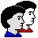
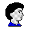

# Stock

Total **6** icons in **stock** context.

| |**48x48**|**32x32**|**24x24**|**22x22**|**16x16**|
|-|-|-|-|-|-|
|**SC-categories-fonts**||||||
|**stock_network-printer**||||||
|**stock_new-meeting**|||

*link:* 
*../../apps/24/system-users.png*
|||
|**stock_people**||

*link:* 
*../../apps/32/config-users.png*
|

*link:* 
*../../apps/24/config-users.png*
|

*link:* 
*../../apps/22/config-users.png*
||
|**stock_person-panel**||||||
|**stock_person**||||||
