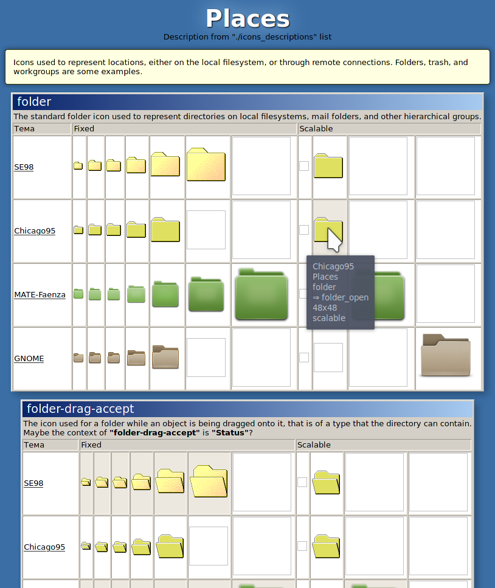

# Usefull Scripts  

## Icon Themes 2 HTML
*Screenshot*


AWK Script for comparing icon themes. It parses *index.theme* file in icon theme folder, finds all icons in all included folders, and creates html files (separated and named by context of icon group) with comparison between themes.<br>How to use:
```
./iconthemes2html.awk [file]... [option]...
```

Files must be correct index.theme files with path.
<br>**Options are:**<br>
**-c** contexts to parse. Syntax: `-c=Actions,Places,MimeTypes`<br>
**-s** sizes to parse. Syntax: `-s=16,24,32`<br>
**-u** user list of contexts, icons and their descriptions. Syntax: `-u=/path/list`<br>

```
# any comment
Context1 #one word;first letter is Uppercase
Description of context #  must contain spaces
# first - name of an icon w/o spaces or capitals, after <tab> - description of icon.
icon1	Description of icon
icon2	Desc of icon2
icon3	Desc of icon3
Context2
Desc of cont2
icon21	Desc of icon21
icon22	Desc of icon22
```

**-f** folder for saving html files. Syntax: `-f=/path`<br>

Single click on icon copies to clipboard absolute path to current icon file, double click copies absolute path to target (if it's a symlink).
Gray background means that current image recognized as is symlink while directory listing.

## link_sosedi.sh
Bash Script. A tool for icon theme makers. it creates relative symlinks in (neighboring to the current) folders to the same targets. Used for Nautilus, Caja and Thunar actions.