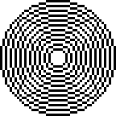
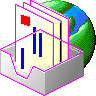
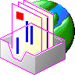
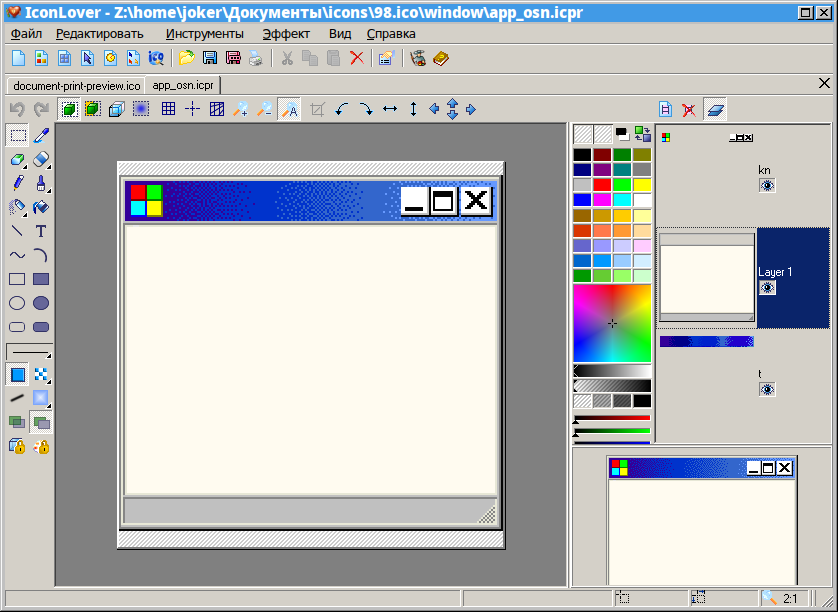
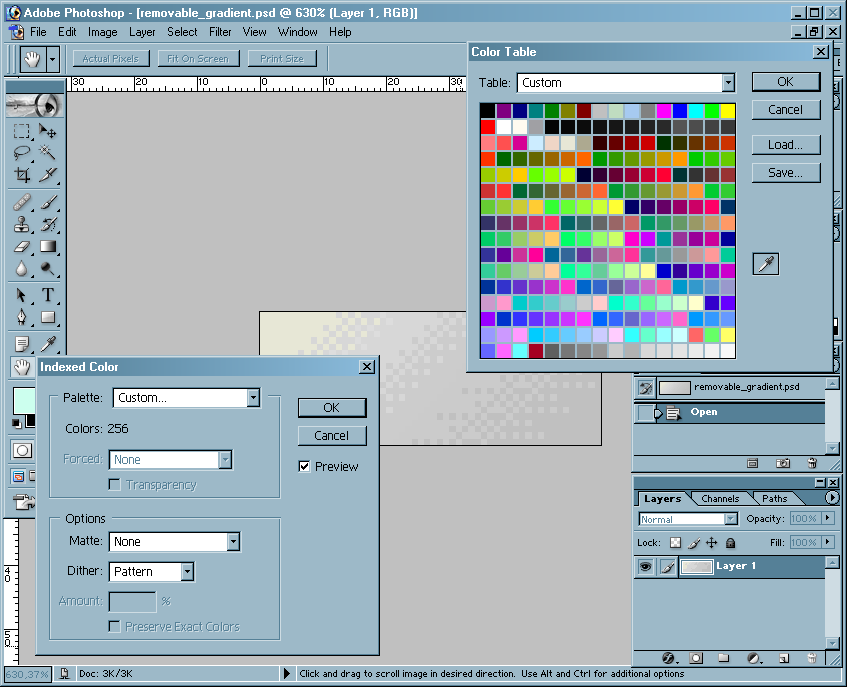

# Style features.
The Windows 98 (R) icon style has its own peculiarities. They are somewhat akin to the Byzantine iconographic style.

First of all, I want to say that this topic does not pretend to be perfect. This is just an attempt to adapt the most appropriate (in my opinion) style to the current reality with its huge screen resolutions.

* **The main criterion** of icons to be **readable**, **recognizable**, **harmoniously fitting** in GUI, but at the same time **not distracting** from the workflow with their excessive intricacy and excessive elaboration.
* Desktop icons before the appearance of pixel translucency -- represent a typical **pixel-art**.
* **Horizontal and vertical lines**, as a rule (almost always), are made **one pixel thick**.
* **Diagonals** are made stepwise with an equal number of pixels for each step.
* **Circles** and other **smooth curves** are more convenient to do in old graphics programs for DOS or Windows(R), or in modern special programs for pixel-art.
* **The color palette** (highly desirable) should be the same for all icons: **256-color, extracted from Windows icons (R) 98 **. Icon palette-98:

  * [For GIMP](GIMP-98.gpl)
  * [Photoshop (R) Color Table](Photoshop-98.act)
  * [ACO for Photoshop (R)](Photoshop-98.aco)
  * [Microsoft RIFF PAL data](Microsoft-98.pal)
  * [JASC-PAL format](Microangelo-98.pal)

The smoothness of the gradients is achieved through two mixing methods:

 diffused

 pattern

**Examples of lines:**

 Correct diagonals (x4)

 Circles: (x3)

* Outline lines are made without breaks, except when it is necessary for the composition.

Isometry. (a little theory)

In Byzantine and Russian iconography, reverse perspective is used to preserve the sense of flatness and prevent the illusion of spatiality. This helps to keep your mind clear, focus on the main tasks and not disperse it into contemplation. The geometry and pixelation of a computer image dictates orthogonality, so strict isometry is used.

The composition is close to the correct one (made from the original icon) except for outlines and gradients. With automatic scaling, the outlines of objects often turn out to be curves (because almost all graphics programs are not able to recognize the direction of raster lines and scale them incorrectly), gradients are full-color (easily corrected with the transfer of the image to indexed-color mode):

Correct diagonals:

 The correct lines are drawn in purple. All programs for pixel graphics allow you to do them.

 Diffuse gradients on the box after being converted to a 256-color palette embedded in Win98 icons (take a closer look). The old versions of Photoshop for Windows (R) 98 and 2000 (I checked it myself, but I don't know about the new ones.) and GIMP can well translate RGB images into index mode with diffuse mixing and pattern mixing.

* Before scaling or creating your own icon, the author must **understand**, **for what** he draws each line, each pixel and understand **why they exist** (for information, or general beauty).

Originals of the hard disk icon (in the case of GNU/Linux -- a block device): 

Zoomed-in icons: 

**Some deviations ** from the original palette and the mandatory lack of translucency of pixels ** are not prohibited**. The blue color used below is absent from the original palette, the edges of the emblem are smoothed due to translucency. The image is mounted in Inkscape:

# Naming of icons

* First of all, you need to create icons whose names are specified in the [FreeDesktop] standard (https://specifications.freedesktop.org/icon-naming-spec/icon-naming-spec-latest.html).
* Identical to them, but having different names for different environments (KDE, Budgie, Gnome) need to be created in the form of symlinks to the originals, so as not to take up extra disk space and make it easier to edit existing icons.

# Software
Coming soon...

The most convenient software for drawing PixelArt in my opinion is **IconLover**. 
*Screenshot*: 

The good tool for creating pixelated gradients is an old version of Adobe(R) PhotoShop(R): 

First, you create an icon project (.icpr file), which contains all the necessary formats (for example, from 16x16 to 256x256), inside each of which there can be an unlimited number of layers of varying degrees of transparency. 
Then this project is saved to the .ico format (it will be good to convert every format to 256-color in Win98 icon palette) and installed from it using the program "[WinIconInstall](https://www.opencode.net/nestoris/winiconinstall)" written by me (`git clone https://www.opencode.net/nestoris/winiconinstall.git`) in the folders of the theme itself.
