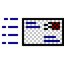

*Built by [MDTable.awk](https://github.com/nestoris/scripts-for-Icon-theming/blob/main/mdtable.awk)*

| |**128x128**|**96x96**|**72x72**|**64x64**|**48x48**|**32x32**|**24x24**|**22x22**|**16x16**|
|-|-|-|-|-|-|-|-|-|-|
|**indicator-messages**||||||||||
|**application-x-m4**||||||||||
|**gnome-fs-loading-icon**||||||||||
|**gpm-inhibit**||||||||||
|**keyboard-brightness**||||||||||
|**thunderbird**||||||||||
|**mail-read**||||||||||
|**applications-email-panel**||||||||||
|**mail-replied**||||||||||
|**mail-signed**||||||||||
|**mail-signed-verified**||||||||||
|**new-messages-red**||||||||||
|**network-receive**||||||||||
|**network-receive-symbolic**||||||||||
|**network-transmit**||||||||||
|**network-transmit-symbolic**||||||||||
|**network-transmit-receive**||||||||||
|**network-transmit-receive-symbolic**||||||||||
|**network-idle**||||||||||
|**network-idle-symbolic**||||||||||
|**network-wireless-disconnected**||||||||||
|**nm-no-connection**||||||||||
|**nm-secure-lock**||||||||||
|**notification-gsm-disconnected**||||||||||
|**notification-network-disconnected**||||||||||
|**notification-network-wireless-disconnected**||||||||||
|**notification-network-ethernet-connected**||||||||||
|**notification-network-ethernet-disconnected**||||||||||
|**notification-display-brightness-full**||||||||||
|**notification-display-brightness-high**||||||||||
|**notification-display-brightness-medium**||||||||||
|**notification-display-brightness-low**||||||||||
|**notification-display-brightness-off**||||||||||
|**notification-power-disconnected**||||||||||
|**notification-printer**||||||||||
|**notification-printer-error**||||||||||
|**nm-mb-roam**||||||||||
|**folder_green**||||||||||
|**folder_home2**||||||||||
|**folder_locked**||||||||||
|**folder_important**||||||||||
|**folder_txt**||||||||||
|**folder_print**||||||||||
|**folder_inbox**||||||||||
|**folder_outbox**||||||||||
|**folder_sent_mail**||||||||||
|**lock_overlay**||||||||||
|**zip_overlay**||||||||||
|**ftp**||||||||||
|**contents**||||||||||
|**cd**||||||||||
|**1downarrow**||||||||||
|**1leftarrow**||||||||||
|**1uparrow**||||||||||
|**1rightarrow**||||||||||
|**about_kde**||||||||||
|**attach**||||||||||
|**bug**||||||||||
|**button_ok**||||||||||
|**contexthelp**||||||||||
|**edittrash**||||||||||
|**emptytrash**||||||||||
|**eraser**||||||||||
|**encrypted**||||||||||
|**filter**||||||||||
|**gnome-app-install-star**||||||||||
|**gear**||||||||||
|**launch**||||||||||
|**knewstuff**||||||||||
|**key_enter**||||||||||
|**mail_delete**||||||||||
|**mail_find**||||||||||
|**mail_generic**||||||||||
|**mail_get**||||||||||
|**mail_new3**||||||||||
|**mail_post_to**||||||||||
|**mail_post_to3**||||||||||
|**mail_replylist**||||||||||
|**message_reply**||||||||||
|**messagebox_critical**||||||||||
|**messagebox_info**||||||||||
|**messagebox_warning**||||||||||
|**mouse**||||||||||
|**no**||||||||||
|**player_time**||||||||||
|**rebuild**||||||||||
|**queue**||||||||||
|**project_open**||||||||||
|**save_all**||||||||||
|**share**||||||||||
|**show_side_panel**||||||||||
|**showmenu**||||||||||
|**signature**||||||||||
|**tdevelop_down**||||||||||
|**text_sub**||||||||||
|**text_super**||||||||||
|**thumbnail**||||||||||
|**today**||||||||||
|**toggle_log**||||||||||
|**unlock**||||||||||
|**translate**||||||||||
|**transform**||||||||||
|**wallet_open**||||||||||
|**view_tree**||||||||||
|**view_top_bottom**||||||||||
|**view_text**||||||||||
|**view_sidetree**||||||||||
|**view_right**||||||||||
|**view_remove**||||||||||
|**view_multicolumn**||||||||||
|**view_left_right**||||||||||
|**view_icon**||||||||||
|**view_fit_window**||||||||||
|**view_fit_width**||||||||||
|**view_fit_height**||||||||||
|**view_detailed**||||||||||
|**view_choose**||||||||||
|**view_bottom**||||||||||
|**window_duplicate**||||||||||
|**wizard**||||||||||
|**make_tdevelop**||||||||||
|**cookie**||||||||||
|**filetypes**||||||||||
|**energy**||||||||||
|**energy_star**||||||||||
|**edu_language**||||||||||
|**edu_mathematics**||||||||||
|**edu_miscelaneous**||||||||||
|**error**||||||||||
|**kcmpci**||||||||||
|**kcmprocessor**||||||||||
|**kcmscsi**||||||||||
|**kcmpartitions**||||||||||
|**kcmopengl**||||||||||
|**kcmmidi**||||||||||
|**kcmmemory**||||||||||
|**kcmkicker**||||||||||
|**kcmdrkonqi**||||||||||
|**kcmdf**||||||||||
|**kcmdevices**||||||||||
|**kchmviewer**||||||||||
|**kcmx**||||||||||
|**kcontrol**||||||||||
|**kdenlive**||||||||||
|**kdisknav**||||||||||
|**keditbookmarks**||||||||||
|**keyboard**||||||||||
|**keyboard_layout**||||||||||
|**kfind**||||||||||
|**kfm_home**||||||||||
|**khotkeys**||||||||||
|**kicker**||||||||||
|**kjobviewer**||||||||||
|**klipper**||||||||||
|**kmenu**||||||||||
|**kmenuedit**||||||||||
|**ktimemon**||||||||||
|**ktip**||||||||||
|**kttsd**||||||||||
|**kvirc**||||||||||
|**kweather**||||||||||
|**kwrite**||||||||||
|**kwrite2**||||||||||
|**kxkb**||||||||||
|**linuxconf**||||||||||
|**love**||||||||||
|**extension**||||||||||
|**application-sql**||||||||||
|**inode-socket**||||||||||
|**inode-chardevice**||||||||||
|**inode-fifo**||||||||||
|**inode-mount-point**||||||||||
|**inode-x-generic**||||||||||
|**application-x-core**||||||||||
|**application-vnd.android.package-archive**||||||||||
|**application-ms-htmlhelp**||||||||||
|**text-x-copying**||||||||||
|**text-x-changelog**||||||||||
|**text-markdown**||||||||||
|**application-x-gettext-translation**||||||||||
|**text-x-gettext-translation-template**||||||||||
|**audio-x-xm**||||||||||
|**audio-x-mod**||||||||||
|**audio-x-it**||||||||||
|**text-x-nfo**||||||||||
|**text-csv**||||||||||
|**text-x-ms-regedit**||||||||||
|**virtualbox-vdi**||||||||||
|**virtualbox-vhd,**||||||||||
|**application-x-yaml**||||||||||
|**application-x-xpinstall**||||||||||
|**application-vnd.openofficeorg.extension**||||||||||
|**application-x-sf2**||||||||||
|**text-x-chdr**||||||||||
|**text-x-install**||||||||||
|**text-x-csrc**||||||||||
|**text-x-tex**||||||||||
|**text-x-makefile**||||||||||
|**application-x-troff-man**||||||||||
|**application-x-raw-disk-image-xz-compressed**||||||||||
|**text-x-credits**||||||||||
|**application-x-zstd-compressed-tar**||||||||||
|**mail-mark-junk**||||||||||
|**mail-mark-notjunk**||||||||||
|**mail-mark-important**||||||||||
|**mail-mark-read**||||||||||
|**mail-message-new**||||||||||
|**mail-move**||||||||||
|**mail-reply-sender**||||||||||
|**mail-send**||||||||||
|**mail-send-receive**||||||||||
|**mail-receive**||||||||||
|**mail-inbox**||||||||||
|**mail-outbox**||||||||||
|**mail-attachment**||||||||||
|**edit-delete-mail**||||||||||
|**preview-file**||||||||||
|**package-upgrade**||||||||||
|**package-remove**||||||||||
|**system-restart**||||||||||
|**dialog-ok-apply**||||||||||
|**calibrate**||||||||||
|**audio-cd-duplicate**||||||||||
|**podcast-new**||||||||||
|**media-optical-audio-new**||||||||||
|**media-optical-burn**||||||||||
|**media-optical-copy**||||||||||
|**media-playlist-repeat**||||||||||
|**media-playlist-shuffle**||||||||||
|**revert**||||||||||
|**open-menu**||||||||||
|**add-files-to-archive**||||||||||
|**add-folder-to-archive**||||||||||
|**archive-insert**||||||||||
|**archive-insert-directory**||||||||||
|**extract-archive**||||||||||
|**gtk-print-error**||||||||||
|**gtk-print-paused**||||||||||
|**gtk-print-report**||||||||||
|**gtk-print-warning**||||||||||
|**help-faq**||||||||||
|**insert-object**||||||||||
|**media-eq**||||||||||
|**media-eq-symbolic**||||||||||
|**application-x-sharedlib,**||||||||||
|**application/pgp-keys**||||||||||
|**application-x-designer**||||||||||
|**application-x-bittorrent**||||||||||
|**application-x-7zip**||||||||||
|**application-pdf**||||||||||
|**AppImageLauncher**||||||||||
|**folder-new**||||||||||
|**fusion-icon**||||||||||
|**gcolor2**||||||||||
|**gdm-xnest**||||||||||
|**geary**||||||||||
|**gnome-app-install-star**||||||||||
|**gnome-contacts**||||||||||
|**gnome-weather**||||||||||
|**gnomebaker**||||||||||
|**gparted**||||||||||
|**gpicview**||||||||||
|**video-quicktime**||||||||||
|**application-x-ole-storage**||||||||||
|**application-x-object**||||||||||
|**audio-x-mod**||||||||||
|**application-x-nzb**||||||||||
|**text-x-scheme**||||||||||
|**application-pgp-keys**||||||||||
|**application-x-zip-compressed-fb2**||||||||||
|**application-x-mobipocket-ebook**||||||||||
|**text-x-rpm-spec**||||||||||
|**application-x-q4os-execscript**||||||||||
|**randr**||||||||||
|**xrandr**||||||||||
|**grandr**||||||||||
|**gsd-xrandr**||||||||||
|**msd-xrandr**||||||||||
|**xfce4-mixer**||||||||||
|**kmix**||||||||||
|**kcmsound**||||||||||
|**bashnee**||||||||||
|**kcontrol**||||||||||
|**kdisknav**||||||||||
|**ksim**||||||||||
|**krdc**||||||||||
|**kpf**||||||||||
|**kttsd**||||||||||
|**kviewshell**||||||||||
|**kvirc**||||||||||
|**laptop_battery**||||||||||
|**laptop_pcmcia**||||||||||
|**licq**||||||||||
|**linuxconf**||||||||||
|**nedit**||||||||||
|**netscape**||||||||||
|**package_applications**||||||||||
|**systemsettings**||||||||||
|**systemtray**||||||||||
|**tdescreensaver**||||||||||
|**tdmconfig**||||||||||
|**twin**||||||||||
|**usb**||||||||||
|**kfind**||||||||||
|**kfax**||||||||||
|**kdict**||||||||||
|**kleopatra**||||||||||
|**kview**||||||||||
|**kxkb**||||||||||
|**noatun**||||||||||
|**printmgr**||||||||||
|**qualculate**||||||||||
|**qualculate_tde**||||||||||
|**showfoto**||||||||||
|**tdeiconedit**||||||||||
|**tdepowersave**||||||||||
|**tdeprinfax**||||||||||
|**tdewalletmanager**||||||||||
|**gcr-smart-card**||||||||||
|**mate-power-statistics**||||||||||
|**mintlocale-im**||||||||||
|**mintstick**||||||||||
|**mintupdate-release-upgrade**||||||||||
|**pix**||||||||||
|**MidnightCommander**||||||||||
|**bibletime**||||||||||
|**libreoffice_extension**||||||||||
|**mintwelcome**||||||||||
|**kruler**||||||||||
|**kaddressbook**||||||||||
|**kalarm**||||||||||
|**kaboodle**||||||||||
|**kdf**||||||||||
|**xfmail**||||||||||
|**xmag**||||||||||
|**xedit**||||||||||
|**xappfinder**||||||||||
|**xclock**||||||||||
|**fsview**||||||||||
|**juk**||||||||||
|**kig**||||||||||
|**khexedit**||||||||||
|**kgpg**||||||||||
|**kgamma**||||||||||
|**kfloppy**||||||||||
|**kontact**||||||||||
|**korn**||||||||||
|**kpager**||||||||||
|**kstars**||||||||||
|**kwrite2**||||||||||
|**kpat**||||||||||
|**kmines**||||||||||
|**kget**||||||||||
|**kmenu,**||||||||||
|**kcmmemory**||||||||||
|**kfm-home**||||||||||
|**kcmdevices**||||||||||
|**kchmviewer**||||||||||
|**energy**||||||||||
|**email**||||||||||
|**kcmprocessor**||||||||||
|**kcmpci**||||||||||
|**kcmpartitions**||||||||||
|**help_index**||||||||||
|**gnomemeeting**||||||||||
|**application-geo+json**||||||||||
|**mate-panel**||||||||||
|**putty**||||||||||
|**parole**||||||||||
